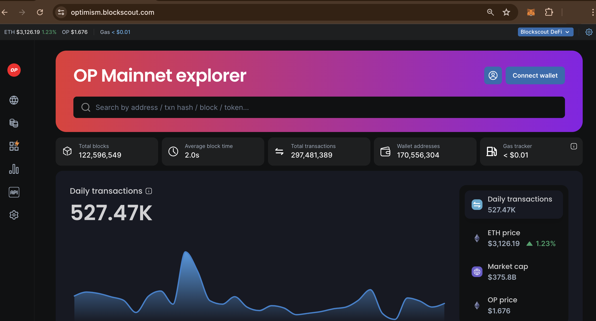

# Blockscout Open-Source Explorer


&#x20;🚗  [Autoscout is now available](using-blockscout/autoscout.md), providing a simple one-click explorer deployment with Blockscout's optimized hosting infrastructure. Use it for early testing, modifications, and launching a full production-grade explorer for your L1, L2, or rollup. [Get Started Now](using-blockscout/autoscout.md) and have **your explorer up-and-running in minutes.**


Blockscout provides a comprehensive, easy-to-use interface for users to view, confirm, inspect and interact on EVM (Ethereum Virtual Machine) blockchains.&#x20;

Blockscout currently supports a wide range of projects and chains, see our [chains and projects page](https://www.blockscout.com/chains-and-projects)for more details.

<figure><figcaption></figcaption></figure>

While there are several explorers available to blockchain projects, most are closed systems (ie Etherscan, Routescan) which are not independently verifiable and do not support all chains in the ecosystem. Blockscout provides a much needed open-source alternative.&#x20;

As the multi-chain paradigm continues to take hold in both private and public settings, transparent tools are needed to analyze and validate transactions and provide an explorer for all networks, including rollups, L2s, L3s and appchains.

Information on the latest release and version history is available in the [Github repo](https://github.com/blockscout/blockscout/releases).
