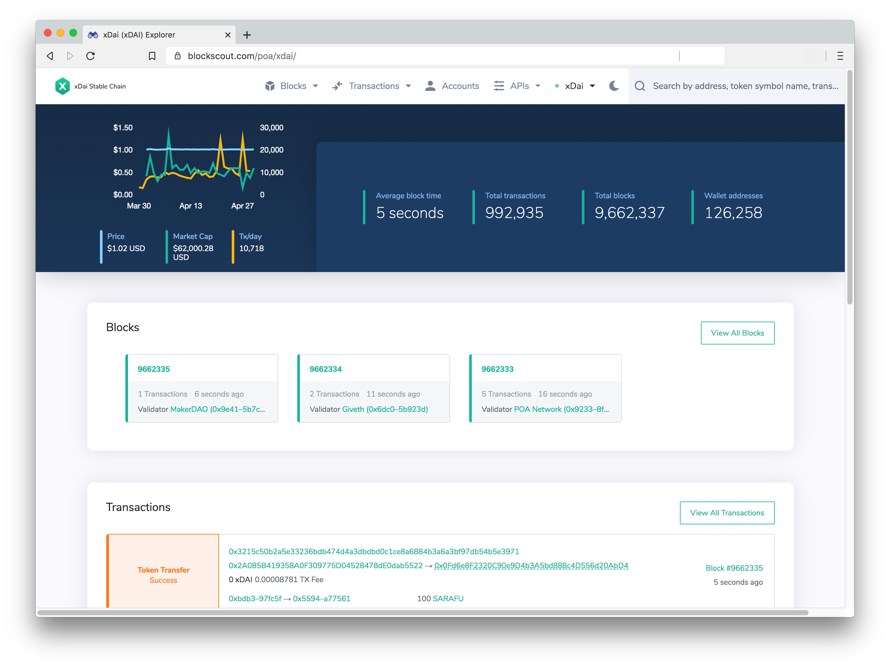

# Welcome to BlockScout


Help up improve BlockScout! 10 random winners will each receive $100 Amazon Gift Cards \(or USDT if Amazon is not available\) for completing a 5 minute survey. 

👉 [https://airtable.com/shrDKDUrK5pt7pIIc](https://airtable.com/shrDKDUrK5pt7pIIc)


BlockScout provides a comprehensive, easy-to-use interface for users to view, confirm, and inspect transactions on EVM \(Ethereum Virtual Machine\) blockchains. BlockScout currently hosts the POA Network, xDai Chain, Ethereum Classic, Sokol & Kovan testnets and many other testnets, private chains and sidechains. [A complete list of projects is available here](for-projects/supported-projects.md).

BlockScout is an Elixir application that allows users to search transactions, view accounts and balances, and verify smart contracts on Ethereum including forks and sidechains.

Currently available block explorers \(i.e. Etherscan and Etherchain\) are closed systems which are not independently verifiable. As Ethereum sidechains continue to proliferate in both private and public settings, transparent tools are needed to analyze and validate transactions.

Information on the latest release and version history is available [on our forum](https://forum.poa.network/c/blockscout/releases)

