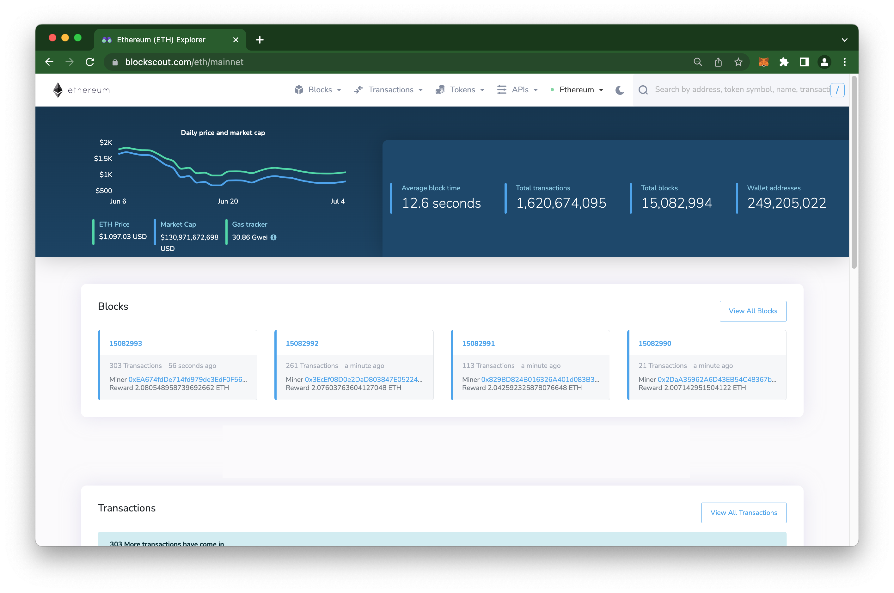

# Welcome to Blockscout


Blockscout 2.0 is almost here! This major update is set to transform blockchain exploration. As we near the final stages of development, [we are excited to share more details about what's coming with BlockScout 2.0](about/roadmap/blockscout-2.0.md).


Blockscout provides a comprehensive, easy-to-use interface for users to view, confirm, and inspect transactions on EVM (Ethereum Virtual Machine) blockchains. Blockscout currently supports a wide range of projects and hosts chains such as Ethereum, Ethereum Classic, Polygon, Optimism, Gnosis Chain, Celo, Astar, and many more. See our [projects list](about/projects.md) for more details.

While there are several explores available to blockchain projects, most are closed systems (ie Etherscan, Etherchain) which are not independently verifiable. Blockscout provides a much needed open-source alternative. As the multi-chain paradigm continues to take hold in both private and public settings, transparent tools are needed to analyze and validate transactions.

Information on the latest release and version history is available in the [Github repo](https://github.com/blockscout/blockscout/releases).
