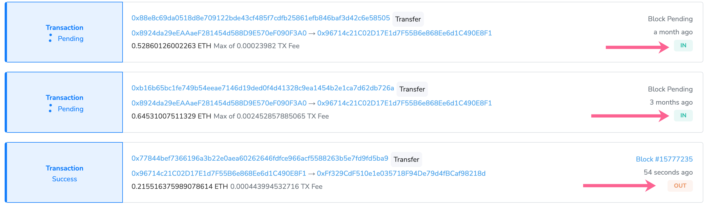
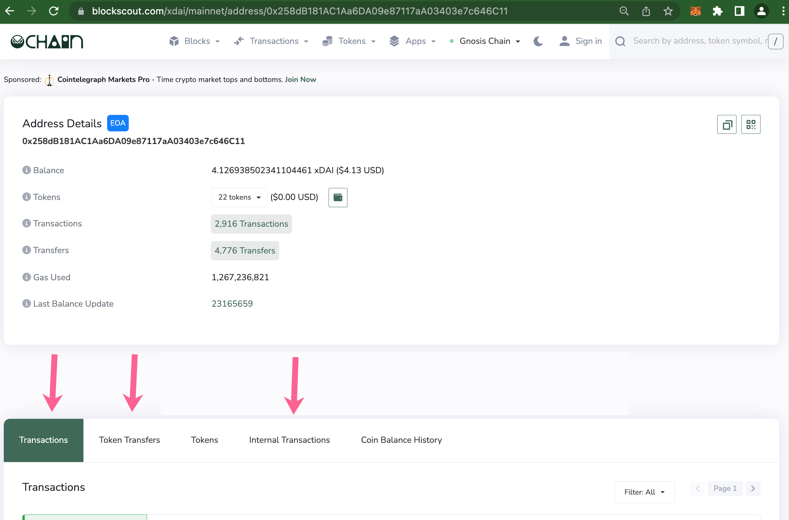
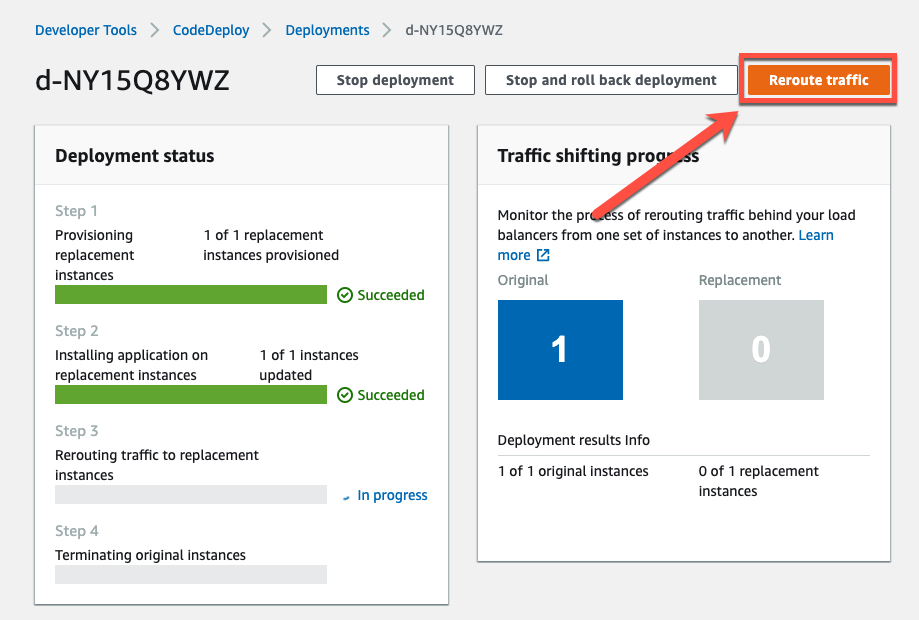
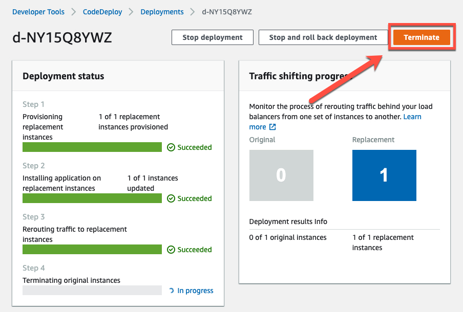
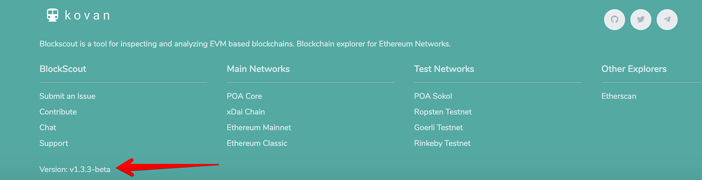

# FAQs

FAQs are divided into 2 sections. [User FAQs](faqs.md#user-faqs) cover questions that may come up when searching for transactions or interacting and verifying smart contracts. Developer FAQs cover questions related to installation, instance customization and hosting. If you have a question that isn't answered here, please contact us in [our Discord](https://discord.gg/blockscout) and the team and community can help troubleshoot your issue.&#x20;

## User FAQs

<details>

<summary>What does the "in" or "out" label mean on a transaction?</summary>

This label appears next to a transaction to signify whether a transaction was sent or received by a particular address.&#x20;

* <mark style="color:green;background-color:green;">**In**</mark>**:** A transaction was sent to the address
* <mark style="color:orange;background-color:orange;">**Out**</mark>**:** A transaction was initiated from the address



</details>

<details>

<summary>What are the different transaction types?</summary>

**There are 3 transaction types which can be accessed from the tabs menu for an EOA (Externally Owned Address) or Smart Contract.**

**Transactions:**\
An EOA, commonly known as a wallet address, initiates a transaction. Both incoming and outgoing transactions are recorded here, and includes includes any transaction that requires a gas fee (in the native token ETH, xDai etc) for execution.

**Token Transfers:**\
Transactions of ERC-20 or ERC-721 tokens. This can include DeFi transactions (like adding or removing liquidity), EOA transfers, airdrops or other transactions where non-native tokens are sent and received.

**Internal Transactions:**\
Transactions initiated and executed between smart contracts. Internal transactions are the result of an external transaction (EOA to contract). This initial transaction can then trigger many internal transactions between contracts as functions are called.



</details>

<details>

<summary>What is CSV export error 504?</summary>

If you request too much data at the same time you may receive a timeout. Decreasing the period of time for an export (**1 week timeframe** is recommended for addresses with lots of transactions) can reduce these errors.

</details>

<details>

<summary>How can I access and read/write contract methods?</summary>

Yes! The contract should be verified (or the bytecode matches an existing contract) to enable reading and writing to contracts and proxy contracts. [More info here](../for-users/interacting-with-smart-contracts.md).

</details>

<details>

<summary>How do I verify a smart contract?</summary>

There are multiple methods including options from the Blockscout UI as well as an integration directly with Hardhat.

**Blockscout UI:**

* [Via flattened source code (Solidity)](../for-users/smart-contract-interaction/verifying-a-smart-contract/#via-flattened-source-code)
* [Via standard JSON input](faqs.md#via-standard-json-input)
* [Via Sourcify: Sources and metadata JSON file](../for-users/smart-contract-interaction/verifying-a-smart-contract/contracts-verification-via-sourcify.md)
* [Vyper contract](../for-users/smart-contract-interaction/verifying-a-smart-contract/#vyper-contract)

**Hardhat:**

* [Hardhat Verification Plugin](../for-users/smart-contract-interaction/verifying-a-smart-contract/hardhat-verification-plugin.md)
* [Sourcify Plugin for Hardhat](../for-users/verifying-a-smart-contract/sourcify-plugin-for-hardhat.md)

</details>

## Developer FAQs

<details>

<summary>How do I speed up my self-hosted instance?</summary>

BlockScout can be resource intensive. If your instance is running slowly:

* clear the cache - the application cache is cleared on restart by running:\
  `sudo systemctl restart explorer.service`
* increase the memory limit for indexers [https://github.com/poanetwork/blockscout/blob/b48305ece284e00084e2bb47ff1ad501bf24f115/apps/indexer/config/config.exs#L36 8](https://github.com/poanetwork/blockscout/blob/b48305ece284e00084e2bb47ff1ad501bf24f115/apps/indexer/config/config.exs#L36) if indexing is slow.
* increase the number of CPUs if CPU is running at 100% on the web app server
* increase the memory if memory consumption is high on the web app server
* increase the number of CPUs or/and increase the memory on the database server if consumption is high.

Instructions for accessing and upgrading CPUs/memory will differ based on your setup. If you are running BlockScout on AWS, these settings can be accessed through your AWS services portal.

</details>

<details>

<summary>How do I customize the coin symbol / name?</summary>

### Exchange Rates Coin Name

* Specify coin name for exchange rates fetcher with the `COIN` [ENV variables](../for-developers/information-and-settings/env-variables.md)

BlockScout utilizes the `COIN` environment variable which pulls the associated market data from the Coinmarketcap.com API or CoinGecko API to provide pricing data throughout the application.

### Displayed Coin Symbol

In order to set displayed coin symbol, instance maintainer should set `COIN_NAME` runtime environment variable:

```
export COIN_NAME=
```

For instance, in case of POA instance of Blockscout:

```
export COIN_NAME=POA
```

</details>

<details>

<summary>How do I manage deployment with AWS CodeDeploy?</summary>

1\) Visit CodeDeploy in AWS. You will see a list of your deployments. Select the deployment id to view details `https://console.aws.amazon.com/codesuite/codedeploy/deployments?region=us-east-1`

2\) Deployment status consists of several steps. Once step 2 is complete (application is installed on replacement instances), you manually reroute traffic. Click the `Reroute traffic` button to initiate.



3\) Once traffic is rerouted, you’ll be asked to terminate the original instance. Click the **Terminate** button to initiate.



4\) Once complete, use the public DNS address of the Amazon EC2 instance to view in a web browser. (To get the public DNS value, choose your Amazon EC2 instance in the Amazon EC2 console, and look for the value in **Public DNS i**n the **Description** tab).

</details>

<details>

<summary>What's the best way to deploy to AWS?</summary>

Currently the best existing way is through docker compose [https://github.com/blockscout/blockscout/tree/master/docker-compose](https://github.com/blockscout/blockscout/tree/master/docker-compose).&#x20;

We are currently working on deployment through Kubernetes (K8s) and other methods for easily spinning up an instance on AWS.

</details>

<details>

<summary>How do I replace missing assets/version numbers?</summary>

## Missing Assets

1. Find the public ip of corresponding Blockscout instance in the EC2 -> Instances of AWS Dashboard.
2. Connect to the host via SSH `ssh -i <host.pem> ec2-user@<public_ip>`, where `<host.pem>` is host’s private key file, `<public_ip>` is the public ip of the host, that can be found in the AWS dashboard.
3. Go to assets folder `cd /opt/app/apps/block_scout_web/priv/static`
4. Add missing assets there or to `./images` folder depending on what is missing. Refresh Blockscout instance page. For example, if `favicon.ico` is missing in `./images` folder, just copy it from the root assets folder \`cp favicon.ico ./images/. You should see now the missing assets.

## Missing Version in Footer

The app version number should be in the footer of BlockScout instance



1. Find the public ip of corresponding Blockscout instance in the EC2 -> Instances of AWS Dashboard
2. Connect to the host via SSH `ssh -i <host.pem> ec2-user@<public_ip>`, where `<host.pem>` is host’s private key file, `<public_ip>` is the public ip of the host, that can be found in the AWS dashboard.
3. Go to layout folder `/opt/app/apps/block_scout_web/lib/block_scout_web/templates/layout`
4. Open `_footer.html.eex` footer template in the favorite text editor. For example `nano ./_footer.html.eex` and fix the line `<% version = version() %>` (it is in the bottom of the file) with the hardcoded new version, for example, `<% version = 'v1.3.3-beta' %>` and save.
5. Restart the Blockscout instance with `sudo systemctl restart explorer.service`

</details>

<details>

<summary>How do I fix the Gettext.Error?</summary>

You may receive this error after making changes to a specific BlockScout application.

`(Gettext.Error) translation with msgid '...<msg_here>...' has a non-empty msgstr`

To update gettext, run the following command **in the app’s folder where the changes were made**.

1. Go to the ./apps/{name\_of\_app} folder where the changes were made.
2. Run `mix gettext.extract —merge`
3. Repeat for other app folders as required.

More information on Gettext is [available here](https://hexdocs.pm/gettext/Mix.Tasks.Gettext.Extract.html).

</details>

<details>

<summary>How do I update the UI?</summary>

See the [Branding configs](../for-developers/configuration-options/branding-configs.md) page for details related to different UI elements.&#x20;

For updates like adding elements/links etc you will need to change .eex templates. When changing .eex templates you don't need to rebuild. Run the application in dev mode (MIX\_ENV=dev), and change the template. You'll see changes on-the-fly. When chaging js/scss while running the application, you need to run `mix phx.digest` to apply the changes.

</details>

<details>

<summary>How can I view smart contracts using RPC?</summary>

Use the JSON RPC `listcontracts` endpoint. For example, to view verified contracts, use the following query. Pagination is available

```shell
curl -X GET "
https://blockscout.com/xdai/mainnet/api?module=contract&action=listcontracts&page=1&offset=50&filter=verified
" -H "accept: application/json"
```

</details>

<details>

<summary>Why are Market Cap/Token Price stats wrong?</summary>

One reason may be related to the CoinGecko API refusing Blockscout requests without an API key.&#x20;

If impacted, apply this pull request to your instance:&#x20;

[https://github.com/blockscout/blockscout/pull/5613](https://github.com/blockscout/blockscout/pull/5613)

It implements CoinGecko API key management and alternative CoinMarketCap exchange rates.

</details>

<details>

<summary>How do I disable exchange rates?</summary>

Change the Explorer.ExchangeRates variable from `enabled: true` to `enabled: false`

* config :explorer, Explorer.ExchangeRates, `enabled: false`, store: :ets

[https://github.com/poanetwork/blockscout/blob/7aeecb2a04838cda0289a7fe432db74481cf575a/apps/explorer/config/config.exs#L32](https://github.com/poanetwork/blockscout/blob/7aeecb2a04838cda0289a7fe432db74481cf575a/apps/explorer/config/config.exs#L32)

</details>

<details>

<summary>How can I migrate verified contracts between databases?</summary>

You may want to do this if you are creating a new instance or resyncing a new node.

1. Backup the `smart_contracts` table&#x20;
2. Restore this table following the resync.

</details>

<details>

<summary>Which Linux distro do I use for manual deployment?</summary>

Ubuntu 18.04 has been configured in Blockscout CI.

</details>

<details>

<summary>Can I set RPC variable to a normal http(s) url?</summary>

Yes you can. The `ethereum_json_rpc_http` variable can be set to any url, it does not need to be a localhost. Client variant env variable should be specified in either case.

</details>

<details>

<summary>Do I need to enable ws?</summary>

No, it is not required. If ws is disabled, leave the `ETHEREUM_JSONRPC_WS_URL` env var empty or unset it.

</details>

<details>

<summary>How to fix error message "execution timeout at <code>pushGasToTopCall</code>"?</summary>

Try increasing time for the `ETHEREUM_JSONRPC_DEBUG_TRACE_TRANSACTION_TIMEOUT` [ENV variable](../for-developers/information-and-settings/env-variables.md#indexer-management). The default is 5 sec.

</details>

<details>

<summary>How do I fix Unknown Private Network error?</summary>

In a self-hosted or locally deployed instance, when attempting to do a **write transaction** on a verified contract, the following errors may appear:

**Unauthorized**\
"You connected to Unknown Private Network chain in the wallet, but the current instance of Blockscout is for Unknown Private Network chain"

"No "from" address specified in neither the give options, nor the default options."

### To **T**roubleshoot:&#x20;

* Check that you set the correct `CHAIN_ID` env variable
* Check correct variable for `NETWORK_ID`
* Check that Metamask (or other web3 wallets) is connected to correct network.
* [Read more about this issue here](https://github.com/blockscout/blockscout/issues/5803).

</details>

<details>

<summary>How do I fix indexer timeouts or update memory to fix indexer memory errors?</summary>

* More on [indexer timeouts](faqs.md#undefined)
* More on [updating memory consumption](../for-developers/indexing/how-do-i-update-memory-consumption-to-fix-indexer-memory-errors.md)

</details>

<details>

<summary>How to incorporate "Add to MM" functionality</summary>

Check that you are running the latest version and set the following variables. These can be set at runtime.

```
CHAIN_ID=
NETWORK_PATH=
SUBNETWORK=
COIN_NAME=
JSON_RPC=
```

Gnosis Chain Example:

```
CHAIN_ID=100
NETWORK_PATH=/xdai/mainnet
SUBNETWORK=Gnosis Chain
COIN_NAME=xDai
JSON_RPC=https://rpc.gnosischain.com/
```

</details>

<details>

<summary>How do I update the internal tx fetcher to skip blocks or start from block to prevent errors?</summary>

Set `TRACE_FIRST_BLOCK` and `TRACE_LAST_BLOCK` [env variables](../for-developers/information-and-settings/env-variables.md).

</details>

<details>

<summary>What is the command to install the smart contract verifier?</summary>

`cargo install --git` [https://github.com/blockscout/blockscout-rs](https://github.com/blockscout/blockscout-rs) `smart-contract-verifier-http`\
\
[Learn more about the contract verifier](../for-developers/information-and-settings/smart-contract-verification.md)

</details>

<details>

<summary>How to fix error: "Could not compile dependency :libsecp256k1, "mix compile" failed.</summary>

This error can happen when running `mix local.rebar --force`

Try this command:

`cd deps/libsecp256k1` \
`make`

</details>

