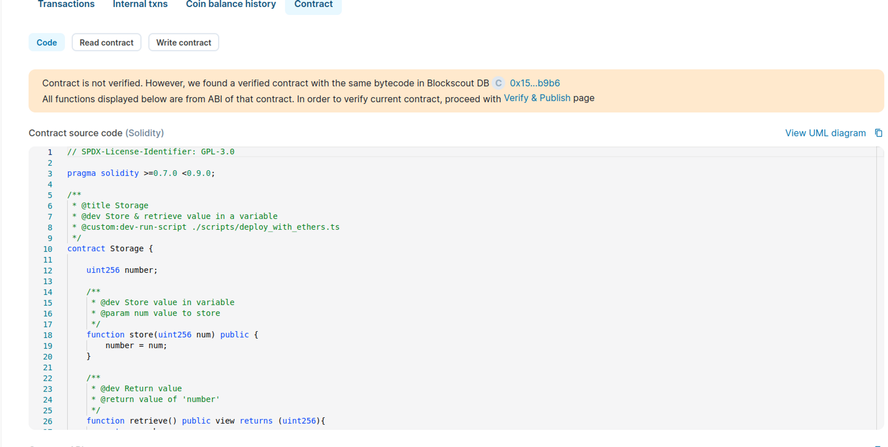
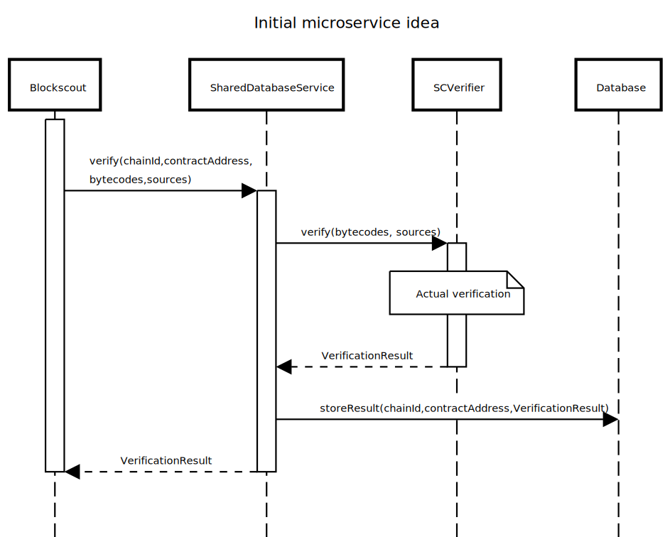

# Ethereum Bytecode Database Microservice

Blockscout supports multiple chains, and each chain has its own database that stores verified smart-contracts. Because these databases are independent of one another, verified contracts and their method identifiers typically cannot be shared between chains.&#x20;

For example, if a contract is verified on Ethereum Mainnet, it cannot be accessed on Gnosis Chain even if the creation transaction input is the same.

<figure><figcaption></figcaption></figure>

To address this issue, we have implemented a database for verified contract information which can be shared across all supported chains. This database and it's associated functionality has been created as a Blockscout microservice called the **Ethereum Bytecode Database (Blockscout EBD).**

## Initial Planning

Initial plans were to create a distinct service with a database responsible for maintaining verification results. This database could then be shared among all supported chains. The service would track the contract address and the chain where the contract was deployed. The source files would also be stored so they could be extracted for verified contracts. The service would also find and match unverified contracts to their verified counterparts if they already existed in the database.

<figure><figcaption></figcaption></figure>

## Restructuring the Search Process

It is possible to search for similar bytecodes if the bytecodes (or their hashes) are stored in the database along with verification results. The list of already verified bytecodes can then be checked when searching for the source codes of unverified contracts.

However, with this type of search the **`chainId`** and **`contractAddress`** arguments are typically required, as source codes for already verified contracts are stored based on the chain and address where these contracts are deployed. This is how most source code databases are designed (e.g., Sourcify, Etherscan, Blockscout).

With this new service, our main goal was not just to return source codes for verified contracts (since that data is already stored and processed internally within Blockscout's main storage), but also to search for source codes for unverified contracts. To do this, we realized we could eliminate **`chainId`** and **`contractAddress`** and gain some advantages.

## Solution - Ethereum Bytecode Database (Blockscout EBD)

A solution can be found by mapping source codes directly to bytecodes. In this case,  **`chainId`** and **`contractAddress`**  are not needed, only the _`bytecode`-`sourceCode`_ correspondence if required. This is similar to what [4bytes](https://www.4byte.directory/) or [sigEth](https://sig.eth.samczsun.com/) does. However, instead of looking for the function signature based on its identifier, we look for the contracts' source code based on its bytecode.&#x20;

* **Current Approaches:** Chain → Contract Address → Sources
* **Blockscout Ethereum Bytecode Database:** Bytecode → Sources

## Basics

In the following diagram for the new service, notice that there is no notion of **`chainId`** and **`contractAddress`**—only raw bytecodes are important.

### Verification

<figure><figcaption></figcaption></figure>

### Bytecode Source Search

The microservice does not care where the contract is deployed (which chain) or even whether a contract with the corresponding bytecode is deployed at all.

<figure><figcaption></figcaption></figure>

## Similar Contracts Search Enhancement

In Blockscout, two contracts share the same source code only if their bytecodes are entirely identical. However, not every part of the bytecode is functional (see [**Sourcify partial vs. full match**](https://docs.sourcify.dev/docs/full-vs-partial-match/)). There may also be a metadata hash, usually located at the end of the creation input or deployed bytecode. The source code can also produce different metadata hashes for inconsequential changes, such as when a new space is appended to the file or the file is renamed. This results in bytecodes with the same EVM-executed portion, but they may not be identified by Blockscout's current similar contracts search algorithm.

As described in [**smart-contract verification**](https://docs.blockscout.com/for-developers/information-and-settings/smart-contract-verification#verification-process), our verification service allows us to split the bytecode into 2 parts, **Main** and **Metadata**. The Ethereum Bytecode Database takes advantage of this and searches for similar bytecodes based only on the **Main** (functionally significant) parts.

## Adding Extractors

Removing the notion of chains and contract addresses is powerful in and of itself. However, the addition of extractors provides the opportunity for an extremely robust database.

<figure><figcaption></figcaption></figure>

Extractors can be implemented as separate extensions which can index different explorers and different chains, then automatically submit newly verified bytecodes into the Ethereum Bytecode Database. It can also import contracts verified long ago.&#x20;

This has the potential rapidly increase the dataset, **allowing the service to collect sources for almost all bytecodes that have been publicly verified**. Every time a new contract is verified on a monitored explorer, the extractor can upload the source code to the Ethereum Bytecode Database\*. \
_\*This is in the research phase._&#x20;

In addition, anyone can start the service from scratch and eventually obtain their own repository of verified contracts by running extractors they are interested in. Those who would like to host their own instance can obtain a populated database which can also be updated from other chains in the ecosystem.

## Conclusion

Implemented as a separate service, _Ethereum Bytecode Database_ may become a unique source of verified contracts working with many chains. Furthermore, the addition of extractors allows verified contracts to be combined from an unlimited number of explorers, and gives users the ability to run the service locally using independently-obtained data.

Extractors implemented within a Blockscout private setting also allow for the creation of a unique and useful ecosystem-wide database. This will likely create a data source that will be attractive to different explorers and other data aggregators. We are currently looking into the best way to provide 3rd party access to this dataset, possibly as a paid database or verifier service in the future.&#x20;

## Implementation Details

### API Integration


The swagger definition -[https://app.swaggerhub.com/apis/rimrakhimov/EthereumBytecodeDatabase/v2](https://app.swaggerhub.com/apis/rimrakhimov/EthereumBytecodeDatabase/v2)


The service has the same public API as the `smart-contract-verifier` service. If a chain wants to start saving verified bytecodes into a database, the only required change is to point `RUST_VERIFICATION_SERVICE_URL` to the `eth-bytecode-db` service instead of the verifier. The service will proxy all requests to the underlying verifier internally.

### Completed Processes

1. The `Eth-bytecode-db` service is implemented with both contract verification proxy and database search functionality ([https://github.com/blockscout/blockscout-rs/tree/main/eth-bytecode-db](https://github.com/blockscout/blockscout-rs/tree/main/eth-bytecode-db)).
2. All hosted blockscout instances are using `eth-bytecode-db` instead of the original smart-contract-verifier; all newly verified bytecodes and corresponding sources are now stored directly in the database.
3. Search functionality is integrated. ([https://github.com/blockscout/blockscout/pull/7187](https://github.com/blockscout/blockscout/pull/7187)).

### Future Plans&#x20;

1. Implement a Blockscout extractor and import all previously verified contracts from Blockscout instances into the running `eth-bytecode-db` database (should expand the current database up to \~100-150k contracts).
2. Estimate and implement prioritization techniques, so that the service returns potential contracts that are the most probable for the given bytecode first.
3. Create a separate page similar to [https://www.4byte.directory/](https://www.4byte.directory/) which allows users to search for the source code for a given bytecode directly, and submit new contracts into the database (to better understand how the service works and expand our database).
4. Support verification of contracts verified via metadata. Write a Sourcify extractor to import these contracts into our database (should expand the database up to \~400-500k contracts).

