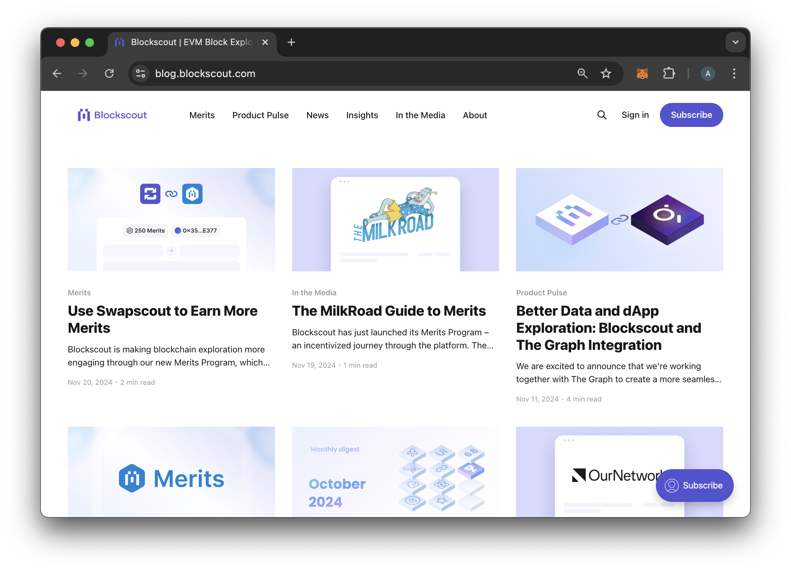

# Newsletter & Blog

The Blockscout Newsletter is sent out monthly. It includes information on updates, new chains, integrations and other related information. If you use the My Account feature on Blockscout, an email newsletter subscription is automatically enabled when you sign up. You can unsubscribe at any time by clicking the unsubscribe link at the bottom of the email.&#x20;

You can also [subscribe to receive the newsletter](https://www.blog.blockscout.com/).

Past newsletters are available on the [Blockscout Blog](https://www.blog.blockscout.com/). If you have anything you'd like to see featured in our newsletters, please [let us know](https://www.blockscout.com/#contact-us)!

<figure><figcaption></figcaption></figure>

