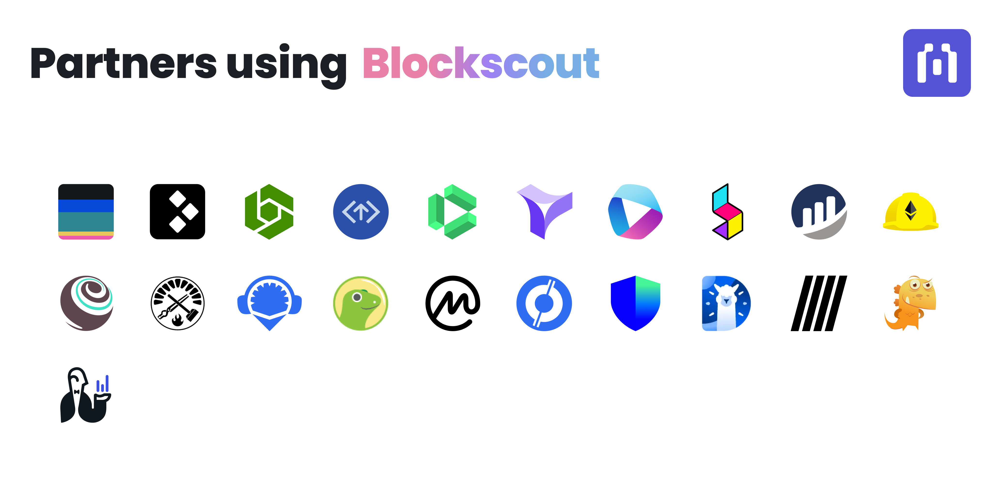
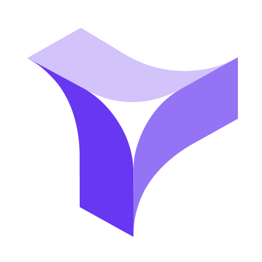
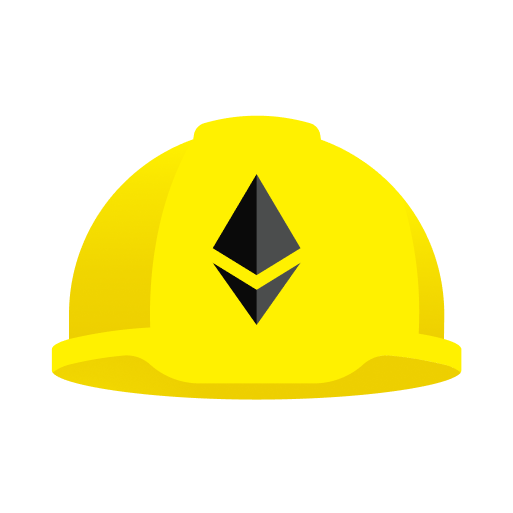
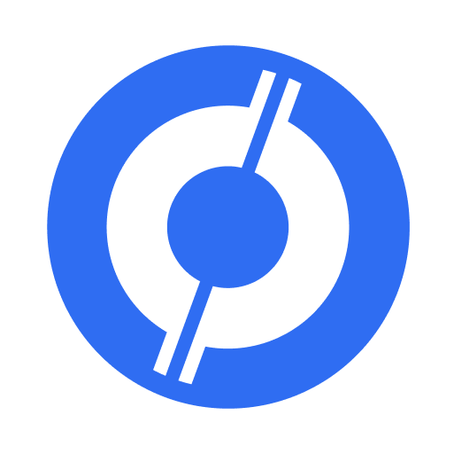

# Partners & Integrations

<figure><figcaption></figcaption></figure>

Blockscout features many 3rd party integrations. Additional services are also integrating Blockscout, including many [Rollup-as-a-Service (RaaS) providers](raas-providers.md).

## Blockscout Partners&#x20;

Partners provide vital data, infrastructure, and contract support to Blockscout.&#x20;

<table><thead><tr><th width="141"> </th><th> </th></tr></thead><tbody><tr><td></td><td><a href="https://blocksec.com/metadock"><strong>Blocksec / Metadock</strong></a> - Blocksec's address labelling service provides comprehesive information and compliance scores for addresses based on behavior.</td></tr><tr><td></td><td><a href="https://sourcify.dev/"><strong>Sourcify</strong></a> gives developers the option to verify contracts via the Sourcify API with Blockscout. Contracts verified through Sourcify will display this information on the verified contracts page. <a href="../../for-users/verifying-a-smart-contract/contracts-verification-via-sourcify.md">Learn more</a>.</td></tr><tr><td></td><td><a href="https://drpc.org/?ref=559183"><strong>DPRC</strong></a> is a decentralized Web3 infrastructure provider with focus on resilience and latency. DPRC provides RPC services for a number of Blockscout hosted instances.</td></tr></tbody></table>

## Tools and Linked Explorers

Blockscout links to relevant, useful tools related to specific transactions and contracts. We also provide links to additional blockchain explorers for verification and transparency on hosted instances. Self-hosted instances can choose which additional explorers to link with using [front-end ENVs](https://github.com/blockscout/frontend/blob/main/docs/ENVS.md) during deployment.

<table><thead><tr><th width="133"> </th><th> </th></tr></thead><tbody><tr><td></td><td><a href="https://tenderly.co/"><strong>Tenderly</strong></a> is an all-in-one Web3 development platform. It is extremely useful for transaction simulation and smart contract development. Blockscout provides a link to transactions for viewing additional detailed information on the Tenderly platform.  </td></tr><tr><td></td><td><a href="https://www.sentio.xyz/"><strong>Sentio</strong></a> is a monitoring, alerting, log management and debugging service for blockchains. Blockscout provides a link to the Sentio explorer for users who need to find advanced analytics about a particular transaction or contract, and read/search/write/fix code faster!</td></tr><tr><td></td><td><a href="https://blockchair.com/"><strong>Blockchair</strong></a> block explorer indexes data for 18 blockchains. When available, Blockscout provides a link to Blockchair for transactions, addresses, and more so users can verify and double-check data accuracy.</td></tr><tr><td></td><td><a href="https://etherscan.io/"><strong>Etherscan</strong></a> explorer is available for large chains and provides a comprehensive data source. When available, Blockscout provides a link to Etherscan so users may double check and verify transactions on multiple explorers. </td></tr><tr><td></td><td><a href="https://0xppl.com/"><strong>0xPPL</strong></a> offers social search as well as transaction information, providing a connection between on and off chain data.  When available, Blockscout provides a link to 0xPPL for transactions, addresses, and more so users can verify and find additional information.</td></tr><tr><td></td><td><a href="https://3xpl.com/"><strong>3xpl</strong></a> is a fast, universal explorer for most popular public blockchains. When available, Blockscout provides a link to 3xpl for data verification.</td></tr></tbody></table>

## Contract Verification

Contract verification integrations make it easier to verify contracts from a variety of development environments and bring in additional verified contact information.

<table><thead><tr><th width="125"> </th><th></th></tr></thead><tbody><tr><td></td><td><a href="https://hardhat.org/"><strong>Hardhat</strong></a> is a popular Ethereum development environment. Contracts can be deployed and verified on Blockscout using the verification plugin. <a href="../../for-users/verifying-a-smart-contract/hardhat-verification-plugin.md">Learn more</a>.</td></tr><tr><td></td><td><a href="https://trufflesuite.com/"><strong>Truffle</strong></a> provides a comprehensive suite of tools for smart contract development. Contracts can be verified using  truffle-plugin-verify. <a href="../../for-users/verifying-a-smart-contract/openzeppelin-contract-verification.md#truffle">Learn more</a>.</td></tr><tr><td></td><td><a href="https://github.com/foundry-rs/foundry/"><strong>Foundry</strong></a> is a smart contract development toolchain and Forge is a command-line tool that ships with Foundry that supports contract verification with Blockscout. <a href="../../for-users/verifying-a-smart-contract/openzeppelin-contract-verification.md#foundry-forge">Learn More</a>.</td></tr><tr><td></td><td><a href="https://remix-project.org/"><strong>Remix</strong> </a>is a simple no-setup tool with a GUI for developing smart contracts. The Flattener plugin can be used to verify contracts in Blockscout. <a href="../../for-users/verifying-a-smart-contract/openzeppelin-contract-verification.md#remix">Learn More</a>.</td></tr></tbody></table>

## Tokens and TVL

Feeds can be sourced from several options to provide the latest up-to-date token information. These options are set through [application ENVs](../../for-developers/information-and-settings/env-variables.md) during deployment.

<table><thead><tr><th width="126"> </th><th> </th></tr></thead><tbody><tr><td>

</td><td><a href="https://www.coingecko.com/"><strong>CoinGecko</strong> </a>is a source for token prices and market cap information using the e CoinGecko API. CoinGecko is a leading application which provides price tracking, volume and market capitalisation, community growth, and open-source code development.</td></tr><tr><td></td><td><a href="https://coinmarketcap.com/"><strong>CoinMarketCap</strong></a> is a source for token prices and market cap information using the CoinMarketCap API. CoinMarketCap is a popular price-tracking website for cryptoassets.</td></tr><tr><td></td><td><a href="https://coincompare.eu/"><strong>CoinCompare</strong></a> is a source for token prices using the CoinCompare API. CoinCompare is a real-time crypto price tracker and comparator.</td></tr><tr><td></td><td><a href="https://trustwallet.com/"><strong>Trust Wallet</strong></a> is a source for token icon information. Trust Wallet is a leading self-custody multi-chain platform, we support millions of assets across 100+ blockchains.</td></tr><tr><td></td><td><a href="https://defillama.com/"><strong>DeFiLlama</strong></a> is a source for TVL information through the API integration. DeFiLlama is a DeFi TVL aggregator providing accurate and transparent data.</td></tr></tbody></table>

## Ad Providers

Ad providers can be selected to bring relevant, web3 based ads based on the network where Blockscout is deployed. Ad options are set using [front-end ENVs](https://github.com/blockscout/frontend/blob/main/docs/ENVS.md) during deployment.

<table><thead><tr><th width="124"></th><th></th></tr></thead><tbody><tr><td></td><td><a href="https://www.slise.xyz/"><strong>Slise</strong></a> specializes in web3 ads for users featuring transparent data usage and no tracking. It is the default ad network for hosted chains.</td></tr><tr><td></td><td><a href="https://coinzilla.com/"><strong>Coinzilla</strong></a> is a large ad network for crypto-relevant content and are well-established in the blockchain space.</td></tr><tr><td></td><td><a href="https://www.adbutler.com/"><strong>Adbutler</strong></a> provides ads for many different types of industries and users, and can be a good option for instances that serve diverse user bases.</td></tr></tbody></table>

