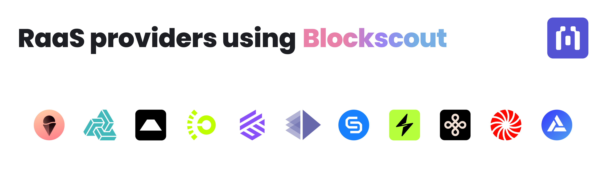
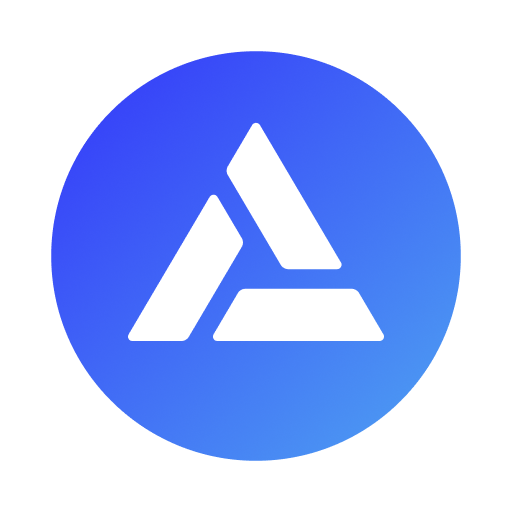

# RaaS Providers

<figure><figcaption></figcaption></figure>

Many Rollup-as-a-Service providers are using Blockscout as the default explorer for their instances. Once deployed, Blockscout can provide explorer support services when rollups want to customize or augment their explorers.&#x20;

Each RaaS has their own processes and specializations including zkRollups or opRollups optimized for different environments. If you have questions about which RaaS to choose, or need customizations for your RaaS Blockscout instance, [please contact us and we can direct you to the best option for your chain](https://www.blockscout.com/#contact-us).

<table data-header-hidden><thead><tr><th width="160" align="right"> </th><th> </th></tr></thead><tbody><tr><td align="right"></td><td><a href="https://www.gelato.network/"><strong>Gelato</strong></a>: Gelato's zkRollup as a Service Platform is fully-serviced, leverages OP, Arbitrum Orbit and Polygon zkEVM, and provides High TPS, Low Fees, and Ethereum’s Security.</td></tr><tr><td align="right"></td><td><a href="https://www.alchemy.com/"><strong>Alchemy</strong></a><strong>:</strong> Alchemy is a proven web3 infrastructure provider now offering best-in-class RaaS services for L2s and L3s.</td></tr><tr><td align="right"></td><td><a href="https://conduit.xyz/"><strong>Conduit</strong></a><strong>:</strong> Conduit's RaaS platform allows teams to scale their applications quickly and easily using production-grade OP Stack or Arbitrum Orbit rollups.</td></tr><tr><td align="right"></td><td><a href="https://caldera.xyz/"><strong>Caldera</strong></a><strong>:</strong> Caldera makes it easy to launch high-performance, customizable, and application-specific Arbitrum Orbit and OP Stack rollups.</td></tr><tr><td align="right"></td><td><a href="https://lumoz.org/?ref=blog.blockscout.com"><strong>Lumoz</strong></a>: Lumoz offers an easy-to-use, universal launchbase where anyone can quickly create a zk-rollup with several different options. <a href="https://www.blog.blockscout.com/lumoz-and-blockscout-collaborate-to-elevate-the-zk-raas-experience/">Learn More</a></td></tr><tr><td align="right"></td><td><a href="https://gateway.fm/presto/?ref=blog.blockscout.com"><strong>Presto</strong></a><strong>:</strong> Presto provides zk-Validium and zk-Rollups with instant deployment and a full suite of tools. Settle on Eth or Gnosis Chain. <a href="https://www.blog.blockscout.com/blockscout-presto-raas/">Learn More</a></td></tr><tr><td align="right"></td><td><a href="https://altlayer.io/raas"><strong>Altlayer</strong></a>: Altlayer offers a versatile rollup stack including Arbitrum Orbit, OP stack, Polygon ZKEVM and StarkWare, and support for various DA layers such as EigenLayer and Celestia.</td></tr><tr><td align="right"></td><td><a href="https://chainstack.com/"><strong>Chainstack</strong></a><strong>:</strong> Chainstack provides infrastructure services including rollup deployment.</td></tr><tr><td align="right"></td><td><a href="https://www.snapchain.dev/"><strong>Snapchain:</strong></a> Snapchain specializes in zkRollups for scaling on-chain games and DeFi applications cheaply and securely.</td></tr><tr><td align="right"></td><td><a href="https://dymension.xyz/"><strong>Dymension</strong></a>: Dymension offers app-chains called RollApps, designed for application-specific speed and efficiency.</td></tr><tr><td align="right"></td><td><a href="https://www.vistara.dev/"><strong>Vistara</strong>:</a> Vistara provides a one-click rollup deployment framework for designing and managing scalable infrastructure.</td></tr></tbody></table>

