# Projects Using Blockscout

Blockscout serves a wide range of execution-layer chains within the Ethereum ecosystem and beyond. Projects can deploy Blockscout themselves to support their chains, or use Blockscout customization and/or hosting services to supercharge their instances.


If you have an instance not listed here, [contact us](https://discord.com/invite/GePYkFuq) or [submit a PR ](https://github.com/blockscout/docs)to add your project.

[Testnet instances](projects.md#testnet-instances) are catalogued in a second table below.


|                                                                                                                                                                                                                                                                                                                                                                                                                                                                                                                                                                                                                                                                                                                                                                                                                                                                                                                                                                                                                                                                                                                                                                                                                                                                                                                                                                                                                                                                                                                                                            |
| ---------------------------------------------------------------------------------------------------------------------------------------------------------------------------------------------------------------------------------------------------------------------------------------------------------------------------------------------------------------------------------------------------------------------------------------------------------------------------------------------------------------------------------------------------------------------------------------------------------------------------------------------------------------------------------------------------------------------------------------------------------------------------------------------------------------------------------------------------------------------------------------------------------------------------------------------------------------------------------------------------------------------------------------------------------------------------------------------------------------------------------------------------------------------------------------------------------------------------------------------------------------------------------------------------------------------------------------------------------------------------------------------------------------------------------------------------------------------------------------------------------------------------------------------------------- |
| <h3>Tags Legend </h3>
In the table below, instances are tagged by network type and hosting setup. 
<ul><li><mark style="background-color:yellow;">L1</mark>: Layer 1. A primary root blockchain providing transactional security and a protocol for transaction execution. </li><li><mark style="background-color:orange;">L2</mark>: Layer 2.  A scaling solution built on top of a layer 1 solution. L2s leverage the security from the L1 while optimizing transactions. Optimistic rollups and zero-knowledge rollups are examples of L2 protocols.</li><li><mark style="background-color:red;">Canary</mark>: Canary Network. An environment for production-grade testing with real-world value. Kusama (in the Polkadot ecosystem) is the primary example. </li><li><mark style="color:green;">Testnet</mark>: Test networks, displayed in a second table below.</li><li><mark style="background-color:blue;">Hosted</mark>: The instance is hosted by the Blockscout team. Hosted instances fall under the blockscout.com domain umbrella and receive priority support and a premium feature set.</li><li><mark style="background-color:purple;">Proxy Hosted</mark>: Proxy instances are hosted by the project team and displayed on the blockscout.com domain for additional visibility and support.</li><li><mark style="background-color:green;">Self Hosted</mark>: Projects hosting their own instances of Blockscout. Many of these are self-deployed using the open-source framework and do not use the Blockscout team for </li></ul> |

### Mainnet Instances

| Blockscout Instance                                                                                                                    | Description                                                                                                                                                        |                                                                                        Tags                                                                                       |
| -------------------------------------------------------------------------------------------------------------------------------------- | ------------------------------------------------------------------------------------------------------------------------------------------------------------------ | :-------------------------------------------------------------------------------------------------------------------------------------------------------------------------------: |
| [ Ethereum ](https://blockscout.com/eth/mainnet)                    | 
Decentralized global computing platform supporting smart contracts &#x26; P2P apps. <a href="https://ethereum.org/en/">🌐 site</a>
                       |                                   
<mark style="background-color:yellow;">L1</mark> <mark style="background-color:green;">Hosted</mark>
                                  |
| [ Ethereum Classic](https://blockscout.com/etc/mainnet)          | Longest running smart contract platform running the original Ethereum protocol. [🌐 site](https://ethereumclassic.org/)                                            |                                
<mark style="background-color:yellow;">L1</mark> <mark style="background-color:green;">Proxy Hosted</mark>
                               |
| [ Celo](https://explorer.celo.org)                                      | Mobile-first, fully EVM compatible proof-of-stake protocol. [ 🌐 site](https://celo.org/)                                                                          |                                
<mark style="background-color:yellow;">L1</mark> <mark style="background-color:purple;">Self Hosted</mark>
                               |
| [ Gnosis Chain](https://blockscout.com/xdai/mainnet/) | Former xDai chain, GC is a feature-rich, user-centered blockchain ecosystem. [🌐](https://developers.gnosischain.com/) [site](https://developers.gnosischain.com/) |                                   
<mark style="background-color:yellow;">L1</mark> <mark style="background-color:green;">Hosted</mark>
                                  |
|  [Moonbeam](https://blockscout.moonbeam.network/)                   | Parachain on Polkadot with full EVM compatibility. [🌐 site](https://moonbeam.network/)                                                                            |                            
PolkaDot <mark style="background-color:yellow;">L1</mark> <mark style="background-color:green;">Self Hosted</mark>
                           |
|  [Moonriver](https://blockscout.moonriver.moonbeam.network/)       | Moonbeam sister chain on Kusama. [🌐 site](https://moonbeam.network/networks/moonriver/)                                                                           |                                
<mark style="background-color:red;">Canary</mark> <mark style="background-color:green;">Self Hosted</mark>
                               |
| [ Astar](https://blockscout.com/astar)                 | Polkadot parachain built on Substrate supporting scalable smart-contract execution. [🌐 site](https://astar.network/)                                              |                         
PolkaDot <mark style="background-color:yellow;">L1</mark> <mark style="color:blue;background-color:blue;">Hosted</mark>
                         |
| [ Shiden](https://blockscout.com/shiden)                | Astar sister network; smart contract Kusama parachain. [🌐 site](https://shiden.astar.network/)                                                                    |                             
<mark style="background-color:red;">Canary</mark> <mark style="color:blue;background-color:blue;">Hosted</mark>
                             |
| 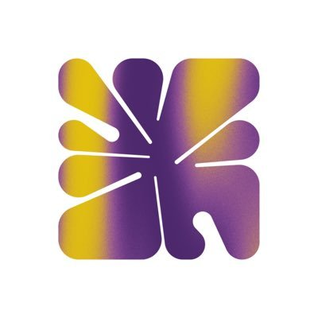 [Palm](https://explorer.palm.io/)                                     | NFT-optimized network focused on creativity & energy-efficiency. [🌐 site](https://palm.io/)                                                                       | 
<mark style="background-color:yellow;">L1</mark> with <mark style="background-color:orange;">L2</mark> roadmap <mark style="background-color:green;">Self Hosted</mark>
 |
|  [Callisto](https://explorer.callisto.network/)                    | Smart-contract ecosystem with a #1 priority focus on security. [🌐 site](https://callisto.network/)                                                                |                                
<mark style="background-color:yellow;">L1</mark> <mark style="background-color:green;">Self Hosted</mark>
                                |
|  [Cronos](https://cronos.org/explorer/)                              | Ethereum-compatible blockchain network built on Cosmos SDK technology. [🌐 site](https://cronos.org/)                                                              |                                
<mark style="background-color:yellow;">L1</mark> <mark style="background-color:green;">Self Hosted</mark>
                                |
|  [Fuse](https://explorer.fuse.io/)                                  | Decentralized payments-focused EVM platform.  [🌐 site](https://fuse.io/)                                                                                          |                                
<mark style="background-color:yellow;">L1</mark> <mark style="background-color:green;">Self Hosted</mark>
                                |
| 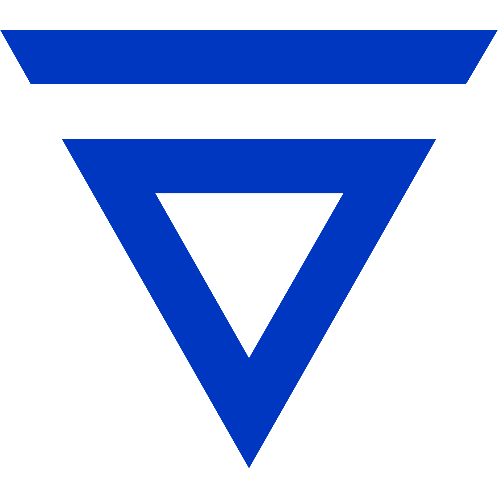 [Velas](https://evmexplorer.velas.com/)                      | Solana fork with embedded EVM integration creates a Solana (eBPF) VM and Ethereum VM hybrid. [🌐 site](https://velas.com/)                                         |                                
<mark style="background-color:yellow;">L1</mark> <mark style="background-color:green;">Self Hosted</mark>
                                |
| [Flare Songbird](https://songbird-explorer.flare.network/)            | Canary Network for the secure and Universal Flare EVM chain. [🌐 site](https://flare.xyz/)                                                                         |                                
<mark style="background-color:red;">Canary</mark> <mark style="background-color:green;">Self Hosted</mark>
                               |
| 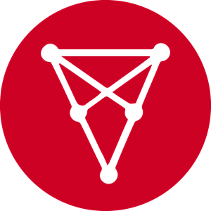 [Chiliz](https://explorer.chiliz.com/)                               | Sports, entertainment and media focused blockchain. [ 🌐 site](https://www.chiliz.com/en/)                                                                         |                                
<mark style="background-color:yellow;">L1</mark> <mark style="background-color:green;">Self Hosted</mark>
                                |
|  [LUKSO](https://blockscout.com/lukso/l14)                            | EVM blockchain based on Casper PoS geared towards the new creative economy.  [🌐 site](https://lukso.network/)                                                     |                        
<mark style="color:blue;background-color:yellow;">L1</mark> <mark style="color:blue;background-color:blue;">Hosted</mark>
                        |
| [ Acala](https://blockscout.acala.network/)                           | Decentralized finance network powering the aUSD ecosystem.                                                                                                         |                            
Polkadot <mark style="background-color:yellow;">L1</mark> <mark style="background-color:green;">Self Hosted</mark>
                           |
|  [Karura](https://blockscout.karura.network/)                      | Scalable, EVM-compatible network optimized for DeFi.                                                                                                               |                                
<mark style="background-color:red;">Canary</mark> <mark style="background-color:green;">Self Hosted</mark>
                               |
|  [KardiaChain](https://explorer.kardiachain.io/)                 | Focus on dual-node execution and cross-chain functionality. [ 🌐 site](https://www.kardiachain.io)                                                                 |                                
<mark style="background-color:yellow;">L1</mark> <mark style="background-color:green;">Self Hosted</mark>
                                |
| [Oasis](https://explorer.emerald.oasis.dev/)                           | Privacy-enabled and scalable layer-1 blockchain network.[ 🌐 site](https://oasisprotocol.org/)                                                                     |                                
<mark style="background-color:yellow;">L1</mark> <mark style="background-color:green;">Self Hosted</mark>
                                |
| [ Eluv](https://exp.contentfabric.io/)                                 | Content Fabric chain enables creators to store, stream, mint, ticket and trade all types of content. [🌐 site](https://live.eluv.io)                               |                                
<mark style="background-color:yellow;">L1</mark> <mark style="background-color:green;">Self Hosted</mark>
                                |
| [ Aurora](https://explorer.mainnet.aurora.dev/)                      | EVM implementation as a smart contract on the NEAR Protocol. [🌐 site](https://aurora.dev/)                                                                        |                              
<mark style="background-color:yellow;">NEAR L1</mark> <mark style="background-color:green;">Self Hosted</mark>
                             |
| [ Metis](https://andromeda-explorer.metis.io/)                        | The Metis Andromeda network is an L2 optimistic rollup running on Ethereum. [🌐 site](https://www.metis.io/)                                                       |                                
<mark style="background-color:orange;">L2</mark> <mark style="background-color:green;">Self Hosted</mark>
                                |
| 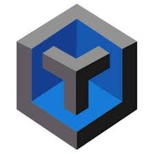 [TechPay](https://tpcscan.com/)                                    | Up to 300K/sec tx speed and compatible with both Cosmos SDK and EVM. [🌐 site](https://techpaychain.com/)                                                          |                                
<mark style="background-color:yellow;">L1</mark> <mark style="background-color:green;">Self Hosted</mark>
                                |
| 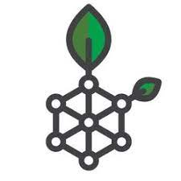[ RootStock](https://blockscout.com/rsk/mainnet)                        | in progress                                                                                                                                                        |                                                           <mark style="color:blue;background-color:blue;">Hosted</mark>                                                           |
| [ Energy Web](https://explorer.energyweb.org/)                     | Building digital operating systems for energy grids. [🌐 site](https://www.energyweb.org/)                                                                         |                                
<mark style="background-color:yellow;">L1</mark> <mark style="background-color:green;">Self Hosted</mark>
                                |
| [ KuCoin CC](https://scan.kcc.io/)                                       | Community-based network built for KuCoin users with KCS as native token. [🌐 site](https://www.kcc.io/)                                                            |                                
<mark style="background-color:yellow;">L1</mark> <mark style="background-color:green;">Self Hosted</mark>
                                |
| 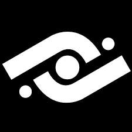[ Milkomeda](https://explorer-mainnet-cardano-evm.c1.milkomeda.com/)    | Protocol that brings EVM capabilities to non-EVM blockchains like Cardano, Solana, and Algorand. [🌐 site](https://www.milkomeda.com/)                             |                        
 Cardano <mark style="background-color:orange;">L2</mark> <mark style="background-color:green;">Self Hosted</mark> 
                        |
| [Loom](https://basechain-blockexplorer.dappchains.com/)                 | User-friendly, highly integrated chain in production since 2018.[🌐 site](https://loomx.io/)                                                                       |                                
<mark style="background-color:yellow;">L1</mark> <mark style="background-color:green;">Self Hosted</mark>
                                |
| [ Quadrans](https://explorer.quadrans.io/)                              | Sustainability-focused chain built for businesses, institutions and public organizations. [🌐 site](https://quadrans.io/)                                          |                                
<mark style="background-color:yellow;">L1</mark> <mark style="background-color:green;">Self Hosted</mark>
                                |
| 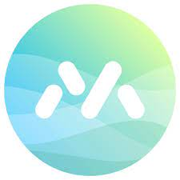[ MistSwap Sonar](https://sonar.cash/)                                | Optimized for smartBCH including LNS support. [🌐 site](https://docs.mistswap.fi/products/sonar/#what-is-sonar)                                                    |                          
Bitcoin Cash <mark style="background-color:yellow;">L1</mark> <mark style="background-color:green;">Self Hosted</mark>
                         |
| 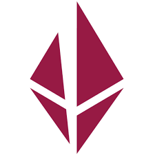[ Etho Protocol](https://explorer.ethoprotocol.com/)                    | Ethereum protocol with additional storage layer to protect content and data freedom. [🌐 site](https://ethoprotocol.com/)                                          |                                
<mark style="background-color:yellow;">L1</mark> <mark style="background-color:green;">Self Hosted</mark>
                                |
| [ Energi](https://explorer.energi.network/)                          | Security-first chain featuring speed, scalability, & dedicated cybersecurity.[ 🌐 site](https://energi.world/)                                                     |                                
<mark style="background-color:yellow;">L1</mark> <mark style="background-color:green;">Self Hosted</mark>
                                |
| [ Cloudwalk](https://explorer.mainnet.cloudwalk.io/)               | Democratizing the payments industry in Brazil with a goal to create a global payments network.  🌐[ site](https://www.cloudwalk.io/)                               |                                
<mark style="background-color:yellow;">L1</mark> <mark style="background-color:green;">Self Hosted</mark>
                                |
| [ Ekta](https://ektascan.io/)                                          | EktaChain aligns the blockchain and physical world through the tokenization of real-world assets.[ 🌐 site](https://www.ekta.io/)                                  |                                
<mark style="background-color:yellow;">L1</mark> <mark style="background-color:green;">Self Hosted</mark>
                                |
| [ Evmos](https://evm.evmos.org/)                                       | Bringing Ethereum-based applications and assets to the Cosmos ecosystem. [🌐 site](https://evmos.org/)                                                             |                             
Cosmos <mark style="background-color:yellow;">L1</mark> <mark style="background-color:green;">Self Hosted</mark>
                            |
| [ Optimism on GC](https://blockscout.com/xdai/optimism)          | Fork of Optimism running on the Gnosis Chain.[ 🌐 site](https://developers.gnosischain.com/for-developers/optimism-optimistic-rollups-on-gc)                       |                       
Gnosis Chain <mark style="background-color:orange;">L2</mark> <mark style="color:blue;background-color:blue;">Hosted</mark>
                       |
| [ Etherlite](https://explorer.etherlite.org/)                     | Scalability solution with POSDAO consensus. [🌐 site](https://etherlite.org/)                                                                                      |                                
<mark style="background-color:yellow;">L1</mark> <mark style="background-color:green;">Self Hosted</mark>
                                |
| [Shyft](https://bx.veriscope.network/)                                 | Network designed to facilitate transfer of verifiable data between centralized and decentralized ecosystems. [🌐 site](https://www.shyft.network/)                 |                                
<mark style="background-color:yellow;">L1</mark> <mark style="background-color:green;">Self Hosted</mark>
                                |
| [ Boba](https://blockexplorer.boba.network/)                            | Boba is an optimistic rollup Ethereum scaling & augmenting solution. [🌐 site](https://boba.network/)                                                              |                                
<mark style="background-color:orange;">L2</mark> <mark style="background-color:green;">Self Hosted</mark>
                                |
| [SysCoin](https://explorer.syscoin.org/)                             | Proof-of-Work blockchain, merged-mined with Bitcoin, while running a smart contract functionality layer. [🌐 site](https://syscoin.org/)                           |                                
<mark style="background-color:yellow;">L1</mark> <mark style="background-color:green;">Self Hosted</mark>
                                |
| 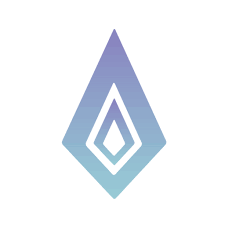[EtherGem](https://blockscout.egem.io/)                                 | EVM chain with targeted 11-13 sec block time and custom node reward system.  [🌐 site](https://egem.io/)                                                           |                                
<mark style="background-color:yellow;">L1</mark> <mark style="background-color:green;">Self Hosted</mark>
                                |
| 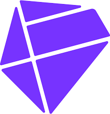[ Findora](https://evm.findorascan.io/)                              | Open, permissionless blockchain featuring programmable privacy features. [🌐 site](https://findora.org/)                                                           |                                
<mark style="background-color:yellow;">L1</mark> <mark style="background-color:green;">Self Hosted</mark>
                                |
| 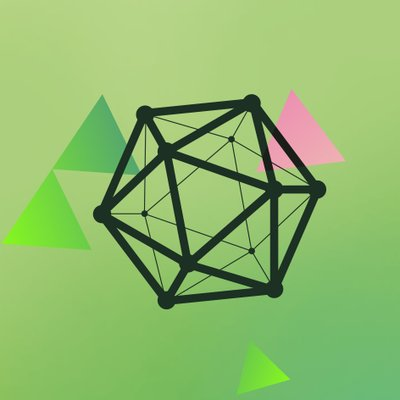[ ARTIS](https://blockscout.com/artis/sigma1)                         | in progress                                                                                                                                                        |                                                              <mark style="background-color:green;">Self Hosted</mark>                                                             |
| [ Atheios](https://explorer.atheios.org/)                            | Pow platform emphasizing on-chain video game development. [🌐 site](https://www.atheios.org/)                                                                      |                                
<mark style="background-color:yellow;">L1</mark> <mark style="background-color:green;">Self Hosted</mark>
                                |
| 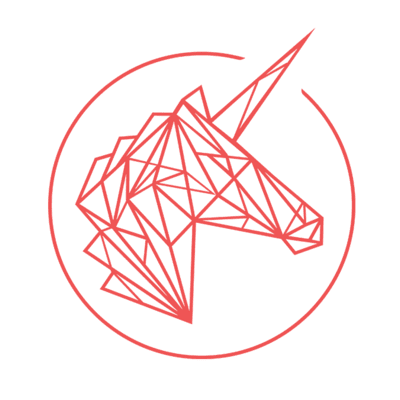[Trustlines](https://explore.tlbc.trustlines.foundation/)        | Community-driven project that empowers people to create their own money. [🌐 site](https://trustlines.network/)                                                    |                                
<mark style="background-color:yellow;">L1</mark> <mark style="background-color:green;">Self Hosted</mark>
                                |
| [ EraSwap](https://eraswap.info/)                                   | A decentralized chain for scalability, speed & low-cost transactions. [🌐 site](https://eraswap.life/)                                                             |                                
<mark style="background-color:yellow;">L1</mark> <mark style="background-color:green;">Self Hosted</mark>
                                |
| [Elastos](https://eth.elastos.io/)                                   | Smart contract sidechain leveraging a DPoS consensus mechanism. [🌐 site](https://www.elastos.org/)                                                                |                                
<mark style="background-color:yellow;">L1</mark> <mark style="background-color:green;">Self Hosted</mark>
                                |
| [Polis](https://explorer.polis.tech/)                                  | Community-driven sidechain promoting  cryptocurrency as a payment model. [🌐 site](https://www.polis.tech/)                                                        |                                
<mark style="background-color:yellow;">L1</mark> <mark style="background-color:green;">Self Hosted</mark>
                                |
| [ Rei Network](https://reiscan.com/)                                    | Light weight, Ethereum compatible, high performance, no fee blockchain framework. [🌐 site](https://www.rei.network/)                                              |                                
<mark style="background-color:yellow;">L1</mark> <mark style="background-color:green;">Self Hosted</mark>
                                |
| [NervosDAO](https://gw-mainnet-explorer.nervosdao.community/)        | in progress                                                                                                                                                        |                                
<mark style="background-color:yellow;">L1</mark> <mark style="background-color:green;">Self Hosted</mark>
                                |
| [INT](https://blockscout.explorer.intchain.io/)                          | in progress                                                                                                                                                        |                                
<mark style="background-color:yellow;">L1</mark> <mark style="background-color:green;">Self Hosted</mark>
                                |
| 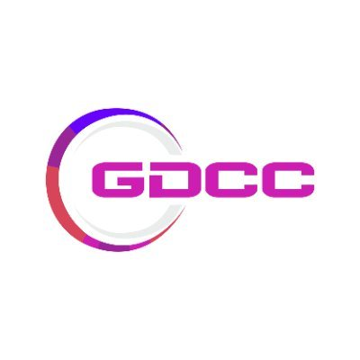[GDCC](https://www.gdccscan.io/)                                       | in progress                                                                                                                                                        |                                
<mark style="background-color:yellow;">L1</mark> <mark style="background-color:green;">Self Hosted</mark>
                                |
| 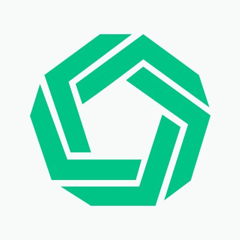[Morpher](https://scan.morpher.com/)                                | in progress                                                                                                                                                        |                                
<mark style="background-color:yellow;">L1</mark> <mark style="background-color:green;">Self Hosted</mark>
                                |
| [POA](https://blockscout.com/poa/core)                               | Proof of Authority network originally built for scalability. Now merged with the Gnosis Chain Ecosystem. [🌐 site](https://www.poa.network/)                       |                       
Gnosis Chain <mark style="background-color:yellow;">L1</mark> <mark style="color:blue;background-color:blue;">Hosted</mark>
                       |
| [Mitgate](https://explorer.mitgate.com/)                             | in progress                                                                                                                                                        |                                
<mark style="background-color:yellow;">L1</mark> <mark style="background-color:green;">Self Hosted</mark>
                                |

### <mark style="color:green;">Testnet Instances</mark>

| 
<a href="https://blockscout.com/etc/mordor">Mordor</a> (Eth Classic) <mark style="background-color:purple;">Proxy Hosted</mark>
 | 
<a href="https://blockscout.com/etc/kotti">Kotti</a> (Eth Classic) <mark style="background-color:purple;">Proxy Hosted</mark>
 | 
<a href="https://blockscout.com/shibuya">Shibuya</a>  (Astar) <mark style="color:blue;background-color:blue;">Hosted</mark>
 |
| :------------------------------------------------------------------------------------------------------------------------------------------: | :----------------------------------------------------------------------------------------------------------------------------------------: | :--------------------------------------------------------------------------------------------------------------------------------------: |
|                               
<a href="https://volta-explorer.energyweb.org/">Volta</a> (Energy Web)
                               |                              
<a href="https://blockscout.mandala.acala.network/">Mandala</a> (Acala)
                             |                            
<a href="https://baklava-blockscout.celo-testnet.org/">Baklava </a>(Celo)
                           |
|                       
<a href="https://alfajores-blockscout.celo-testnet.org/">Alphajores Testnet</a> (Celo)
                       |                                
<a href="https://zksync2-testnet.zkscan.io">zkSync_v2</a> (zkSync)
                                |                  
<a href="https://moonbase-blockscout.testnet.moonbeam.network/">Moonbase Alpha</a> (Moonbeam)
                 |
|    
<a href="ttps://blockscout.com/poa/sokol">Sokol</a> (POA/GC) <mark style="color:blue;background-color:blue;">Hosted</mark>
   |                                   
<a href="https://scout.agung.peaq.network/">Agung</a> (Peaq)
                                   |                                     
<a href="https://tanenbaum.io/">Tanenbaum</a> (SysCoin)
                                    |
|                                  
<a href="https://explorer.testnet.aurora.dev/">Aurora</a> Testnet
                                 |                               
<a href="https://explorer.testnet.quadrans.io/">Quadrans </a> Testnet
                              |                            
<a href="https://scan.v2b.testnet.pulsechain.com/">Pulsechain</a> Testnet
                           |
|                              
<a href="https://evm-testnet.venidiumexplorer.com/">Venidium</a> Testnet
                              |                                      
<a href="https://testnet.indoscan.io/">Indo</a> Testnet
                                     |                                     
<a href="https://testnet.sonar.cash/">Sonar</a> Testnet
                                    |
|                                          
<a href="https://aiaxscan.com/">Aiax</a> Testnet
                                          |                            
<a href="https://testnet-fxscan.functionx.io/">FX Testnet</a>  (Function X)
                           |                              
<a href="https://scoville-explorer.chiliz.com/">Scoville</a> (Chiliz)
                             |

