# Chains & Projects Using Blockscout

Blockscout serves execution-layer chains and testnets within the Ethereum ecosystem and beyond. Open-source code gives all types of projects and chains the ability to spin up an instance and provide data exploration capabilities for their users.

Projects can choose to deploy Blockscout themselves or use customization and hosting services for their instances.

### ⭐️ 13+ Ecosystems ⭐️ 260+ Networks, Rollups, and Testnets

<figure><figcaption></figcaption></figure>


If you have an instance not listed here, [contact us](https://discord.gg/blockscout) or [submit a PR ](https://github.com/blockscout/docs)to add your project. Chain compatibility is considered when categorizing Blockscout instances.

Categories:

* [**Ethereum** Ecosystem L1: High Usage Chains](projects.md#ethereum-ecosystem-l1-tier-1-high-usage-chains)
* [**Polygon** Ecosystem](projects.md#undefined)
* [**Optimism** Ecosystem](projects.md#optimism-ecosystem)
* [Additional Ethereum **L2s & Rollups**](projects.md#ethereum-l2-and-rollups-ecosystem)
* [**Polkadot** Ecosystem](projects.md#polkadot-ecosystem)
* [**Cosmos** Ecosystem](projects.md#cosmos-ecosystem)
* [**Bitcoin/BCH** Merged Mining / AuxPOW](projects.md#bitcoin-bch-merged-mining-auxpow)
* [**Near** Ecosystem](projects.md#near-ecosystem)
* [**Solana** Ecosystem](projects.md#solana-ecosystem)
* [**Cardano** Ecosystem](projects.md#cardano-ecosystem)
* [**Avalanche** Ecosystem](projects.md#avalanche-ecosystem)
* [**Binance Smart Chain** Ecosystem](projects.md#binance-smart-chain)
* [**Ethereum** Greater Ecosystem L1: Mid Range Usage](projects.md#ethereum-ecosystem-l1-tier-2-mid-to-low-range-usage)
* [**Testnets** (all ecosystems)](projects.md#testnet-instances)


|                                                                                                                                                                                                                                                                                                                                                                                                                                                                                                                                                                                                                                                                                                                                                                                                                                                                                                                         |
| ----------------------------------------------------------------------------------------------------------------------------------------------------------------------------------------------------------------------------------------------------------------------------------------------------------------------------------------------------------------------------------------------------------------------------------------------------------------------------------------------------------------------------------------------------------------------------------------------------------------------------------------------------------------------------------------------------------------------------------------------------------------------------------------------------------------------------------------------------------------------------------------------------------------------- |
| 
<strong>Tags Legend</strong>

In the tables below, instances are tagged by network type and hosting setup.
<ul><li><mark style="background-color:green;">Hosted by Blockscout:</mark> The instance is hosted by the Blockscout team. Hosted instances fall under the blockscout.com domain umbrella and receive priority support and a premium feature set.</li><li><mark style="background-color:purple;">Proxy Hosted</mark>: Proxy instances are hosted by the project team and displayed on the blockscout.com domain for additional visibility and support.</li><li><mark style="background-color:blue;">Self Hosted</mark>: Projects hosting their own instances of Blockscout. Many of these are self-deployed using the open-source framework without any assistance from Blockscout.</li><li><mark style="color:green;">Testnet</mark>: Test networks, displayed in a second table below.</li></ul> |

### Ethereum Ecosystem L1: High Usage Chains

<table><thead><tr><th width="58" align="right"> </th><th width="198">Blockscout Instance</th><th>Description</th></tr></thead><tbody><tr><td align="right"></td><td><a href="https://blockscout.com/eth/mainnet">Ethereum</a></td><td>Decentralized global computing platform supporting smart contracts &#x26; P2P apps. <mark style="background-color:green;">Hosted by Blockscout</mark><a href="https://ethereum.org/en/"> 🌐 site</a></td></tr><tr><td align="right">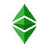</td><td><a href="https://blockscout.com/etc/mainnet">Ethereum Classic</a></td><td>Longest running smart contract platform running the original Ethereum protocol. <mark style="background-color:purple;">Proxy Hosted</mark> <a href="https://ethereumclassic.org/">🌐 site</a></td></tr><tr><td align="right"></td><td><a href="https://explorer.celo.org">Celo</a></td><td>Mobile-first, fully EVM compatible proof-of-stake protocol. <mark style="background-color:blue;">Self Hosted</mark> <a href="https://celo.org/">🌐 site</a></td></tr><tr><td align="right"></td><td><a href="https://blockscout.com/xdai/mainnet/">Gnosis Chain</a></td><td>Former xDai chain, GC is a feature-rich, user-centered blockchain ecosystem. <mark style="background-color:green;">Hosted by Blockscout</mark> <a href="https://developers.gnosischain.com/">🌐</a> <a href="https://developers.gnosischain.com/">site</a></td></tr><tr><td align="right"></td><td><a href="https://explorer.chiliz.com/">Chiliz</a></td><td>Sports, entertainment, and media focused blockchain. <mark style="background-color:blue;">Self Hosted</mark> <a href="https://www.chiliz.com/en/">🌐 site</a></td></tr><tr><td align="right"></td><td><a href="https://explorer.callisto.network/">Callisto</a></td><td>Smart-contract ecosystem with a #1 priority focus on security. <mark style="background-color:blue;">Self Hosted</mark> <a href="https://callisto.network/">🌐 site</a></td></tr><tr><td align="right">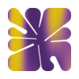</td><td><a href="https://explorer.palm.io/">Palm</a></td><td>NFT-optimized network focused on creativity &#x26; energy-efficiency. <mark style="background-color:blue;">Self Hosted</mark> <a href="https://palm.io/">🌐 site</a></td></tr><tr><td align="right"></td><td><a href="https://explorer.fuse.io/">Fuse</a></td><td>Decentralized payments-focused EVM platform. <mark style="background-color:green;">Hosted by Blockscout</mark> <a href="https://fuse.io/">🌐 site</a></td></tr><tr><td align="right"></td><td><a href="https://songbird-explorer.flare.network/">Flare Networks</a></td><td>Networks for the secure and Universal Flare EVM chain. <mark style="background-color:blue;">Self Hosted</mark> <a href="https://flare.xyz/">🌐 site</a></td></tr><tr><td align="right"></td><td><a href="https://elated-tan-skat.explorer.mainnet.skalenodes.com/">Skale</a></td><td>Multichain network composed of an unlimited number high-performance Ethereum Blockchains. <mark style="background-color:blue;">Self Hosted</mark> <a href="https://skale.network/">🌐 site</a></td></tr><tr><td align="right"></td><td><a href="https://explorer.emerald.oasis.dev/">Oasis</a></td><td>Privacy-enabled and scalable layer-1 blockchain network. <mark style="background-color:blue;">Self Hosted</mark><a href="https://oasisprotocol.org/"> 🌐 site</a></td></tr><tr><td align="right"></td><td><a href="https://explorer.mainnet.cloudwalk.io/">Cloudwalk</a></td><td>Democratizing the payments industry in Brazil with a goal to create a global payments network. <mark style="background-color:blue;">Self Hosted</mark> 🌐<a href="https://www.cloudwalk.io/"> site</a></td></tr></tbody></table>

### Polygon Ecosystem

Polygon is currently using Blockscout for testing zkEVM, Polygon Edge and Polygon Supernets instances. Look for more instances in the future as projects onboard to Polygon infra.

<table><thead><tr><th width="61" align="right"> </th><th width="192">Blockscout Instance</th><th>Description</th></tr></thead><tbody><tr><td align="right"></td><td><a href="https://polygon.blockscout.com/">Polygon PoS</a></td><td>Polygon mainnet explorer. <mark style="background-color:green;">Hosted by Blockscout</mark> <a href="https://polygon.technology/">🌐 site</a></td></tr><tr><td align="right"></td><td><a href="https://explorer.mainnet.zkevm-test.net/">Polygon zkEVM</a></td><td>Testnet for the publicly available zkEVM. Additional private instances are in queue. <mark style="background-color:blue;">Self Hosted</mark> <a href="https://polygon.technology/solutions/polygon-zkevm">🌐 site</a></td></tr><tr><td align="right"></td><td><a href="https://explorer.sx.technology/">SX Network</a></td><td>SX Network is a L2 blockchain built on Polygon Edge. Scaling betting, DeFi, and NFT applications. <mark style="background-color:blue;">Self Hosted</mark> <a href="https://sx.technology/">🌐 site</a></td></tr><tr><td align="right">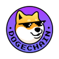</td><td><a href="https://explorer.dogechain.dog/">DogeChain</a></td><td>A chain for Dogecoin holders built with the Polygon Edge framework. <mark style="background-color:blue;">Self Hosted</mark> <a href="https://dogechain.dog/">🌐 site</a></td></tr><tr><td align="right"></td><td><a href="https://blockscout.pooscan.co/">PooChain</a></td><td>Blockchain built for the meme token market on Polygon Edge <mark style="background-color:blue;">Self Hosted</mark> <a href="https://www.poochain.co/">🌐 site</a></td></tr><tr><td align="right"></td><td><a href="https://explorer.chainers.io/">Chainers</a></td><td>Next-gen NFT metagame for web 3.0 funseekers running on Polygon. <mark style="background-color:blue;">Self Hosted</mark> <a href="https://chainers.io/">🌐 site</a></td></tr></tbody></table>

### Optimism Ecosystem

We are working with Optimism to create a robust explorer infrastructure to support OP chains. Additional instances are in progress.

<table><thead><tr><th width="65.13584637268848" align="right"> </th><th width="197">Blockscout Instance</th><th>Description</th></tr></thead><tbody><tr><td align="right"></td><td><a href="https://optimism.blockscout.com/">Optimism Mainnet</a></td><td>OP mainnet instance featuring Blockscout Portal. <mark style="background-color:green;">Hosted by Blockscout</mark> <a href="https://www.optimism.io/">🌐 site</a></td></tr><tr><td align="right"></td><td><a href="https://blockscout.com/optimism/bedrock-beta">Bedrock Beta</a></td><td>OP testnet with 2 second block times and customized theming. <mark style="background-color:green;">Hosted by Blockscout</mark> <a href="https://www.optimism.io/">🌐 site</a></td></tr><tr><td align="right"></td><td><a href="https://optimism-sepolia.blockscout.com/">OP Sepolia</a></td><td>Latest OP testnet <mark style="background-color:green;">Hosted by Blockscout</mark> <a href="https://www.optimism.io/">🌐 site</a></td></tr><tr><td align="right"></td><td><a href="https://blockscout.com/optimism/goerli">Goerli Testnet</a></td><td>A second testnet with batches sent to the Goerli network. <mark style="background-color:green;">Hosted by Blockscout</mark> <a href="https://www.optimism.io/">🌐 site</a></td></tr><tr><td align="right"></td><td><a href="https://blockscout.com/optimism/opcraft/">OPCraft</a></td><td>OPCraft beta. OPCraft brings generated minecraft inspired worlds to the blockchain. <mark style="background-color:green;">Hosted by Blockscout</mark> <a href="https://www.optimism.io/">🌐 site</a></td></tr></tbody></table>

### Additional L2s & Rollups

<table><thead><tr><th width="67.69257950530034"> </th><th width="195">Blockscout Instance</th><th>Description</th></tr></thead><tbody><tr><td></td><td><a href="https://base.blockscout.com/">Base</a></td><td>Base is a secure, low-cost, builder-friendly Ethereum L2 built to bring the next billion users onchain. <mark style="background-color:green;">Hosted by Blockscout</mark> <a href="https://base.org/">🌐 site</a></td></tr><tr><td></td><td><a href="https://puppyscan.shib.io/">Shibarium</a></td><td>Shiba Inu's L2 blockchain featuring low cost, fast, and powerful technology. <mark style="background-color:green;">Hosted by Blockscout</mark> <a href="https://docs.shibariumtech.com/shibarium/">🌐 site</a></td></tr><tr><td></td><td><a href="https://phoenix.lightlink.io/">Lightlink</a></td><td>L2 secured by Ethereum, purposefully built for Metaverse, NFT and Gaming applications. <mark style="background-color:green;">Hosted by Blockscout</mark> <a href="https://www.lightlink.io/">🌐 site</a></td></tr><tr><td></td><td><a href="https://explorer.publicgoods.network/">PGN</a></td><td>PGN is both a digital schelling point and the world’s first L2 that works to create durable and recurring funding for public goods. <mark style="background-color:blue;">Self Hosted</mark> <a href="https://explorer.publicgoods.network/">🌐 site</a></td></tr><tr><td></td><td><a href="https://nova-explorer.arbitrum.io/">Arbitrum Nova</a></td><td>Committee-based chain with rollup fallback designed for social applications and gaming and built using <a href="https://medium.com/offchainlabs/introducing-anytrust-chains-cheaper-faster-l2-chains-with-minimal-trust-assumptions-31def59eb8d7">Arbitrum AnyTrust</a>. <mark style="background-color:blue;">Self Hosted</mark> <a href="https://offchainlabs.com/">🌐 site</a></td></tr><tr><td></td><td><a href="https://andromeda-explorer.metis.io/">Metis</a></td><td>The Metis Andromeda network is an L2 optimistic rollup running on Ethereum. <mark style="background-color:blue;">Self Hosted</mark> <a href="https://www.metis.io/">🌐 site</a></td></tr><tr><td></td><td><a href="https://explorer.nahmii.io/">Nahmii</a></td><td>Rollup with high throughput, low latency and instant finality. <mark style="background-color:blue;">Self Hosted</mark> <a href="https://nahmii.io/">🌐 site</a></td></tr><tr><td></td><td><a href="https://blockscout.scroll.io/">Scroll</a></td><td>A native zkEVM Layer 2 Solution for Ethereum. <mark style="background-color:blue;">Self Hosted</mark> <a href="https://scroll.io/">🌐 site</a></td></tr><tr><td></td><td><a href="https://explorer.gton.network/">Gton Capital</a></td><td>Community Governed BSC Rollup Protocol with a native, multi-collateral stablecoin. <mark style="background-color:blue;">Self Hosted</mark> <a href="https://gton.capital/">🌐 site</a></td></tr><tr><td></td><td><a href="https://www.autobahn.network/">Autobahn Network</a></td><td>Layer 2 Rollup on the BSC. <mark style="background-color:blue;">Self Hosted</mark> <a href="https://www.autobahn.network/">🌐 site</a></td></tr><tr><td></td><td><a href="https://explorer.zora.energy/">Zora Network</a></td><td>Fast, cost-efficient, and scalable Layer 2 built to help bring media onchain, built on the OP Stack. <mark style="background-color:blue;">Self Hosted</mark> <a href="https://zora.co/">🌐 site</a></td></tr></tbody></table>

### Polkadot Ecosystem

<table><thead><tr><th width="64.26615705350937" align="right"> </th><th width="202">Blockscout Instance</th><th>Description</th></tr></thead><tbody><tr><td align="right"></td><td><a href="https://blockscout.moonbeam.network/">Moonbeam</a></td><td>Parachain on Polkadot with full EVM compatibility. <mark style="background-color:blue;">Self Hosted</mark> <a href="https://moonbeam.network/">🌐 site</a></td></tr><tr><td align="right"></td><td><a href="https://blockscout.moonriver.moonbeam.network/">Moonriver</a></td><td>Moonbeam sister chain on Kusama. <mark style="background-color:blue;">Self Hosted</mark> <a href="https://moonbeam.network/networks/moonriver/">🌐 site</a></td></tr><tr><td align="right"></td><td><a href="https://blockscout.com/astar">Astar</a></td><td>Polkadot parachain built on Substrate supporting scalable smart-contract execution. <mark style="background-color:green;">Hosted by Blockscout</mark> <a href="https://astar.network/">🌐 site</a></td></tr><tr><td align="right"></td><td><a href="https://blockscout.com/shiden">Shiden</a></td><td>Astar sister network; smart contract Kusama parachain. <mark style="background-color:green;">Hosted by Blockscout</mark> <a href="https://shiden.astar.network/">🌐 site</a></td></tr><tr><td align="right">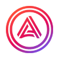</td><td><a href="https://blockscout.acala.network/">Acala</a></td><td>Decentralized finance network powering the aUSD ecosystem. <mark style="background-color:blue;">Self Hosted</mark> <a href="https://acala.network/">🌐 site</a></td></tr><tr><td align="right"></td><td><a href="https://blockscout.karura.network/">Karura</a></td><td>All-in-one DeFi platform to help you swap, borrow, lend, earn, and more – all with a micro gas fee. <mark style="background-color:blue;">Self Hosted</mark> <a href="https://acala.network/karura">🌐 site</a></td></tr><tr><td align="right"></td><td><a href="https://blockexplorer.bobabeam.boba.network/">Bobabeam</a></td><td>Boba rollup running on Moonbeam. <mark style="background-color:blue;">Self Hosted</mark> 🌐 site</td></tr><tr><td align="right"></td><td><a href="https://edgscan.live/">Edgeware</a></td><td>EdgeEVM is a Permissionless, DAO-first smart contract blockchain. <mark style="background-color:blue;">Self Hosted</mark> <a href="https://www.edgeware.io/">🌐 site</a></td></tr><tr><td align="right"></td><td><a href="https://explorer.exosama.com/">Exosama</a></td><td>NFTs on Ethereum with Polkadot composability via the <a href="https://minecraft-metaverse.moonsama.com/login">Moonsama multiverse bridge</a>. <mark style="background-color:blue;">Self Hosted</mark> <a href="https://exosama.com/">🌐 site</a></td></tr><tr><td align="right"></td><td><a href="https://explorer.mainnet.thebifrost.io/">Bitfrost</a></td><td>Built on the Substrate framework with a focus on a decentralized cross-chain channel. <mark style="background-color:blue;">Self Hosted</mark> <a href="https://thebifrost.io/">🌐 site</a></td></tr></tbody></table>

### Cosmos Ecosystem

Chains utilizing Cosmos SDK

<table><thead><tr><th width="59.45727956254271" align="right"> </th><th width="210">Blockscout Instance</th><th>Description</th></tr></thead><tbody><tr><td align="right"></td><td><a href="https://cronos.org/explorer/">Cronos</a></td><td>Ethereum-compatible blockchain network built on Cosmos SDK technology. <mark style="background-color:blue;">Self Hosted</mark> <a href="https://cronos.org/">🌐 site</a></td></tr><tr><td align="right"></td><td><a href="https://blockscout.evmos.org">Evmos</a></td><td>Bringing Ethereum-based applications and assets to the Cosmos ecosystem. <mark style="background-color:blue;">Self Hosted</mark> <a href="https://evmos.org/">🌐 site</a></td></tr><tr><td align="right"></td><td><a href="https://explorer.kava.io/">Kava</a></td><td>L1 combining Ethereum smart contract development with the interoperability of the Cosmos SDK. <mark style="background-color:blue;">Self Hosted</mark> <a href="https://www.kava.io/">🌐 site</a></td></tr><tr><td align="right">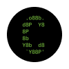</td><td><a href="https://evm.explorer.canto.io/">Canto</a></td><td>Providing core DeFi primitives to support free public infrastructure. <mark style="background-color:blue;">Self Hosted</mark> <a href="https://canto.io/">🌐 site</a></td></tr><tr><td align="right"></td><td><a href="https://tpcscan.com/">TechPay</a></td><td>Up to 300K/sec tx speed and compatible with both Cosmos SDK and EVM. <mark style="background-color:blue;">Self Hosted</mark> <a href="https://techpaychain.com/">🌐 site</a></td></tr><tr><td align="right"></td><td><a href="https://explorer.pointnetwork.io/">Point</a></td><td>Decentralized proof-of-stake chain based on Evmos technology. <mark style="background-color:blue;">Self Hosted</mark> <a href="https://pointnetwork.io/">🌐 site</a></td></tr><tr><td align="right"></td><td><a href="https://explorer.dehvo.com/">Dehvo</a></td><td>Dehvo is a high-performance, modular Layer 1 blockchain compatible with the EVM &#x26; Cosmos. <mark style="background-color:blue;">Self Hosted</mark> <a href="https://dehvo.com/">🌐 site</a></td></tr><tr><td align="right"></td><td><a href="https://l1.3ventures.io/">Genesis L1</a></td><td>Experimental Cosmos SDK and Ethereum EVM (Ethermint engine) powered blockchain. <mark style="background-color:blue;">Self Hosted</mark> <a href="https://www.3ventures.io/">🌐 site</a></td></tr></tbody></table>

### Bitcoin/BCH Merged Mining / AuxPOW

<table><thead><tr><th width="60" align="right"> </th><th width="218">Blockscout Instance</th><th>Description</th></tr></thead><tbody><tr><td align="right"></td><td><a href="https://blockscout.com/rsk/mainnet">RootStock</a></td><td>Enables smart-contracts, near-instant payments and scalability to the Bitcoin ecosystem through merged mining. <mark style="background-color:green;">Hosted by Blockscout</mark> <a href="https://www.rsk.co/">🌐 site</a></td></tr><tr><td align="right"></td><td><a href="https://explorer.syscoin.org/">SysCoin</a></td><td>Proof-of-Work blockchain, merged-mined with Bitcoin, while running a smart contract functionality layer. <mark style="background-color:blue;">Self Hosted</mark> <a href="https://syscoin.org/">🌐 site</a></td></tr><tr><td align="right">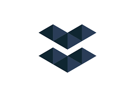</td><td><a href="https://eth.elastos.io/">Elastos</a></td><td>Smart contract sidechain leveraging a DPoS consensus mechanism. <mark style="background-color:blue;">Self Hosted</mark> <a href="https://www.elastos.org/">🌐 site</a></td></tr><tr><td align="right"></td><td><a href="https://sonar.cash/">MistSwap Sonar</a></td><td>Optimized for smartBCH including LNS support. <mark style="background-color:blue;">Self Hosted</mark> <a href="https://docs.mistswap.fi/products/sonar/#what-is-sonar">🌐 site</a></td></tr></tbody></table>

### Near Ecosystem

<table><thead><tr><th width="57" align="right"> </th><th width="220">Blockscout Instance</th><th>Description</th></tr></thead><tbody><tr><td align="right"></td><td><a href="https://explorer.mainnet.aurora.dev/">Aurora</a></td><td>EVM implementation as a smart contract on the NEAR Protocol. <mark style="background-color:blue;">Self Hosted</mark> <a href="https://aurora.dev/">🌐 site</a></td></tr></tbody></table>

### Solana Ecosystem

<table><thead><tr><th width="64" align="right"> </th><th width="223">Blockscout Instance</th><th>Description</th></tr></thead><tbody><tr><td align="right"></td><td><a href="https://neon.blockscout.com/">Neon</a></td><td>Neon is an Ethereum Virtual Machine with the scalability and liquidity of Solana. <mark style="background-color:green;">Hosted by Blockscout</mark> <a href="https://neonevm.org/">🌐 site</a></td></tr><tr><td align="right"></td><td><a href="https://evmexplorer.velas.com/">Velas</a></td><td>Solana fork with embedded EVM integration creates a Solana (eBPF) VM and Ethereum VM hybrid. <mark style="background-color:blue;">Self Hosted</mark> <a href="https://velas.com/">🌐 site</a></td></tr></tbody></table>

### Avalanche Ecosystem

<table><thead><tr><th width="61" align="right"> </th><th width="225">Blockscout Instance</th><th>Description</th></tr></thead><tbody><tr><td align="right"></td><td><a href="https://stepscan.io">Step Network</a></td><td>Fitness-centric chain powered by high throughput on an Avalanche subnet. <mark style="background-color:blue;">Self Hosted</mark> <a href="https://step.app/">🌐 site</a></td></tr><tr><td align="right"></td><td><a href="https://deeptrace.deepsquare.run/">DeepSquare</a></td><td>Decentralised and sustainable cloud ecosystem focused on High-Performance Computing and deployed on an Avalanche subnet. <mark style="background-color:blue;">Self Hosted</mark> <a href="https://deepsquare.io/">🌐 site</a></td></tr></tbody></table>

### Cardano Ecosystem

<table><thead><tr><th width="63" align="right"> </th><th width="229">Blockscout Instance</th><th>Description</th></tr></thead><tbody><tr><td align="right"></td><td><a href="https://explorer-mainnet-cardano-evm.c1.milkomeda.com/">Milkomeda</a></td><td>Protocol that brings EVM capabilities to non-EVM blockchains like Cardano, Solana, and Algorand. <mark style="background-color:blue;">Self Hosted</mark> <a href="https://www.milkomeda.com/">🌐 site</a></td></tr></tbody></table>

### Fantom Ecosystem

<table><thead><tr><th width="65" align="right"> </th><th width="228">Blockscout Instance</th><th>Description</th></tr></thead><tbody><tr><td align="right"></td><td><a href="https://tombscout.com/">TombChain</a></td><td>Fast and secure Optimistic Rollup built on Fantom. <mark style="background-color:blue;">Self Hosted</mark> <a href="https://tombchain.com/">🌐 site</a></td></tr></tbody></table>

### Binance Smart Chain

<table><thead><tr><th width="67" align="right"> </th><th width="227">Blockscout Instance</th><th>Description</th></tr></thead><tbody><tr><td align="right"></td><td><a href="https://explorer.bas.metaapesgame.com/">MetaApes</a></td><td>Dedicated BNB Application Sidechain (BAS) for the Meta Apes gaming universe. <mark style="background-color:blue;">Self Hosted</mark> <a href="https://metaapesgame.com/">🌐 site</a></td></tr></tbody></table>

## Ethereum Greater Ecosystem&#x20;

### A-F

<table><thead><tr><th width="67" align="right"> </th><th width="227">Blockscout Instance</th><th>Description</th></tr></thead><tbody><tr><td align="right">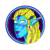</td><td><a href="https://alveyscan.com/">AlveyChain</a></td><td>VR multiverse exchange featuring 200k tx per second. <mark style="background-color:blue;">Self Hosted</mark> <a href="https://alveychain.com/">🌐 site</a></td></tr><tr><td align="right">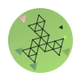</td><td><a href="https://blockscout.com/artis/sigma1">ARTIS</a></td><td>Ethereum compliant chain serving as a foundation for energy and data markets. <mark style="background-color:blue;">Self Hosted</mark> <a href="https://artis.eco/">🌐 site</a></td></tr><tr><td align="right"></td><td><a href="https://explorer.atheios.org/">Atheios</a></td><td>PoW chain emphasizing on-chain video game development. <mark style="background-color:blue;">Self Hosted</mark> <a href="https://www.atheios.org/">🌐 site</a></td></tr><tr><td align="right"></td><td><a href="https://sahara.ftnscan.com/">Bahamut Sahara Chain</a></td><td>Smart contract-enabled, open source DLT platform for all things Web3. <mark style="background-color:blue;">Self Hosted</mark> <a href="https://sahara.ftnscan.com/">🌐 site</a></td></tr><tr><td align="right"></td><td><a href="https://evm.bings.network/">Bings</a></td><td>Ecofriendly EVM blockchain running PoA consensus. <mark style="background-color:blue;">Self Hosted</mark> <a href="https://bings.network/">🌐 site</a></td></tr><tr><td align="right"></td><td><a href="https://www.bkcscan.com/">Bitcub</a></td><td>Proof of Staked Authority (PoSA) chain serving the Thai community. <mark style="background-color:blue;">Self Hosted</mark> <a href="https://www.bitkubchain.com/">🌐 site</a></td></tr><tr><td align="right"></td><td><a href="https://brisescan.com/">Bitgert</a></td><td>Blockchain with +100k TPS and zero cost gas fee. <mark style="background-color:blue;">Self Hosted</mark> <a href="https://bitgert.com/">🌐 site</a></td></tr><tr><td align="right"></td><td><a href="https://scan.camelark.com/">Camelark</a></td><td>Scaling solutions that can enhance the speed of EthereumPow. <mark style="background-color:blue;">Self Hosted</mark> <a href="https://www.camelark.com/">🌐 site</a></td></tr><tr><td align="right"></td><td><a href="https://explore.consciousdao.com/">Conscious</a></td><td>Conscious Network is a public chain infrastructure that deeply integrates AI. <mark style="background-color:blue;">Self Hosted</mark> <a href="https://consciousdao.com/home">🌐 site</a></td></tr><tr><td align="right"></td><td><a href="https://scan.crossbell.io/">Crossbell</a></td><td>Social activites platform composed of an EVM-compatible blockchain and a set of smart contracts. <mark style="background-color:blue;">Self Hosted</mark> <a href="https://crossbell.io/">🌐 site</a></td></tr><tr><td align="right"></td><td><a href="https://dynoscan.io/">Dynochain</a></td><td>PoA chain supporting short block times and lower fees. <mark style="background-color:blue;">Self Hosted</mark> <a href="https://dynochain.io/">🌐 site</a></td></tr><tr><td align="right"></td><td><a href="https://explorer.echain.network/">Echain</a></td><td>Fast, scalable &#x26; DeFi-driven Layer-1 network focused on energy efficiency and interoperability. <mark style="background-color:blue;">Self Hosted</mark> <a href="https://echain.network/">🌐 site</a></td></tr><tr><td align="right"></td><td><a href="https://ektascan.io/">Ekta</a></td><td>Aligns the blockchain and physical world through the tokenization of real-world assets.<mark style="background-color:blue;">Self Hosted</mark> <a href="https://www.ekta.io/">🌐 site</a></td></tr><tr><td align="right"></td><td><a href="https://exp.contentfabric.io/">Eluv</a></td><td>Content Fabric chain enables creators to store, stream, mint, ticket and trade all types of content. <mark style="background-color:blue;">Self Hosted</mark> <a href="https://live.eluv.io">🌐 site</a></td></tr><tr><td align="right"></td><td><a href="https://explorer.energi.network/">Energi</a></td><td>Security-first chain featuring speed, scalability, &#x26; dedicated cybersecurity. <mark style="background-color:blue;">Self Hosted</mark><a href="https://energi.world/"> 🌐 site</a></td></tr><tr><td align="right"></td><td><a href="https://explorer.energyweb.org/">Energy Web</a></td><td>Building digital operating systems for energy grids. <mark style="background-color:blue;">Self Hosted</mark> <a href="https://www.energyweb.org/">🌐 site</a></td></tr><tr><td align="right"></td><td><a href="https://eraswap.info/">EraSwap</a></td><td>A decentralized chain for scalability, speed &#x26; low-cost transactions. <mark style="background-color:blue;">Self Hosted</mark> <a href="https://eraswap.life/">🌐 site</a></td></tr><tr><td align="right">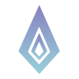</td><td><a href="https://blockscout.egem.io/">EtherGem</a></td><td>EVM chain with targeted 11-13 sec block time and custom node reward system. <mark style="background-color:blue;">Self Hosted</mark> <a href="https://egem.io/">🌐 site</a></td></tr><tr><td align="right"></td><td><a href="https://explorer.etherlite.org/">Etherlite</a></td><td>Scalability solution with POSDAO consensus. <mark style="background-color:blue;">Self Hosted</mark> <a href="https://etherlite.org/">🌐 site</a></td></tr><tr><td align="right">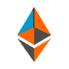</td><td><a href="https://blockscout.etherone.one/">EtherOne</a></td><td>Ethereum fork with POW consensus and initiated from block 0 following the Ethereum Merge. <mark style="background-color:blue;">Self Hosted</mark> <a href="https://etherone.one/">🌐 site</a></td></tr><tr><td align="right">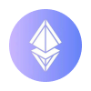</td><td><a href="https://explorer.etherfair.org/">EthereumFair</a></td><td>Ethereum post-merge fork with POW. <mark style="background-color:blue;">Self Hosted</mark> <a href="https://etherfair.org/">🌐 site</a></td></tr><tr><td align="right"></td><td><a href="https://explorer.ethoprotocol.com/">Etho Protocol</a></td><td>Ethereum protocol with additional storage layer to protect content and data freedom. <mark style="background-color:blue;">Self Hosted</mark> <a href="https://ethoprotocol.com/">🌐 site</a></td></tr><tr><td align="right"></td><td><a href="https://evm.findorascan.io/">Findora</a></td><td>Open, permissionless blockchain featuring programmable privacy features. <mark style="background-color:blue;">Self Hosted</mark> <a href="https://findora.org/">🌐 site</a></td></tr><tr><td align="right"></td><td><a href="https://fufiscan.com/">FutureFi</a></td><td>Decentralized POA blockchain with high TPS. <mark style="background-color:blue;">Self Hosted</mark> <a href="https://fufi.info/">🌐 site</a></td></tr></tbody></table>

### G-L

<table><thead><tr><th width="67" align="right"> </th><th width="227">Blockscout Instance</th><th>Description</th></tr></thead><tbody><tr><td align="right"></td><td><a href="https://www.gdccscan.io/">GDCC</a></td><td>P2P network hub for digital assets, international payments and applications. <mark style="background-color:blue;">Self Hosted</mark> <a href="https://www.gdccoin.biz/">🌐 site</a></td></tr><tr><td align="right"></td><td><a href="https://hooscan.com/">Hoo Smart Chain</a></td><td>EVM sidechain featuring POSA consensus. <mark style="background-color:blue;">Self Hosted</mark> <a href="https://github.com/hoosmartchain/hoo-smartchain">🌐 site</a></td></tr><tr><td align="right"></td><td><a href="https://hyperonscan.com/">HyperonChain</a></td><td>EVM based blockchain with Delegated Proof of Stack (DPoS) consensus. <mark style="background-color:blue;">Self Hosted</mark> <a href="https://hyperonchain.com/">🌐 site</a></td></tr><tr><td align="right"></td><td><a href="https://blockscout-bellecour.iex.ec/">iExec</a></td><td>Decentralized marketplace for computing power, datasets, and applications. <mark style="background-color:blue;">Self Hosted</mark> <a href="https://iex.ec/marketplace/">🌐 site</a></td></tr><tr><td align="right"></td><td><a href="https://blockscout.explorer.intchain.io/">INT</a></td><td>Blockchain of things (BoT) communication standard and base application platform. <mark style="background-color:blue;">Self Hosted</mark> <a href="https://intchain.io/#/">🌐 site</a></td></tr><tr><td align="right"></td><td><a href="https://blk.keeex.me/">Keeex</a></td><td>POA infrastructure chain designed for industry and cybersecurity. <mark style="background-color:blue;">Self Hosted</mark> <a href="https://keeex.me/products/#keeex-chain">🌐 site</a></td></tr><tr><td align="right"></td><td><a href="https://scan.kcc.io/">KuCoin CC</a></td><td>Community-based network built for KuCoin users with KCS as native token. <mark style="background-color:blue;">Self Hosted</mark> <a href="https://www.kcc.io/">🌐 site</a></td></tr><tr><td align="right"></td><td><a href="https://scan.lachain.io/">Lachain</a></td><td>Web3 gateway for easy asset launch &#x26; management across chains. <mark style="background-color:blue;">Self Hosted</mark> <a href="https://lachain.io/">🌐 site</a></td></tr><tr><td align="right"></td><td><a href="https://explorer.lacchain.net/">LACChain</a></td><td>General purpose permissioned public chain focused on Latin America and Caribbean blockchain ecosystems. <mark style="background-color:blue;">Self Hosted</mark> <a href="https://www.lacchain.net/">🌐 site</a></td></tr><tr><td align="right"></td><td><a href="https://explorer.libex.ai/">Libex</a></td><td>Blockchain for the Libex currency exchange. <mark style="background-color:blue;">Self Hosted</mark> <a href="https://libex.ai/">🌐 site</a></td></tr><tr><td align="right"></td><td><a href="https://basechain-blockexplorer.dappchains.com/">Loom</a></td><td>User-friendly, highly integrated chain in production since 2018. <mark style="background-color:blue;">Self Hosted</mark> <a href="https://loomx.io/">🌐 site</a></td></tr><tr><td align="right"></td><td><a href="https://explorer.mainnetloop.com/">Loop</a></td><td>EVM-compatible programmability with Proof of Stake and Authority(PoSA) consensus. <mark style="background-color:blue;">Self Hosted</mark><a href="https://www.theloopnetwork.org/">🌐 site</a></td></tr><tr><td align="right"></td><td><a href="https://explorer.lovely.finance/">Lovely</a></td><td>A system designed to unite memes with decentralized finance technology. <mark style="background-color:blue;">Self Hosted</mark> <a href="https://lovely.finance/">🌐 site</a></td></tr><tr><td align="right"></td><td><a href="https://blockscout.com/lukso/l14">LUKSO</a></td><td>EVM blockchain based on Casper PoS geared towards the new creative economy. <mark style="background-color:green;">Hosted by Blockscout</mark> <a href="https://lukso.network/">🌐 site</a></td></tr></tbody></table>

### M-Q

<table><thead><tr><th width="67" align="right"> </th><th width="227">Blockscout Instance</th><th>Description</th></tr></thead><tbody><tr><td align="right"></td><td><a href="https://explorer.mitgate.com/">Mitgate</a></td><td>High-transaction payments ecosystem designed for retail. <mark style="background-color:blue;">Self Hosted</mark> <a href="https://mitgate.com/">🌐 site</a></td></tr><tr><td align="right"></td><td><a href="https://scan.mvm.dev/">Mixin</a></td><td>EVM compatible decentralized W3 POS network managed by multiple nodes. <mark style="background-color:blue;">Self Hosted</mark> <a href="https://mvm.dev/">🌐 site</a></td></tr><tr><td align="right"></td><td><a href="https://scan.morpher.com/">Morpher</a></td><td>Stock-trading chain optimized for fast transactions - linked with Ethereum via the root hash of its Merkle Tree. <mark style="background-color:blue;">Self Hosted</mark> 🌐<a href="https://www.morpher.com/"> site</a></td></tr><tr><td align="right"></td><td><a href="https://mtvscout.com/">MultiVAC</a></td><td>Chain designed for large-scale and complex distributed applications. <mark style="background-color:blue;">Self Hosted</mark>🌐<a href="https://www.mtv.ac/"> site</a></td></tr><tr><td align="right"></td><td><a href="https://myveescan.com/">Myvee</a></td><td>Decentralized marketplace powered by blockchain. <mark style="background-color:blue;">Self Hosted</mark> <a href="https://www.myvee.io/">🌐 site</a></td></tr><tr><td align="right"></td><td><a href="https://gw-mainnet-explorer.nervosdao.community/">NervosDAO</a></td><td>NervosDAO tracks the locked CKBytes used by members to receive rewards from secondary issuance on the Nervos CKB mainnet. <mark style="background-color:blue;">Self Hosted</mark> <a href="https://docs.nervos.org/docs/basics/concepts/nervos-blockchain/">🌐 site</a></td></tr><tr><td align="right">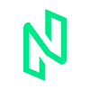</td><td><a href="https://evmscan.nuls.io/">Nuls</a></td><td>Fully compatible EVM L1 community chain. <mark style="background-color:blue;">Self Hosted</mark> <a href="https://nuls.io/enuls/">🌐 site</a></td></tr><tr><td align="right"></td><td><a href="https://scan.oasys.games/">Oasys</a></td><td>L1 &#x26; L2 Ecosystem built for GameFi. <mark style="background-color:blue;">Self Hosted</mark> <a href="https://www.oasys.games/">🌐 site</a></td></tr><tr><td align="right"></td><td><a href="https://ozonescan.io/">Ozone</a></td><td>Quantum resistant blockchain with embedded quantum security technologies included. <mark style="background-color:blue;">Self Hosted</mark> <a href="https://ozonechain.io/">🌐 site</a></td></tr><tr><td align="right"></td><td><a href="http://violins.peopledc.cn/">PeopleDC</a></td><td>Personal information protection &#x26; rights confirmation service platform. <mark style="background-color:blue;">Self Hosted</mark> <a href="https://peopledc.cn/home">🌐 site</a></td></tr><tr><td align="right"></td><td><a href="https://phiscan.com/">PHI Network</a></td><td>Decentralized social entertainment network that instantly rewards users. <mark style="background-color:blue;">Self Hosted</mark> <a href="https://phi.network/">🌐 site</a></td></tr><tr><td align="right"></td><td><a href="https://pinkscan.org/">Pinkchain</a></td><td>Layer 1 PoW Blockchain with Liquidity Mining and Staking. <mark style="background-color:blue;">Self Hosted</mark> <a href="https://pinkchain.net/">🌐 site</a></td></tr><tr><td align="right"></td><td><a href="https://scan.chain.pixie.xyz/">Pixie</a></td><td>Decentralized video and photo sharing based on crypto tokenomics. <mark style="background-color:blue;">Self Hosted</mark> <a href="https://pixie.xyz/#page3">🌐 site</a></td></tr><tr><td align="right"></td><td><a href="https://blockscout.com/poa/core">POA</a></td><td>Proof of Authority network originally built for scalability. Now merged with the Gnosis Chain Ecosystem. <mark style="background-color:green;">Hosted by Blockscout</mark> <a href="https://www.poa.network/">🌐 site</a></td></tr><tr><td align="right"></td><td><a href="https://explorer.polis.tech/">Polis</a></td><td>Community-driven sidechain promoting cryptocurrency as a payment model. <mark style="background-color:blue;">Self Hosted</mark> <a href="https://www.polis.tech/">🌐 site</a></td></tr><tr><td align="right"></td><td><a href="https://scan.poolsmobility.com/">Pools Mobility</a></td><td>Blockchain for the Pools web3 mobile phone. <mark style="background-color:blue;">Self Hosted</mark> <a href="https://www.poolsmobility.com/">🌐 site</a></td></tr><tr><td align="right"></td><td><a href="https://explorer.q.org/">Q </a></td><td>A decentralized ledger with transparency and predictability of enforceable private contracts. <mark style="background-color:blue;">Self Hosted</mark> <a href="https://explorer.q.org/">🌐 site</a></td></tr><tr><td align="right"></td><td><a href="https://evm.meerscan.io/">Qitmeer</a></td><td>High-Performance Public Blockchain Powered by the MeerDAG Consensus. <mark style="background-color:blue;">Self Hosted</mark> <a href="https://www.qitmeer.io/">🌐 site</a></td></tr><tr><td align="right"></td><td><a href="https://explorer.qiyihuo.com/">Qiyihuo</a></td><td>NFT casting, display and technology protocol. <mark style="background-color:blue;">Self Hosted</mark> <a href="https://crypts.cn/">🌐 site</a></td></tr><tr><td align="right"></td><td><a href="https://explorer.quadrans.io/">Quadrans</a></td><td>Sustainability-focused chain built for businesses, institutions and public organizations. <mark style="background-color:blue;">Self Hosted</mark> <a href="https://quadrans.io/">🌐 site</a></td></tr></tbody></table>

### R-Z

<table><thead><tr><th width="68.59657218193803" align="right"> </th><th width="228">Blockscout Instance</th><th>Description</th></tr></thead><tbody><tr><td align="right"></td><td><a href="https://exp.raicachain.com/">RaicaChain</a></td><td>NFT-focused blockchain  <mark style="background-color:blue;">Self Hosted</mark> <a href="https://exp.raicachain.com/">🌐 site</a></td></tr><tr><td align="right"></td><td><a href="https://scan.rei.network/">Rei Network</a></td><td>Light weight, Ethereum compatible, high performance, no fee blockchain framework. <mark style="background-color:blue;">Self Hosted</mark> <a href="https://www.rei.network/">🌐 site</a></td></tr><tr><td align="right"></td><td><a href="https://rikscan.com/">Rikeza</a></td><td>P2P open-source blockchain protocol offering instant, near-zero cost processing. <mark style="background-color:blue;">Self Hosted</mark> <a href="https://rikeza.io/">🌐 site</a></td></tr><tr><td align="right"></td><td><a href="https://bx.veriscope.network/">Shyft</a></td><td>Network designed to facilitate transfer of verifiable data between centralized and decentralized ecosystems. <mark style="background-color:blue;">Self Hosted</mark> <a href="https://www.shyft.network/">🌐 site</a></td></tr><tr><td align="right"></td><td><a href="https://explorer.tecra.space/">TecraSpace</a></td><td>Crypto-powered crowdfunding platform. <mark style="background-color:blue;">Self Hosted</mark> <a href="https://tecra.space/">🌐 site</a></td></tr><tr><td align="right"></td><td><a href="https://scan.tokenx.finance/">Token X</a></td><td>Cost-efficient enterprise grade POA blockchain network. <mark style="background-color:blue;">Self Hosted</mark> <a href="https://tokenx.finance/tkx-chain">🌐 site</a></td></tr><tr><td align="right"></td><td><a href="https://explore.twitterchain.net/">Twitterchain</a></td><td>Meme chain with community-driven rewards. <mark style="background-color:blue;">Self Hosted</mark> <a href="https://twitterchain.net/">🌐 site</a></td></tr><tr><td align="right"></td><td><a href="https://xanachain.xana.net/">Xana</a></td><td>Blockchain infrastructure and dApps platform built for the Metaverse. <mark style="background-color:blue;">Self Hosted</mark> <a href="https://xana.net/">🌐 site</a></td></tr><tr><td align="right"></td><td><a href="https://scan.zenithchain.co/">Zenith</a></td><td>Digital peer to peer network designed for efficient asset transfer. <mark style="background-color:blue;">Self Hosted</mark> <a href="https://scan.zenithchain.co/">🌐 site</a></td></tr></tbody></table>

### <mark style="color:green;">Testnet Instances</mark>

| 
<a href="https://eth-goerli.blockscout.com/">Ethereum Göerli</a> <mark style="color:blue;background-color:blue;">Hosted</mark> <mark style="color:green;">Testnet</mark>
                      | 
<a href="https://eth-sepolia.blockscout.com/">Ethereum Sepolia</a>

<mark style="color:blue;background-color:blue;">Hosted</mark> <mark style="color:green;">Testnet</mark>
          | 
<a href="https://base-goerli.blockscout.com/">Base Göerli</a> <mark style="color:blue;background-color:blue;">Hosted</mark> <mark style="color:green;">Testnet</mark>
               |
| ---------------------------------------------------------------------------------------------------------------------------------------------------------------------------------------------------------- | --------------------------------------------------------------------------------------------------------------------------------------------------------------------------------------------------- | ------------------------------------------------------------------------------------------------------------------------------------------------------------------------------------------------ |
| 
<a href="https://blockscout.com/etc/mordor">Mordor</a> (Eth Classic) <mark style="background-color:purple;">Proxy Hosted</mark> <mark style="background-color:purple;">Testnet</mark>
      | 
<a href="https://blockscout.com/etc/kotti">Kotti</a> (Eth Classic) <mark style="background-color:purple;">Proxy Hosted</mark> <mark style="background-color:purple;">Testnet</mark>
 | 
<a href="https://blockscout.com/shibuya">Shibuya</a> (Astar) <mark style="color:blue;background-color:blue;">Hosted</mark> <mark style="color:green;">Testnet</mark>
             |
| 
<a href="https://explorer.goerli.zkevm.consensys.net/">Linea</a> (Consensys) <mark style="color:green;">Testnet</mark>
                                                                        | 
<a href="https://www.mantle.xyz/">Mantle</a> <mark style="color:green;">Testnet</mark>
                                                                                                    | 
<a href="https://explorer.public.zkevm-test.net/">Polygon zkEVM</a> <mark style="color:green;">Testnet</mark>
                                                                          |
| 
<a href="https://explorer.testnet.immutable.com/">Immutable zkEVM</a> <mark style="color:blue;background-color:blue;">Hosted</mark> <mark style="color:green;">Testnet</mark>
                 | 
<a href="https://puppyscan.shib.io/">Shibarium Puppynet</a> <mark style="color:green;">Testnet</mark> <mark style="color:blue;background-color:blue;">Hosted</mark>
                    | 
<a href="https://zetachain-athens-3.blockscout.com/">ZetaChain Athens-3</a> <mark style="color:green;">Testnet</mark> <mark style="color:blue;background-color:blue;">Hosted</mark>
 |
| 
<a href="https://volta-explorer.energyweb.org/">Volta</a> (Energy Web) <mark style="color:green;">Testnet</mark>
                                                                              | 
<a href="https://blockscout.mandala.aca-staging.network/">Mandala</a> (Acala) <mark style="color:green;">Testnet</mark>
                                                                | 
<a href="https://baklava-blockscout.celo-testnet.org/">Baklava </a>(Celo) <mark style="color:green;">Testnet</mark>
                                                                 |
| 
<a href="https://alfajores-blockscout.celo-testnet.org/">Alphajores Testnet</a> (Celo) <mark style="color:green;">Testnet</mark>
                                                              | 
<a href="https://wannsee-explorer.mxc.com/">MXC zkEVM</a> <mark style="color:green;">Testnet</mark>
                                                                                       | 
<a href="https://moonbase-blockscout.testnet.moonbeam.network/">Moonbase Alpha</a> (Moonbeam) <mark style="color:green;">Testnet</mark>
                                             |
| 
<a href="https://blockscout.com/poa/sokol">Sokol</a> (POA/GC) <mark style="color:blue;background-color:blue;">Hosted</mark> <mark style="color:blue;background-color:blue;">Testnet</mark>
 | 
<a href="https://scout.agung.peaq.network/">Agung</a> (Peaq) <mark style="color:green;">Testnet</mark>
                                                                                 | 
<a href="https://tanenbaum.io/">Tanenbaum</a> (SysCoin) <mark style="color:green;">Testnet</mark>
                                                                                   |
| 
<a href="https://explorer.testnet.aurora.dev/">Aurora</a> <mark style="color:green;">Testnet</mark>
                                                                                              | 
<a href="https://explorer.testnet.quadrans.io/">Quadrans</a> <mark style="color:green;">Testnet</mark>
                                                                                    | 
<a href="https://scan.v4.testnet.pulsechain.com/">PulseChain</a> (Testnet v4) <mark style="color:green;">Testnet</mark>
                                                             |
| 
<a href="https://evm-testnet.venidiumexplorer.com/">Venidium</a> <mark style="color:green;">Testnet</mark>
                                                                                       | 
<a href="https://explorer-edgenet.polygon.technology/">Polygon Edge</a> <mark style="color:green;">Testnet</mark>
                                                                         | 
<a href="https://blockscout.chiadochain.net/">Chiado</a> (Gnosis Chain) <mark style="color:blue;background-color:blue;">Hosted</mark> <mark style="color:green;">Testnet</mark>
  |
| 
<a href="https://beta.evmscan.nuls.io/">Nuls</a> <mark style="color:green;">Testnet</mark>
                                                                                                       | 
<a href="https://testnet-fxscan.functionx.io/">FX Testnet</a> (Function X) <mark style="color:green;">Testnet</mark>
                                                                   | 
<a href="https://scoville-explorer.chiliz.com/">Scoville</a> (Chiliz) <mark style="color:green;">Testnet</mark>
                                                                     |
| 
<a href="https://scan-dev.lachain.io/">LaChain</a> <mark style="color:green;">Testnet</mark>
                                                                                                     | 
<a href="https://testnet-explorer.lamina1.global/">Lamina</a> <mark style="color:green;">Testnet</mark>
                                                                                   | 
<a href="https://testnet.numblock.org/">NumBlock</a> <mark style="color:green;">Testnet</mark>
                                                                                         |
| 
<a href="https://www.mantle.xyz/">Mantle</a> <mark style="color:green;">Testnet</mark>
                                                                                                           | 
<a href="https://explorer.test.taiko.xyz/">Taiko</a> <mark style="color:green;">Testnet</mark>
                                                                                            | 
<a href="https://explorer.toronto.sx.technology/">Toronto SX</a> <mark style="color:green;">Testnet</mark>
                                                                             |
| 
<a href="https://yuma-explorer.horizen.io/">Horizen</a> Yuma <mark style="color:green;">Testnet</mark>
                                                                                        | 
<a href="https://dune-explorer.horizen.io/">Horizen Dune</a> <mark style="color:green;">Testnet</mark>
                                                                                    | 
<a href="https://tanenbaum.io/">Syscoin Tanenbaum</a> <mark style="color:green;">Testnet</mark>
                                                                                        |
| 
<a href="https://satoshiscan.io/">SatoshiChain</a> <mark style="color:green;">Testnet</mark>
                                                                                                     | 
<a href="https://testnet.explorer.zora.energy/">Zora</a> <mark style="color:green;">Testnet</mark>
                                                                                        | 
<a href="https://scout-axc-testnet.axia.dev/">AXIA</a> <mark style="color:green;">Testnet</mark>
                                                                                       |
| 
<a href="https://explorer.testnet.thebifrost.io/">Bitfrost</a> <mark style="color:green;">Testnet</mark>
                                                                                         | 
<a href="https://oasis.ftnscan.com/">Bahamut Oasis</a> <mark style="color:green;">Testnet</mark>
                                                                                          | 
<a href="https://testnet.ozonescan.io/">Ozone</a> <mark style="color:green;">Testnet</mark>
                                                                                            |
| 
<a href="https://testnet.unscan.io/">Unscan</a> <mark style="color:green;">Testnet</mark>
                                                                                                        | 
<a href="https://testnet.uniultra.xyz/">Unicorn Ultra</a> <mark style="color:green;">Testnet</mark>
                                                                                       | 
<a href="https://securityalliance.dev/">Security Alliance</a> <mark style="color:green;">Testnet</mark>
                                                                                |
| 
<a href="https://explorer-dev.arthera.net/">Arthera</a> <mark style="color:green;">Testnet</mark>
                                                                                                | 
<a href="https://explorer.testedge2.haqq.network/">Haqq</a> <mark style="color:green;">Testnet</mark>
                                                                                     | 
<a href="https://testnet-explorer.xai-chain.net/">Xai</a> <mark style="color:green;">Testnet</mark>
                                                                                    |
