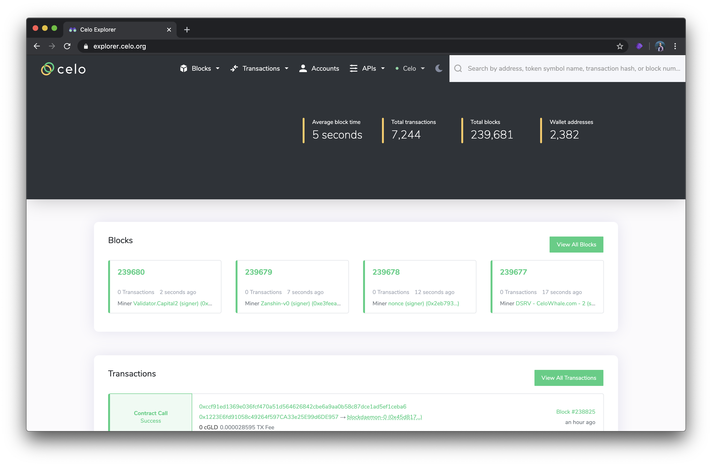
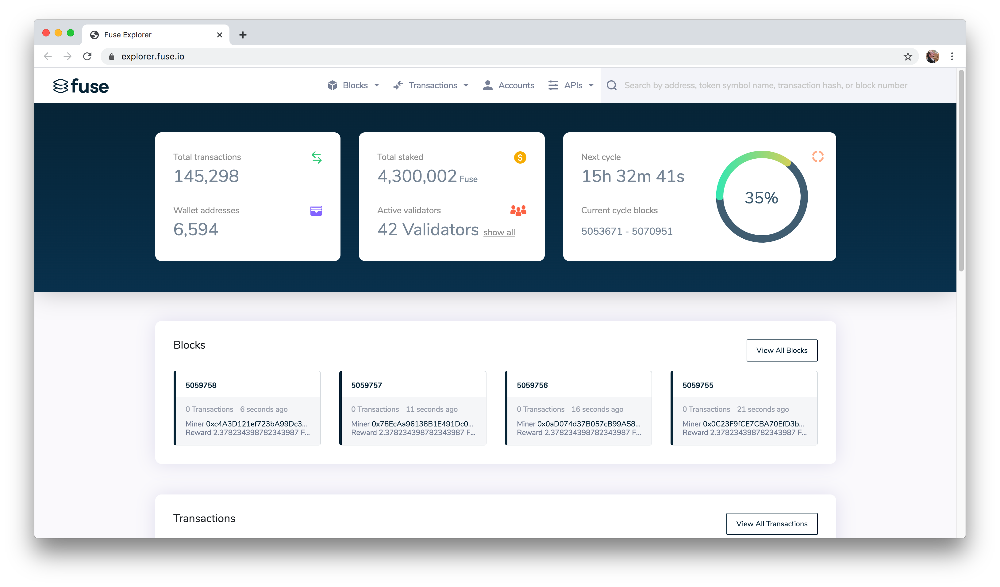
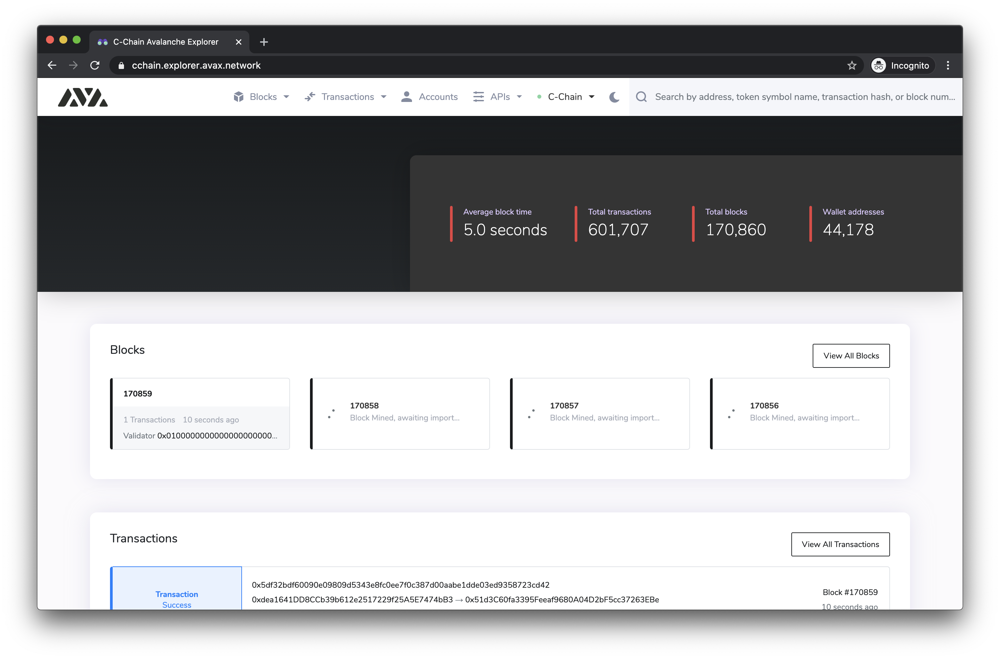
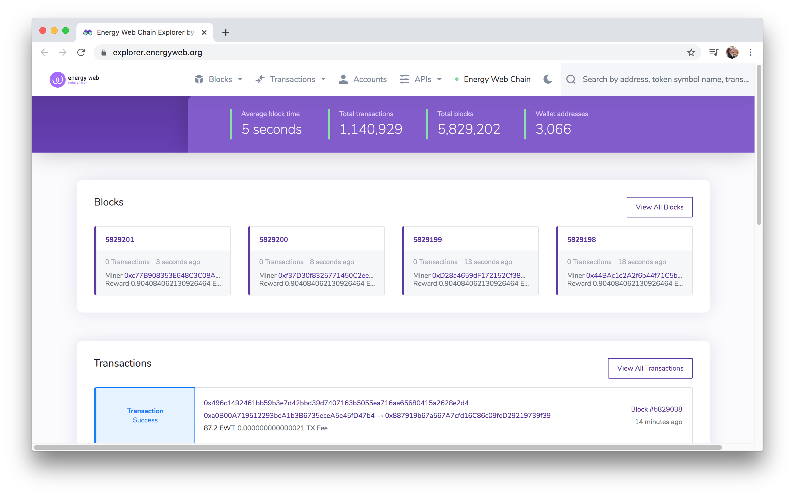
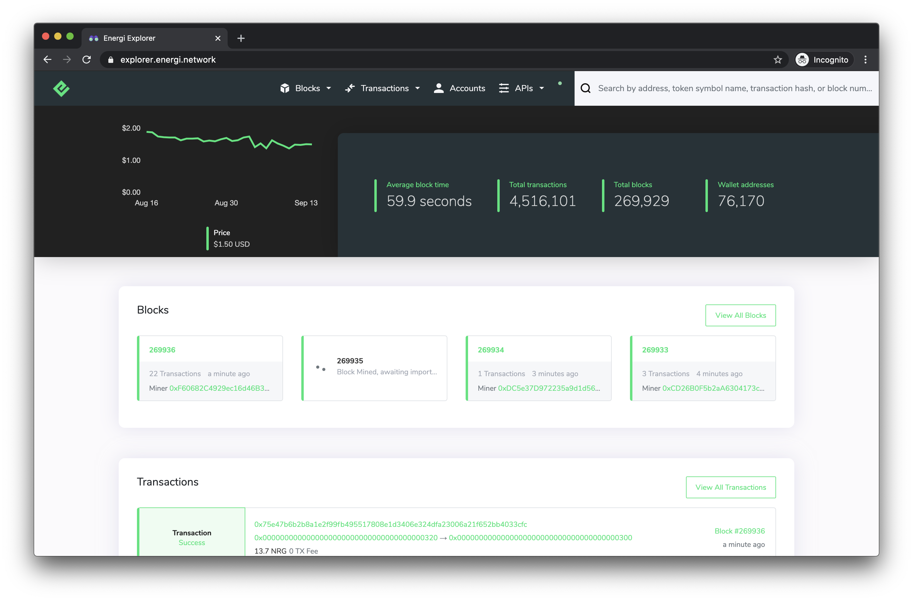
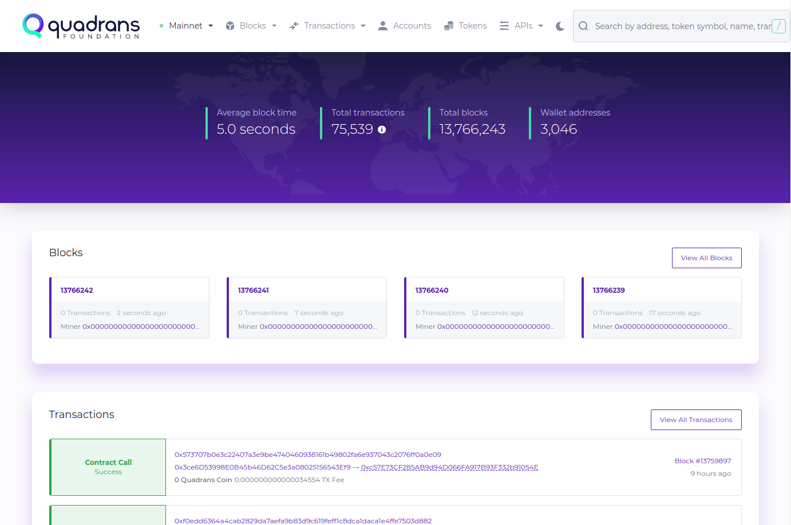
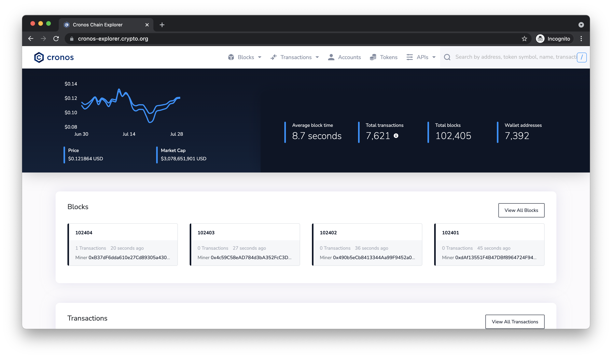

# Self-hosted BlockScout

BlockScout can be [manually deployed](../../for-developers/manual-deployment/) to a selected server environment. This provides control over costs, server location, decentralization and other factors that may influence hosting decisions.

BlockScout [Ansible Playbooks ](../../for-developers/ansible-deployment/)and the [AWS Marketplace ](../../for-developers/aws-marketplace/)integration provide several step-by-step options for deploying to AWS **** if desired. **** Projects may also self-host and use a proxy server for additional load balancing, data caching or security.

Sites can be configured to reflect a chain's unique branding, color scheme, logos and more.&#x20;

## Self-hosted BlockScout examples

### ETC Cooperative

> **Projects:** ETC Mainnet, Kotti Testnet, Mordor Testnet\
> **Explorers:**
>
> * ETC Mainnet: [https://blockscout.com/etc/mainnet](https://blockscout.com/etc/mainnet)
> * Kotti: [https://blockscout.com/etc/kotti](https://blockscout.com/etc/kotti)
> * Mordor: [https://blockscout.com/etc/mordor](https://blockscout.com/etc/mordor)
>
> **Description:** ETC Cooperative hosts all instances. Proxies are used to include these chains at blockscout.com. _\*\*_Kotti Ethereum Classic Testnets provide reliable and robust Proof-of-Authority networks for testing across client implementations. Mordor is an Ethereum Classic Proof-of-Work Testnet launched in October 2019.

### CELO

> **Project:** [Celo](https://celo.org)
>
> **Mainnet RC1 explorer:**
>
> * [https://explorer.celo.org/](https://explorer.celo.org)
>
> **Testnet Explorers:**
>
> * [https://alfajores-blockscout.celo-testnet.org/](https://alfajores-blockscout.celo-testnet.org) &#x20;
> *   [https://baklava-blockscout.celo-testnet.org/](https://baklava-blockscout.celo-testnet.org) &#x20;
>
>     **Description:** Proof of stake blockchain optimized for mobile-based financial transactions.

### Fuse Network

> **Project:** [Fuse Network](https://explorer.fuse.io)\
> **BlockScout URL:** [https://explorer.fuse.io](https://explorer.fuse.io)****\
> **Description:** Open-source platform for economic-based community creation.

### **Petrachor**

> **Project:** [Petrachor](https://petrachor.com)\
> **BlockScout url:** [https://explorer.petrachor.com/](https://explorer.petrachor.com)\
> **Description:** Light-weight blockchain with a "secure and eco-friendly Satoshi-style protocol"

### **Trustlines Blockchain**

> **Project:** [Trustlines Network](https://trustlines.network)\
> **BlockScout url:** [https://explore.tlbc.trustlines.foundation/](https://explore.tlbc.trustlines.foundation)\
> **Description:** The **Trustlines Network** ecosystem aims to promote financial & economic inclusion of all people through decentralized and open source systems

### Elastos

> **Project:** Elastos\
> **BlockScout url:** [https://explorer.elaeth.io/](https://explorer.elaeth.io)\
> **Description:** Elastos (ELA) bills itself as the 'first completely safe and decentralized infrastructure for the internet'. Its vision is to create a blockchain-powered decentralized internet that enables digital rights and secure transactions

### AVA

> **Project:** C-Chain AVA\
> **Blockscout url:** [https://cchain.explorer.avax.network/](https://cchain.explorer.avax.network)\
> **Description:**\
> AVA is
>
> * A heterogeneous network of custom, interoperable blockchains and custom validator sets &#x20;
> * A platform for defining, launching and maintaining custom blockchains &#x20;
> * A platform for creating and trading smart digital assets &#x20;
> * A way to store and transfer value without a centralized entity

### Energy Web

> **Project:** Energy Web\
> **Blockscout urls:**\
> **Mainnet:** [https://explorer.energyweb.org/](https://explorer.energyweb.org)\
> **Testnet:** [https://volta-explorer.energyweb.org/](https://volta-explorer.energyweb.org)\
> **Description:** The _\*\*_Energy Web Chain is the world’s first open-source, enterprise blockchain platform tailored to the energy sector. Energy Web has become the industry’s leading blockchain partner and most-respected voice of authority on energy blockchain.

### **Chiliz**

> **Project:** Chiliz\
> **Blockscout url:** [https://explorer.chiliz.com/](https://explorer.chiliz.com)\
> **Description:** The blockchain fintech provider for Sports & Entertainment

### IDChain

> **Project:** IDChain\
> **Blockscout url:** [https://explorer.idchain.one/](https://explorer.idchain.one)\
> **Description:** IDChain is a fork of the [official Golang implementation of the Ethereum protocol](https://github.com/ethereum/go-ethereum) with a small change to burn gas fees instead of awarding them to the block sealers.

### Velas

> **Project:** Velas\
> **Blockscout url:** [https://explorer.velas.com/](https://explorer.velas.com)\
> **Description:** Velas blockchain uses AI-enhanced DPOS (AIDPOS) consensus for high volume transactions processing that reportedly does not come at the expense of decentralization and security.

### Energi

> **Project:** Energi\
> **Blockscout url:** [https://explorer.energi.network/](https://explorer.energi.network)\
> **Description:** Energi (NRG) is a next-generation Proof of Stake (PoS) cryptocurrency that combines smart contract capabilities, decentralized governance, and a self-funding treasury.

### PublicMint

> **Project:** PublicMint\
> **Blockscout url:** [https://explorer.publicmint.io/](https://explorer.publicmint.io)\
> **Description:** Public Mint offers a fiat-native blockchain, APIs and web components, open and ready for anyone to build fiat-native applications _\*\*_and accept credit cards, ACH, wire transfers and more. No bank accounts needed.

### Quadrans

> **Project:** [Quadrans Foundation](https://quadrans.io)\
> **Mainnet Explorer:** [https://explorer.quadrans.io/](https://explorer.quadrans.io)\
> **Testnet Explorer:** [https://explorer.testnet.quadrans.io/](https://explorer.testnet.quadrans.io)\
> **Description:** Quadrans is an open-source, public, decentralised blockchain infrastructure for Smart-Contracts and dApps, where individuals and enterprises can store and share any type of data (public or encrypted), validate business processes and optimise governance procedures.

### Cronos chain

> **Project:** [Cronos chain](https://cronos.crypto.org)\
> **Testnet Explorer:** [https://cronos-explorer.crypto.org/](https://cronos-explorer.crypto.org)\
> **Description:** Get Instant DApp Portability with EVM Support.

