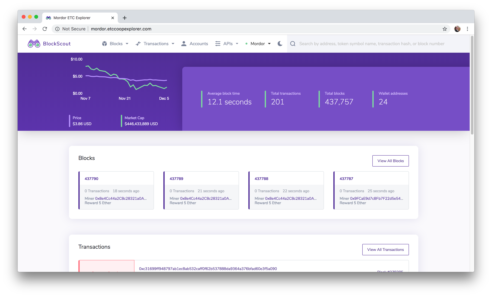
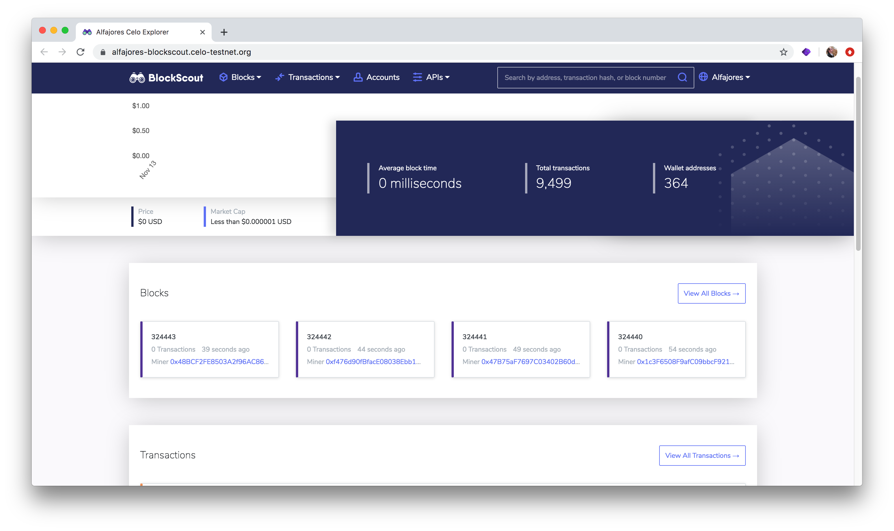
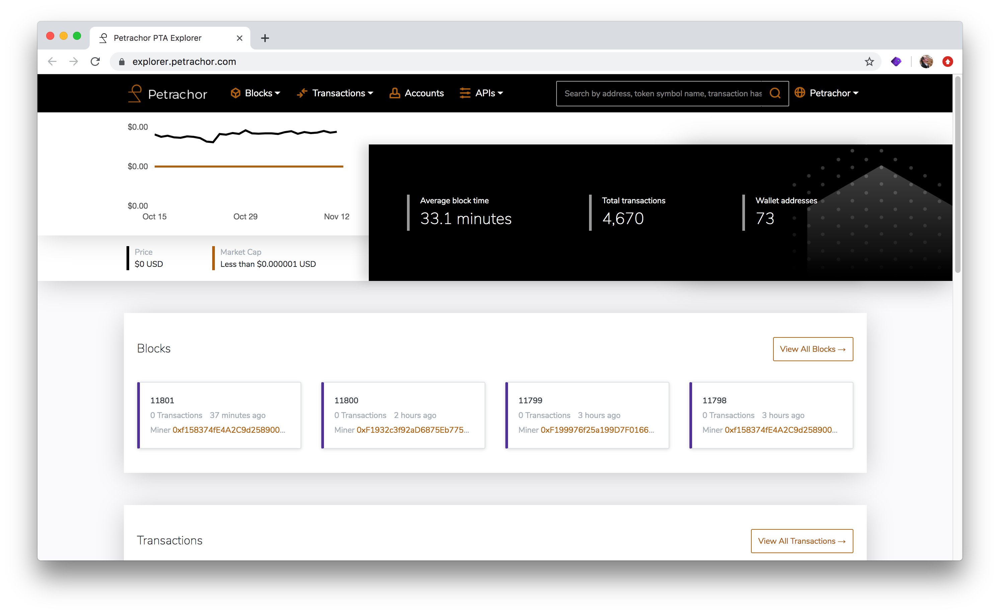
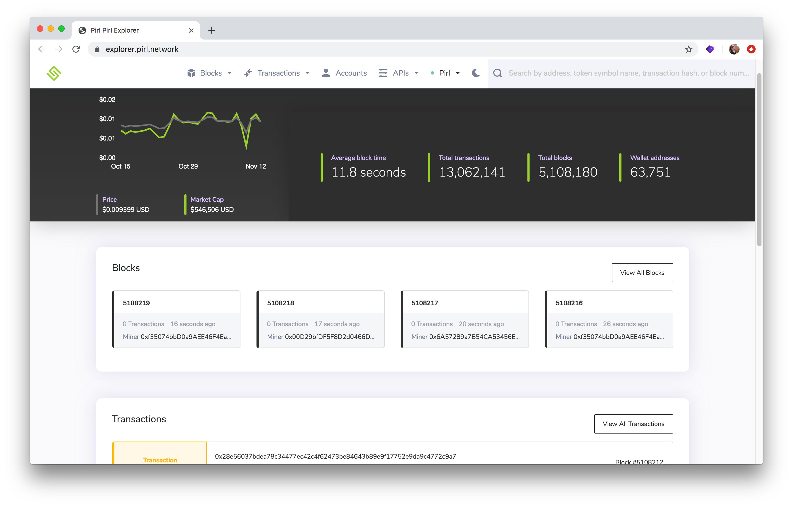

# Self-hosted BlockScout on BYO Servers

BlockScout can be [manually deployed](../../for-developers/manual-deployment/) to a selected server environment. This provides control over costs, server location, decentralization and other factors that may influence hosting decisions.

Projects may also self-host and use a proxy server for additional load balancing, data caching or security.

Sites can be configured to reflect a chain's unique branding, color scheme, logos and more. See the examples below.

## Self-hosted BlockScout examples

### ETC Cooperative

> **Projects:** ETC Mainnet, Kotti Testnet, Mordor Testnet  
> **Explorers:**

> * ETC Mainnet: [https://blockscout.com/etc/mainnet](https://blockscout.com/etc/mainnet)
> * Kotti: [https://blockscout.com/etc/kotti](https://blockscout.com/etc/kotti)
> * Mordor: [https://blockscout.com/etc/mordor](https://blockscout.com/etc/mordor)
>
> **Description:** ETC Cooperative hosts all instances. Proxies are used to include these chains at blockscout.com. ****Kotti Ethereum Classic Testnets provide reliable and robust Proof-of-Authority networks for testing across client implementations. Mordor is an Ethereum Classic Proof-of-Work Testnet launched in October 2019.

### CELO

> **Project:** [Celo](https://celo.org/)  
> **Testnet Explorers:**   
> - [https://alfajores-blockscout.celo-testnet.org/](https://alfajores-blockscout.celo-testnet.org/)  
> - [https://baklava-blockscout.celo-testnet.org/](https://baklava-blockscout.celo-testnet.org/)  
> **Description:** Proof of stake blockchain optimized for mobile-based financial transactions.

### **Petrachor**

> **Project:** [Petrachor](https://Petrachor.com)  
> **BlockScout url:** [https://explorer.petrachor.com/](https://explorer.petrachor.com/)  
> **Description:** Light-weight blockchain with a "secure and eco-friendly Satoshi-style protocol"

### Pirl

> **Project:** [Pirl](https://pirl.io/en/)  
> **BlockScout url:** [https://explorer.pirl.network/](https://explorer.pirl.network/)  
> **Description:** Community based smart contract platform utilizing masternodes for decentralized data storage.

### **Trustlines Blockchain**

> **Project:** [Trustlines Network](https://trustlines.network/)  
> **BlockScout url:** [https://explore.tlbc.trustlines.foundation/](https://explore.tlbc.trustlines.foundation/)  
> **Description:** The **Trustlines Network** ecosystem aims to promote financial & economic inclusion of all people through decentralized and open source systems

### iExec viviani

> **Project:** iExec  
> **BlockScout url:** [https://blockscout-viviani.iex.ec/](https://blockscout-viviani.iex.ec/)  
> **Description:** The First Decentralized Marketplace for Cloud Resources

### 

### EtherCore

> **Project:** EtherCore  
> **BlockScout url:** [https://explorer.ethercore.org](https://explorer.ethercore.org)  
> **Description:** Security, Scalability and Decentralization Application Platform Powered by ProgPoW Consensus

