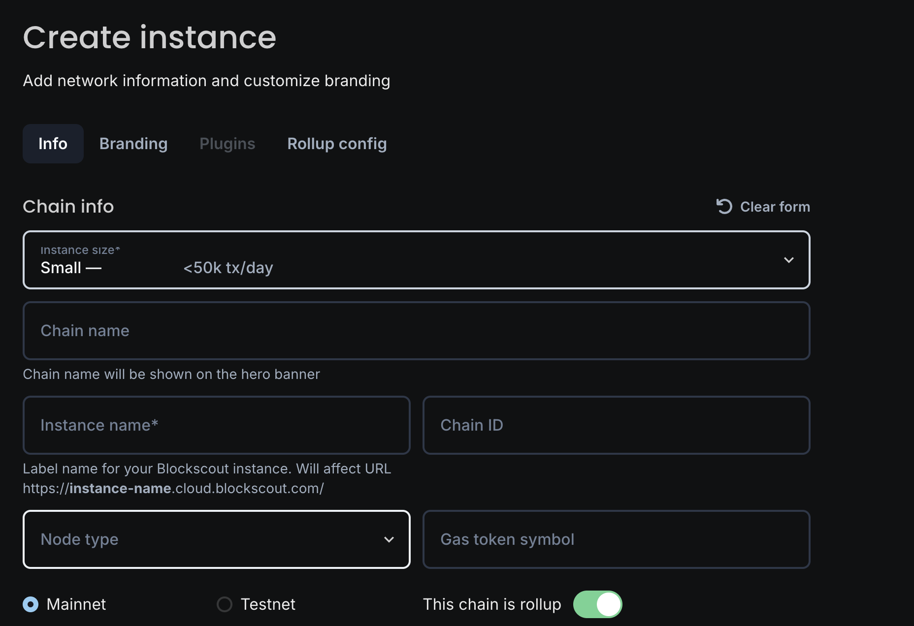
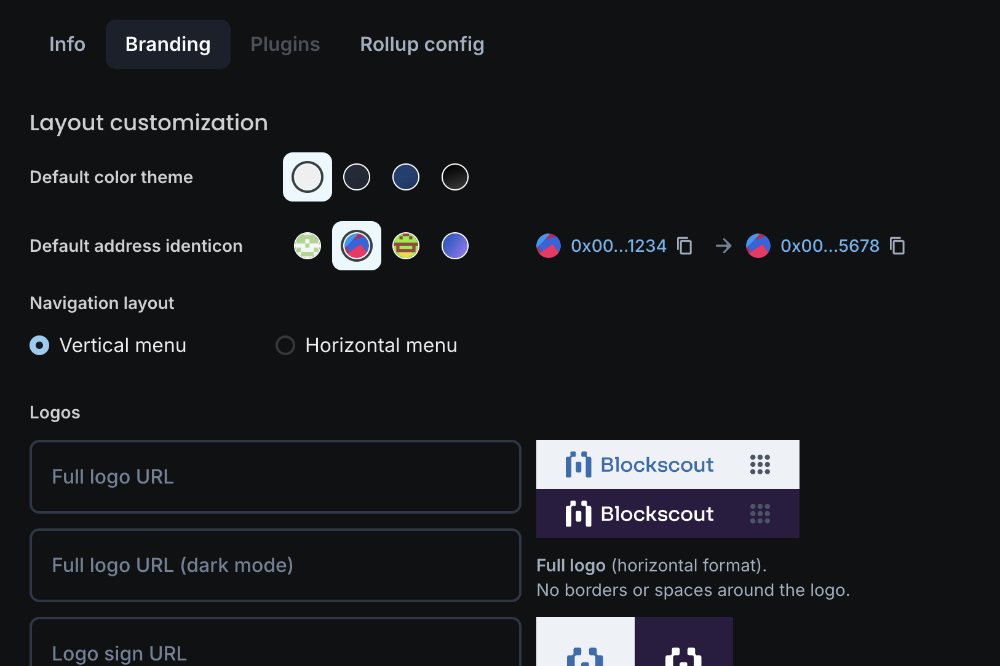
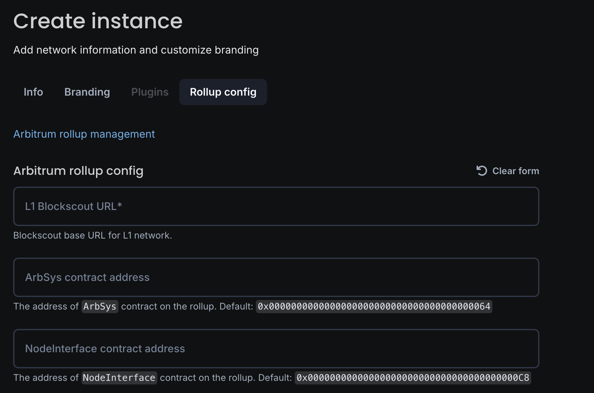

# Autoscout 1-click cloud deployment


Coming Soon!


Autoscout is a web-based interface for Blockscout deployment.  Add in some basic info and get your explorer up and running in no time! Autoscout is currently in development and will be available soon. Below are a few screenshots of the UI.

### Create Instance

<figure><figcaption></figcaption></figure>

### Customize Layout

<figure><figcaption></figcaption></figure>

### Add Rollup Parameters

<figure><figcaption></figcaption></figure>
