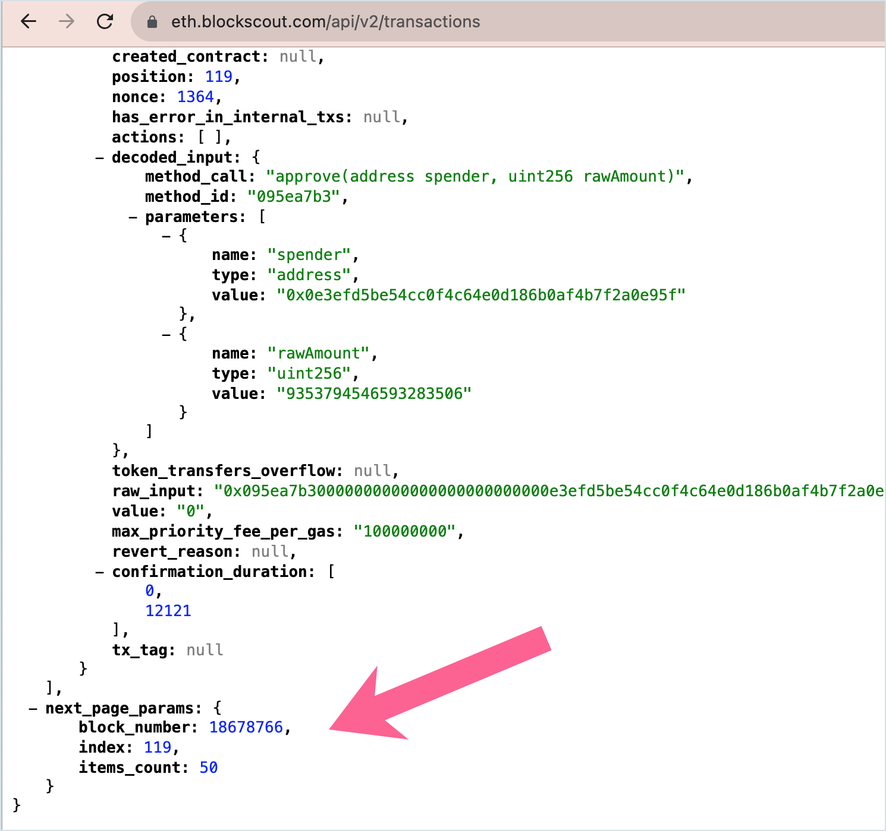
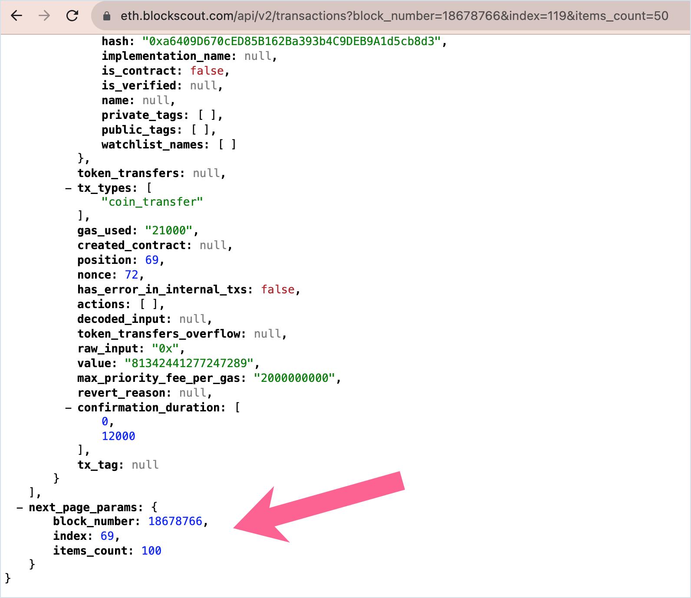

# REST API Endpoints

REST API methods are used to render the UI for new versions of Blockscout. These can be accessed and used to get many types of information. Methods parameters and schemas are available at _https://instance-name/api-docs_ (ie [https://eth.blockscout.com/api-docs](https://eth.blockscout.com/api-docs))

<figure><figcaption></figcaption></figure>

## Pagination

Blockscout uses the keyset pagination method to quickly return results. By default an API response returns the first 50 results. To access additional results (in groups of 50), add the `next_page_params` to your query.&#x20;

For example, open [https://eth.blockscout.com/api/v2/transactions](https://eth.blockscout.com/api/v2/transactions) and scroll to the bottom of the response.

<figure><figcaption>
Example response from transactions query
</figcaption></figure>

You will see the `next_page_params` object. Add the parameters from this object to your next query to receive the next 50 results.&#x20;

[https://eth.blockscout.com/api/v2/transactions?block\_number=18678766\&index=119\&items\_count=50](https://eth.blockscout.com/api/v2/transactions?block\_number=18678766\&index=119\&items\_count=50)

Repeat this process to continue receiving results in groups of 50 (remove params and substitute the new `next_page_params` found in the body of the query).

<figure><figcaption></figcaption></figure>

In this example, the query to receive the next 50 results would be:

[https://eth.blockscout.com/api/v2/transactions?block\_number=18678766\&index=69\&items\_count=100](https://eth.blockscout.com/api/v2/transactions?block\_number=18678766\&index=69\&items\_count=100)

\
