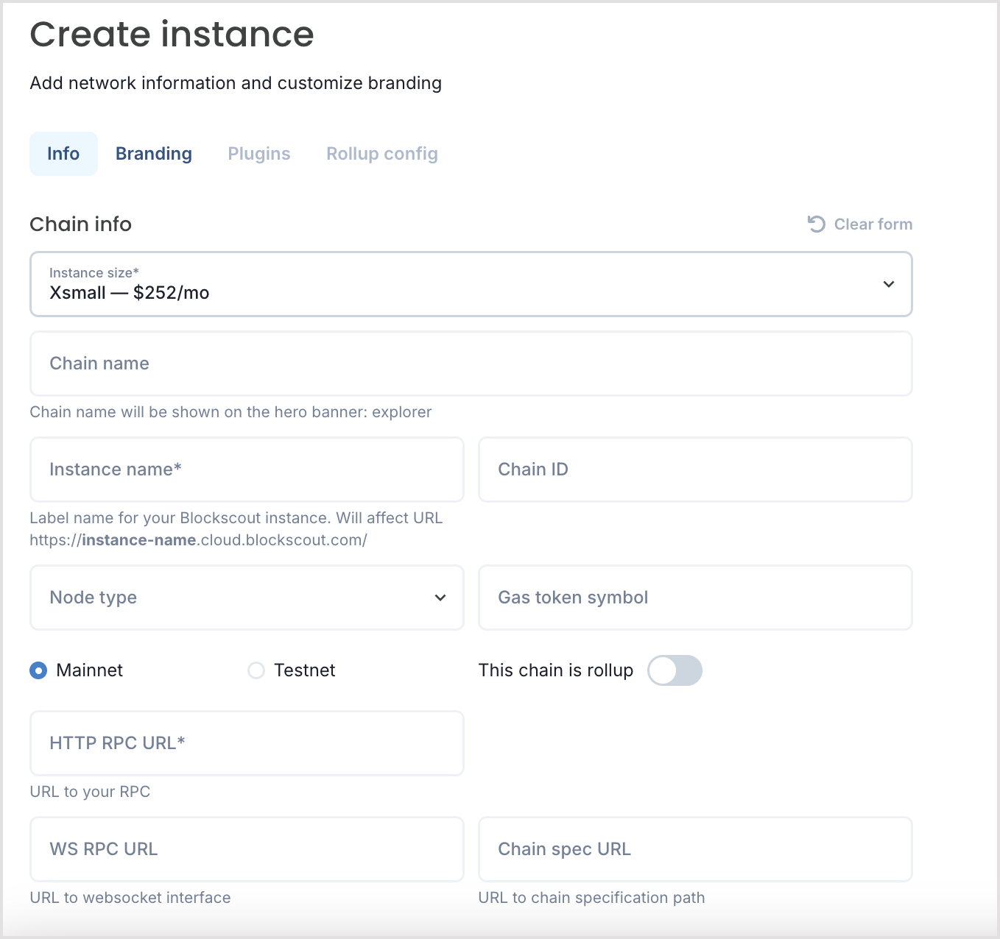

# Autoscout cloud deployment

## Autoscout Beta


Autoscout is currently in Beta. It is available for general testing at \
[https://deploy.blockscout.com/](https://deploy.blockscout.com/), however some features may not yet be functional.\
\
Other deployment options are available here:

* [Docker-compose Deployment](../setup/deployment/docker-compose-deployment.md)
* [Manual Deployment Guide](../setup/deployment/manual-deployment-guide/)
* [Kubernetes Deployment](../setup/deployment/kubernetes-deployment.md)
* [Rollup Deployment](../setup/deployment/rollup-deployment.md)


### Get Started with Autoscout

1. **Create an account:** To get started, go to [https://deploy.blockscout.com/](https://deploy.blockscout.com/), create an account, and login with the login button.&#x20;
2. **Request credits:** You will need credits to launch your explorer. Please let us know that you have created an instance in the [Blockscout Discord](https://discord.gg/blockscout) `#autoscout` channel and we will top off your account for testing.&#x20;
3. **Add a new instance:** You can start adding an instance before credits are added to your account. Click the Add instance button to get started.
4. **Add your network info**:  See below for info on configuration and parameters.
5. **Deploy your explorer:** Click save and deploy to start the deployment process. In 5-10 minutes your explorer will be live and indexing your chain. Once deployed you can access your explorer link.


For additional Blockscout deployment options please see

* [Docker-compose Deployment](../setup/deployment/docker-compose-deployment.md)
* [Manual Deployment Guide](../setup/deployment/manual-deployment-guide/)
* [Kubernetes Deployment](../setup/deployment/kubernetes-deployment.md)
* [Rollup Deployment](../setup/deployment/rollup-deployment.md)


## Create Instance

There are several tabs to fill out to start your instance, Info, Branding and Rollup config (if needed). You can also add plugins (currently the only live plugin is stats) once your instance is indexed. You can come back and edit parameters later, but this may require relaunching the instance.

### Info

<figure><figcaption></figcaption></figure>

The following parameters are in the Info section. \* parameters are required.

* **Instance size\***: Select based on the number of transactions anticipated for the instance. The costs are currently placeholders, but your credits will be impacted according to chain usage.
* **Chain name**: The chain name will be shown in the top explorer banner.
* **Instance name\***:  A label for your instance, it is reflected in the url of the instance ie https://instance-name.cloud.blockscout.com/
* **Chain ID**: If you don't know the chain ID you can get with the `eth_chainId` JSON-RPC method.
* **Node type:** Choose from the list of clients for the archive node:
  * Besu, Erigon, Ganache, Geth, Parity
* **Gas token symbol**: Will show in the interface, for example ETH if your chain uses Ether for gas.
* **Mainnet or Testnet**: Select the type of chain, if Testnet a label will be added to the instance.
* **This chain is a Rollup**: If selected, another field will appear to select **Arbitrum** or **Optimism**. These are the 2 currently supported rollup types. You will then fill out additional information in the Rollup Config tab.
* **RPC URL\***: The archive node url (https://your-rpc-url)
* **WS URL**: The websocket url (wss://ws.your-websocket-url)
* **Custom Domain**: You can use a custom domain for your instance but must configure your DNS and add a DNS `CNAME` record pointing to `autoscout.cname.blockscout.com`
* **Public RPC URL**: Enables 'add to Metamask button'. Can be the same as the RPC URL if this is a public node.
* **WalletConnect project ID:** Enables the ability for Read and Write functionality with smart contracts. [Learn more about setting one up here](../setup/configuration-options/walletconnect-project-id-for-contract-read-write.md).

### Branding

_More info coming soon_

<figure><figcaption></figcaption></figure>

### Rollup Config

_More info coming soon_

If your chain is a rollup (Arbitrum and Optimism rollups are currently supported) you will select in the info screen and then fillout the Rollup config info based on these parameters:

* [Arbitrum](../setup/env-variables/backend-envs-chain-specific.md#arbitrum-management)
* [Optimism](../setup/env-variables/backend-envs-chain-specific.md#optimism-rollup-management)

<figure><figcaption></figcaption></figure>
