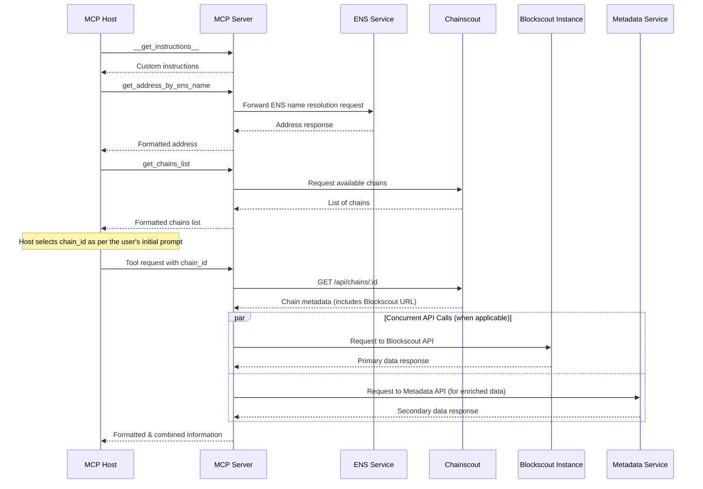

<Tip>
  MCP Landing page: https://mcp.blockscout.com/\
  \
  Github with technical specs and run information located at https://github.com/blockscout/mcp-server
</Tip>

The Model Context Protocol (MCP) is an open protocol designed to allow AI agents, IDEs, and automation tools to consume, query, and analyze structured data through context-aware APIs.

This server wraps Blockscout APIs and exposes blockchain data—balances, tokens, NFTs, contract metadata—via MCP so that AI agents and tools (like Claude, Cursor, or IDEs) can access and analyze it contextually.

#### **Key Features:**

- Contextual blockchain data access for AI tools
- Multi-chain support via getting Blockscout instance URLs from Chainscout
- Custom instructions for MCP host to use the server
- Supports MCP progress notifications for multi-step tool operations, allowing clients to track execution status
- Enhanced User Experience: Provides periodic progress updates for long-running API queries (e.g., fetching extensive transaction histories) when requested by the client, improving responsiveness

#### Use Cases

- Enabling AI agents to analyze blockchain transactions and account balances.
- Automating blockchain data analysis workflows with context-aware APIs.
- Allowing IDEs to fetch contract ABIs and other relevant smart contract information.
- Additional info available at https://mcpmarket.com/server/blockscout

#### **Architecture and Data Flow**

