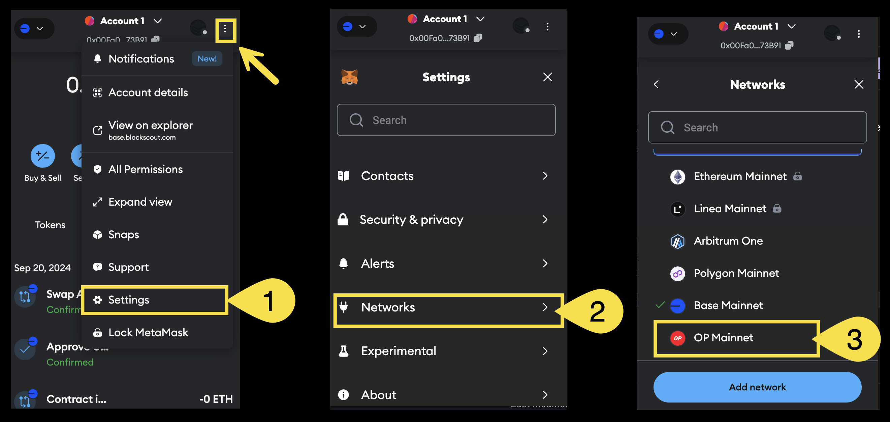
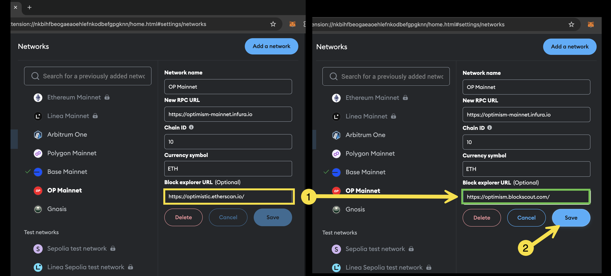

# Replace Links

## Replace the primary explorer link

In most cases simply replacing the first part of the url is all that is needed to replace Etherscan with Blockscout.

For example, replace [https://etherscan.com/](https://etherscan.com/) with [https://eth.blockscout.com/](https://eth.blockscout.com/) in your code and the corresponding links to blocks, transactions, etc will be mapped to Blockscout rather than Etherscan.


😢 Tx before replacement[<mark style="background-color:red;">**https://etherscan.io**</mark>/tx/0x3e8c3aad50b2f8471400e3fe6b812f20c332846064dff8c25fadf783eefa68df](https://etherscan.io/tx/0x3e8c3aad50b2f8471400e3fe6b812f20c332846064dff8c25fadf783eefa68df)\
\
😁 Tx after replacement\
[<mark style="color:green;background-color:green;">**https://eth.blockscout.com**</mark>/tx/0x3e8c3aad50b2f8471400e3fe6b812f20c332846064dff8c25fadf783eefa68df](https://eth.blockscout.com/tx/0x3e8c3aad50b2f8471400e3fe6b812f20c332846064dff8c25fadf783eefa68df)


Blockscout linking architecture follows [EIP-3091 ](https://eips.ethereum.org/EIPS/eip-3091)standardization for the following routes:

* Blocks \
  `<BLOCK_EXPLORER_URL>/block/<BLOCK_HASH_OR_HEIGHT>`
* Transactions\
  `<BLOCK_EXPLORER_URL>/tx/<TX_HASH>`
* Accounts\
  `<BLOCK_EXPLORER_URL>/address/<ACCOUNT_ADDRESS>`
* Tokens\
  `<BLOCK_EXPLORER_URL>/token/<TOKEN_ADDRESS>`

### Common chain replacements

Replace the Etherscan url in your code with the Blockscout url for a seamless transition. All chains supported by Etherscan are also supported by Blockscout (along with many additional Blockscout chains). Some examples are below. For additional Blockscout chains see the [chains and projects](https://www.blockscout.com/chains-and-projects) page or the [chainscout json file which includes chainids](https://github.com/blockscout/chainscout/blob/main/data/chains.json).

<table><thead><tr><th width="126">Chain</th><th>Etherscan ❌</th><th>Blockscout ✅</th></tr></thead><tbody><tr><td>Ethereum</td><td><a href="https://etherscan.io/">https://etherscan.io/</a></td><td><a href="https://eth.blockscout.com/">https://eth.blockscout.com/</a></td></tr><tr><td>Ethereum Sepolia</td><td><a href="https://sepolia.etherscan.io/">https://sepolia.etherscan.io/</a></td><td><a href="https://eth-sepolia.blockscout.com/">https://eth-sepolia.blockscout.com/</a></td></tr><tr><td>Optimism</td><td><a href="https://optimistic.etherscan.io/">https://optimistic.etherscan.io/</a></td><td><a href="https://optimism.blockscout.com/">https://optimism.blockscout.com/</a></td></tr><tr><td>Optimism Sepolia</td><td><a href="https://sepolia-optimism.etherscan.io/">https://sepolia-optimism.etherscan.io/</a></td><td><a href="https://optimism-sepolia.blockscout.com/">https://optimism-sepolia.blockscout.com/</a></td></tr><tr><td>Base</td><td><a href="https://basescan.org/">https://basescan.org/</a></td><td><a href="https://base.blockscout.com/">https://base.blockscout.com/</a></td></tr><tr><td>Base Sepolia</td><td><a href="https://sepolia.basescan.org/">https://sepolia.basescan.org/</a></td><td><a href="https://base-sepolia.blockscout.com/">https://base-sepolia.blockscout.com/</a></td></tr><tr><td>Arbitrum</td><td><a href="https://arbiscan.io/">https://arbiscan.io/</a></td><td><a href="https://arbitrum.blockscout.com/">https://arbitrum.blockscout.com/</a></td></tr><tr><td>Arbitrum Sepolia</td><td><a href="https://sepolia.arbiscan.io/">https://sepolia.arbiscan.io/</a></td><td><a href="https://arbitrum-sepolia.blockscout.com/">https://arbitrum-sepolia.blockscout.com/</a></td></tr><tr><td>Polygon</td><td><a href="https://polygonscan.com/">https://polygonscan.com/</a></td><td><a href="https://polygon.blockscout.com/">https://polygon.blockscout.com/</a></td></tr><tr><td>Gnosis</td><td><a href="https://gnosisscan.io/">https://gnosisscan.io/</a></td><td><a href="https://gnosis.blockscout.com/">https://gnosis.blockscout.com/</a></td></tr></tbody></table>

### Exceptions

Some newer operations without standards are still handled differently by different explorers. For example:

* Blobs on Blockscout are accessed in different ways depending on the route. For example via the `?tab=blob_txs` query string following a block ([https://eth.blockscout.com/block/20822532?tab=blob\_txs](https://eth.blockscout.com/block/20822532?tab=blob\_txs)) or the `?tab=blobs` query string following a transaction. Blobs on Etherscan are accessed via `#blobinfo` query strign following a block (ie [https://etherscan.io/block/20822532#blobinfo](https://etherscan.io/block/20822532#blobinfo)).
* User Operations (EIP-4337) are displayed on Blockscout via the [https://eth.blockscout.com/ops](https://eth.blockscout.com/ops) url. On Etherscan there is currently no defined route, but User Operations can be viewed with the `Handle Ops` filter applied to the senders address (ie [https://etherscan.io/advanced-filter?fadd=0x20e9695f25413f14e5807b530D0698bd4F155074\&mtd=0x1fad948c\~Handle+Ops\&ps=10\&p=8](https://etherscan.io/advanced-filter?fadd=0x20e9695f25413f14e5807b530D0698bd4F155074\&mtd=0x1fad948c\~Handle+Ops\&ps=10\&p=8))

## Replace the API link


Standard Blockscout RPC calls do not need an API key (Etherscan calls always require one). You can remove the `&apikey=YourApiKeyToken` query string at the end of the url with no problem or keep it as any string value and Blockscout will process. If you want to increase your limits, you can also [sign up for a free Blockscout API key](../using-blockscout/my-account/api-keys.md) and use it to access 10 RPS limits.


Etherscan uses a subdomain link for api access. For example, the Ethereum explorer the api link is [https://api.etherscan.io/](https://api.etherscan.io/) followed by your query, or for Optimism it is [https://api-optimistic.etherscan.io/](https://api-optimistic.etherscan.io/) followed by your query.&#x20;

**To replace, simply use the regular blockscout url for the instance**, for example [https://eth.blockscout.com/](https://eth.blockscout.com/) for Ethereum or [https://optimism.blockscout.com/](https://optimism.blockscout.com/) for Optimism.


😢 API call before replacement (doesn't work without API key)\
[<mark style="background-color:red;">https://api.etherscan.io/</mark>api?module=account\&action=balance\&address=0xde0b295669a9fd93d5f28d9ec85e40f4cb697bae\&tag=latest\&apikey=YourApiKeyToken](https://api.etherscan.io/api?module=account\&action=balance\&address=0xde0b295669a9fd93d5f28d9ec85e40f4cb697bae\&tag=latest\&apikey=YourApiKeyToken)

\
😁 API call after replacement (works without API key)\
[<mark style="background-color:green;">https://eth.blockscout.com/</mark>api?module=account\&action=balance\&address=0xde0b295669a9fd93d5f28d9ec85e40f4cb697bae\&tag=latest](https://eth.blockscout.com/api?module=account\&action=balance\&address=0xde0b295669a9fd93d5f28d9ec85e40f4cb697bae\&tag=latest)


Standard API routes on Etherscan work for your queries on Blockscout. We've structured our data calls to be consistent with Etherscan whenever possible. You can see supported calls in the [JSON RPC & ETH Compatible RPC endpoints section](apis/rpc/).


If you require more varied or richer datasets consider replacing your JSON RPC calls with the [REST API from Blockscout](apis/rest/). This free API features additional metadata, stats data, human readable transactions and more.&#x20;


### API Exceptions&#x20;

* Blockscout does not currently support most [Etherscan API PRO](https://docs.etherscan.io/api-pro/etherscan-api-pro) queries.
* The 50 global/10 RPS limits can be increased further via the [Quicknode marketplace add-on](https://marketplace.quicknode.com/add-on/blockscout-json-rpc-api).

## Replace your wallet block explorer link

Every wallet handles the explorer link differently, but typically wallets ship with Etherscan links by default. To change, simply go to settings and replace the Etherscan link with the Blockscout one. Here's how you do it in MetaMask.

1. Open MetaMask, click the dots to open the menu, and select Settings
2. Select Networks
3. Select the network where you want to change the explorer link

<figure><figcaption></figcaption></figure>

4. Find the block explorer url (ie [https://optimistic.etherscan.io/](https://optimistic.etherscan.io/)).
5. Change the url to blockscout (ie [https://optimism.blockscout.com/](https://optimism.blockscout.com/)) and Save.

<figure><figcaption></figcaption></figure>


Repeat this process for all networks from the Networks screen.

