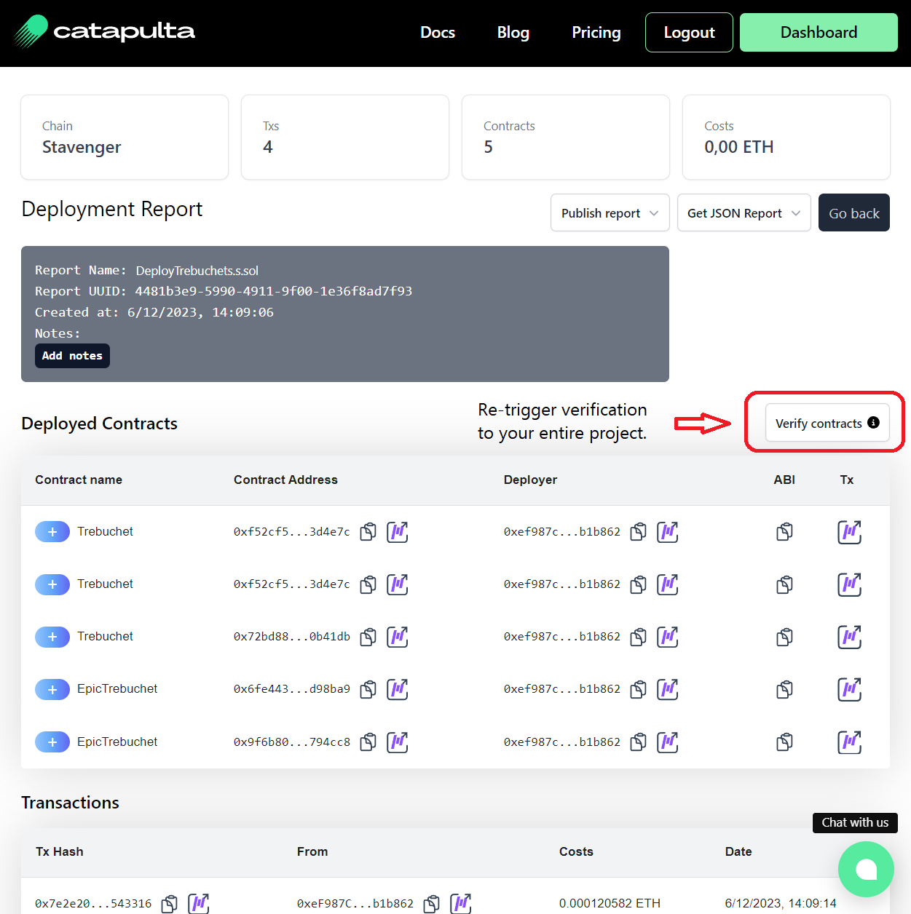

## Catapulta smart contracts verification

[Catapulta](https://catapulta.sh) is a multi-chain smart contracts deployment tool for Foundry and Hardhat to improve deployments DevX and remove the need to perform manual verifications.

With Catapulta you can deploy to +14 networks and the verification will happen automatically in Blockscout based block explorers. You may need to register in Catapulta to be able to deploy in testnets with automatic verification, for free, in Blockscout based explorers.

You can install `catapulta` in your Linux/MacOs machine using NPM:

```
npm i -g catapulta
```

### Deploy with Foundry and Catapulta

To verify at deployment time with Foundry and Catapulta, just broadcast your script with the Catapulta CLI:

```
catapulta script scripts/Deploy.s.sol --network [NETWORK_NAME]
```

If you already deployed with Forge, but want to automate the verification, you can import your deployment to Catapulta with the "catapulta import" command, and it will re-trigger verification:

```
catapulta import 'broadcasts/Deploy.s.sol/[chain id]/run-latest.json'
```

### Deploy with Hardhat and Catapulta

To verify at deployment time with `hardhat-deploy` and Catapulta, just deploy with Catapulta CLI to enjoy automated verifications.

```
catapulta deploy --network [NETWORK_NAME]
```

If you use plain Hardhat scripts, you can use `catapulta run`, pointing to your Javascript or Typescript deploy script:

```
catapulta run scripts/DeployScript.ts --network [NETWORK_NAME]
```

### Verify your project anytime, with one button

In case Blockscout is newly added to a network you already deployed with Catapulta, you can always re-trigger verification to your entire project with only one click, from your deployment report, and Catapulta will take care to migrate all the verifications to Blockscout block explorer.


