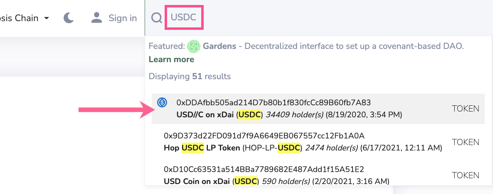
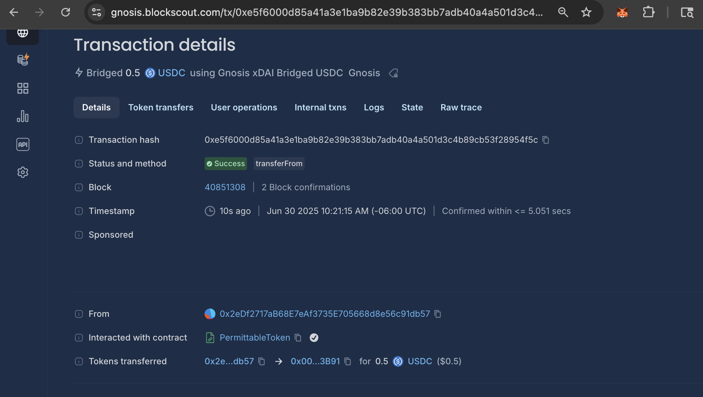

# Interacting with Smart Contracts

Once a contract is verified, contract methods are exposed and contract interaction is possible directly from Blockscout.


In the following examples we use Blockscout on Gnosis Chain. You can interact with verified contracts on any supported chain. Make sure your web3 wallet (like MetaMask) is also connected to that chain when reading / writing to a contract.


## Read Contract

Read actions let you check various contract attributes. You will connect a web3 wallet to make a query, though a query does not require a transaction or any gas costs.

1\) Find the contract address you want to interact with and enter into the search bar. In this example we search for USDC on Gnosis Chain.

<figure><figcaption></figcaption></figure>

2\) Select the first option in search and go to the token page.  \
[`0xDDAfbb505ad214D7b80b1f830fcCc89B60fb7A83`](https://gnosis.blockscout.com/token/0xDDAfbb505ad214D7b80b1f830fcCc89B60fb7A83)\
\
Scroll down to see the code is verified by the checkmark :white\_check\_mark:. In this case the code is partially verified and we can still interact with it. If the code is not verified, it is not possible to read/write.

<figure><figcaption></figcaption></figure>

3\) Go to the Contract tab. You will see buttons for Read/Write Contract and Read/Write proxy.&#x20;

The fact that there are 2 options means this is a proxy contract. Proxy contracts are upgradeable, and the admin can set a new proxy address for the primary contract if upgrades are required.

Choose **Read/Write Proxy**, since it contains all the relevant methods for the current contract implementation.

<figure><figcaption></figcaption></figure>

4\) Connect your wallet to interact with the proxy contract (in this case it is the implementation address denoted in the contract, `0xf8D1677c8a0c961938bf2f9aDc3F3CFDA759A9d9`

<figure><figcaption></figcaption></figure>

5\) If preferred, select Read to view only the available Read methods.  Some Read methods show current values assigned to the contract and others are queryable based on added information. An example to query is 3) `balanceOf` method.

<figure><figcaption></figcaption></figure>

6\) This method expects an `0x` address and will output an integer. Simply paste in an address and press **Read** to see the balance in USDC held by that particular address.&#x20;

<figure><figcaption></figcaption></figure>

The result shows this address holds 16200109864 of the token, which converts to 16,200.10 USDC.&#x20;


Note ERC20 tokens allow for custom decimal point precision. USDC uses 6 decimal precision. Many others use 18 (to denote wei) so be sure to check the token implementation for conversion info).


## Write Contract


Many write functions can only be performed by an approved owner. Connect the owner wallet when performing gated functions.


1\) In this example we'll use Blockscout to transfer 0.50 USDC from 1 address to another. While you can perform this action directly through a wallet UI, we use the Blockscout interface here for demonstration purposes.\
\
See steps 1-4 above for accessing USDC on Gnosis Chain, or simply type the contract address (_0xDDAfbb505ad214D7b80b1f830fcCc89B60fb7A83_) into the search bar.&#x20;

Select the Write button to see the available function.

<figure><figcaption></figcaption></figure>

2\) Scroll down to find the `transferFrom` method.

<figure><figcaption></figcaption></figure>

The following information is added:

1. `_sender(address)`: The `0x` address sending the USDC. _**This account is the one that needs to be connected to Blockscout to write to the contract.**_
2. `_recipient(address)`: The `0x` address receiving the USDC.
3. `_amount(uint256)`: Amount to transfer. We use 6 decimals of precision for USDC - for other tokens this can differ. Here we enter 500000 to denote $0.50.

<figure><figcaption></figcaption></figure>

3\) Press the **Write** button, and MetaMask or another web3 wallet takes us through the transaction. You can also Simulate a transaction beforehand to make sure it will go through before writing.


The connected wallet must contain the tokens to transfer **along with enough native tokens** (in this case xDai) to pay gas for the transaction.


<figure><figcaption></figcaption></figure>

4\) Once completed, check the results of the transaction through a direct link from the interface.

<figure><figcaption></figcaption></figure>

Transaction hash: [https://gnosis.blockscout.com/tx/0xe5f6000d85a41a3e1ba9b82e39b383bb7adb40a4a501d3c4b89cb53f28954f5c](https://gnosis.blockscout.com/tx/0xe5f6000d85a41a3e1ba9b82e39b383bb7adb40a4a501d3c4b89cb53f28954f5c)

<figure><figcaption></figcaption></figure>
