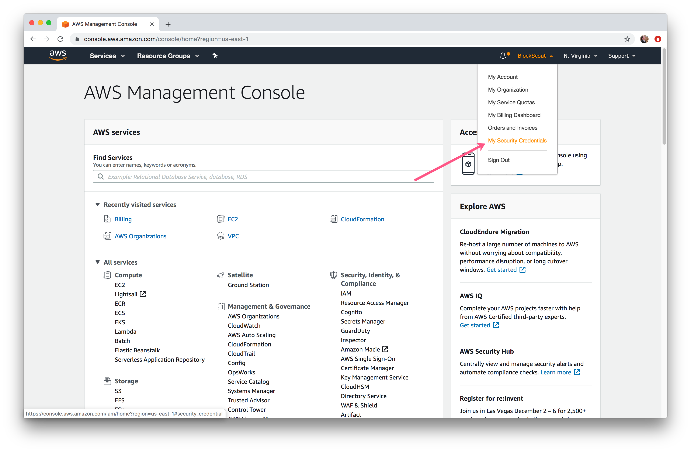
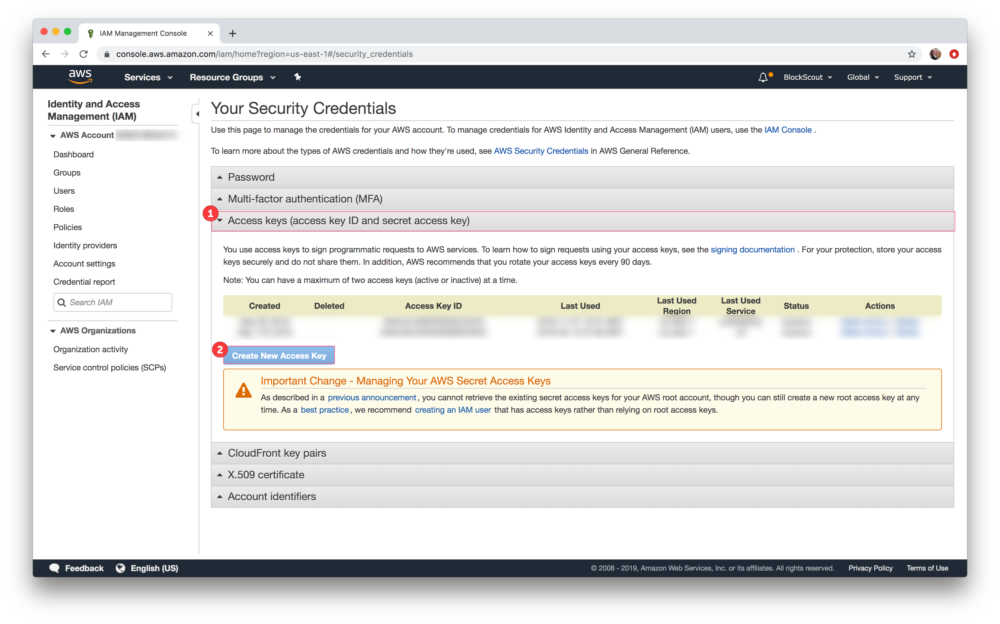
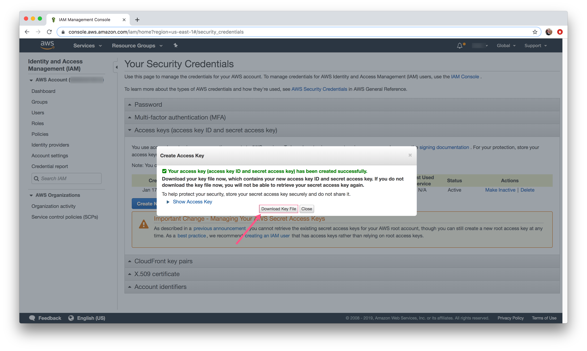

# Creating a Secret Key Pair

1\) Go to MyAccount -&gt; My Security Credentials

2\) Expand **Access keys** section and click **Create New Access Key** button

3\) Download your key file and store it in a safe place. You will need it to login with the AWS CLI.   The file will include:

* AWSAccessKeyID
* AWSSecretKey

