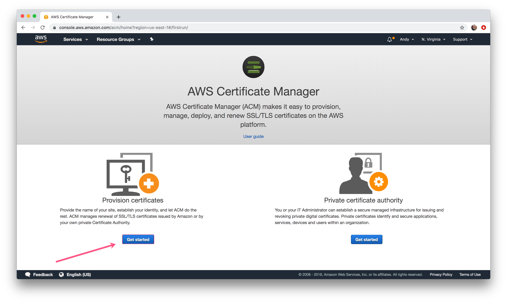
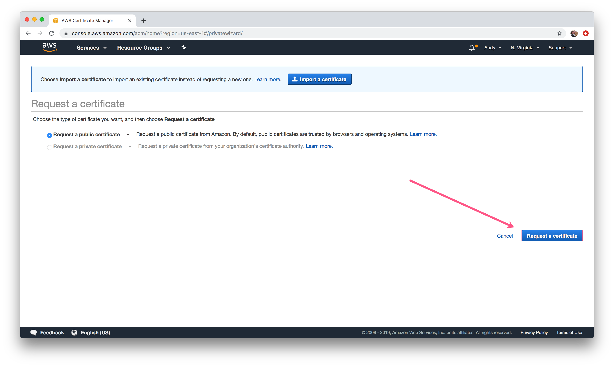
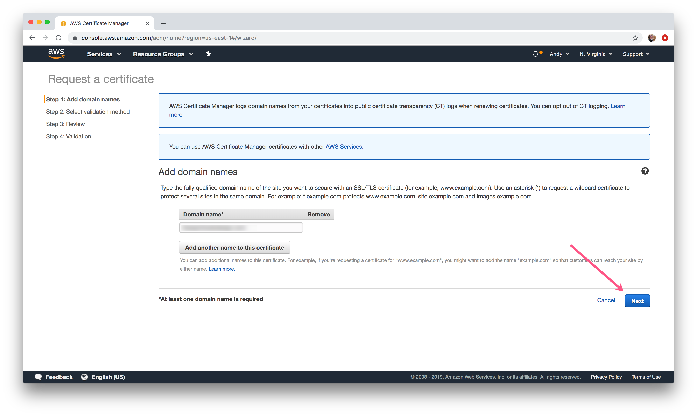
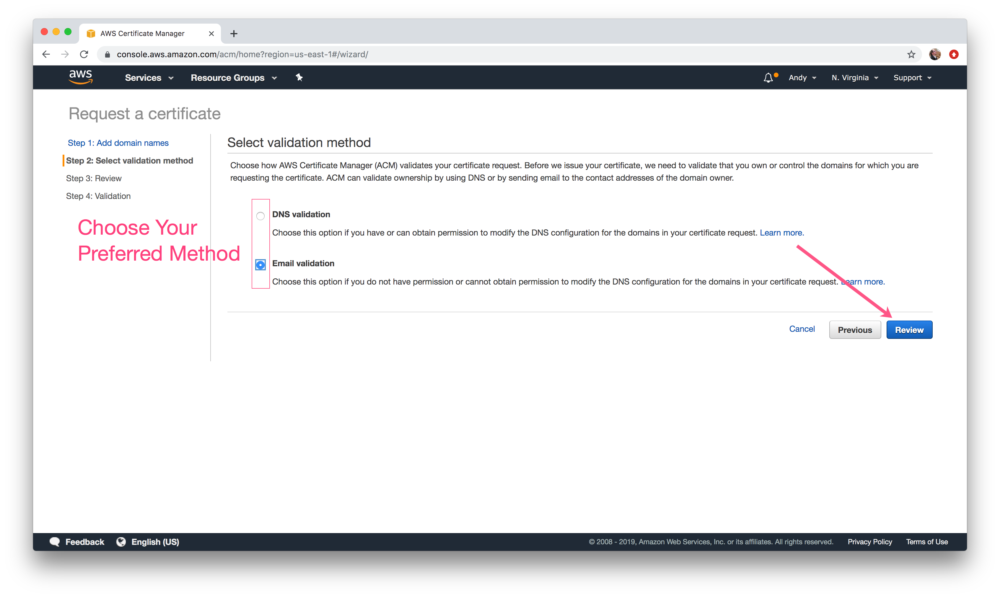
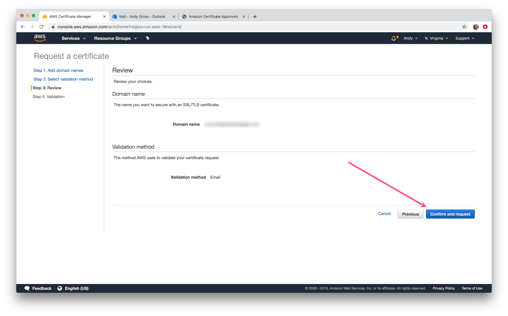
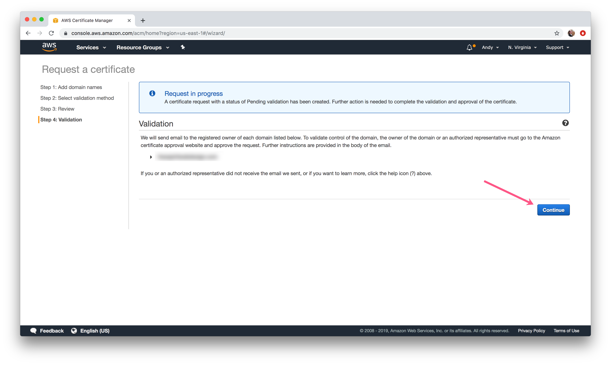
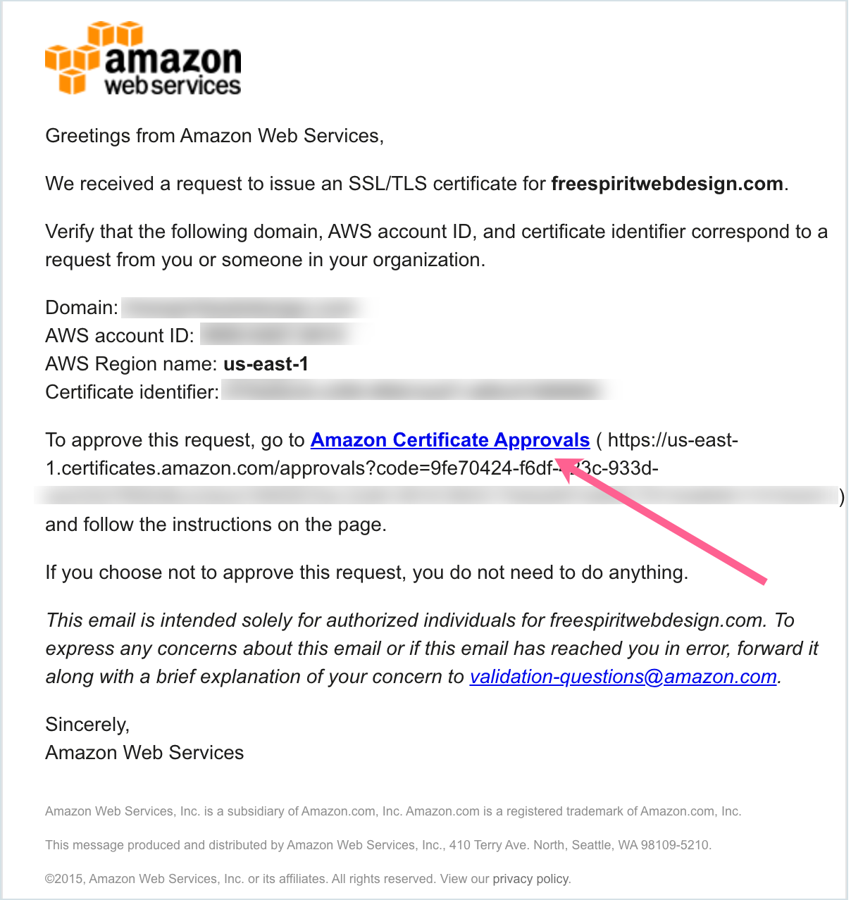
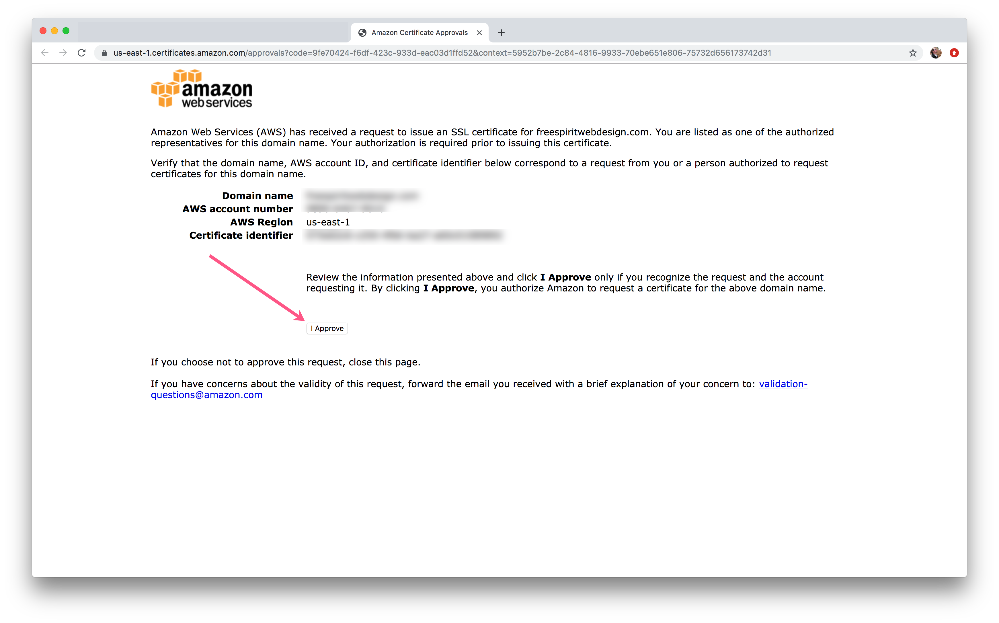
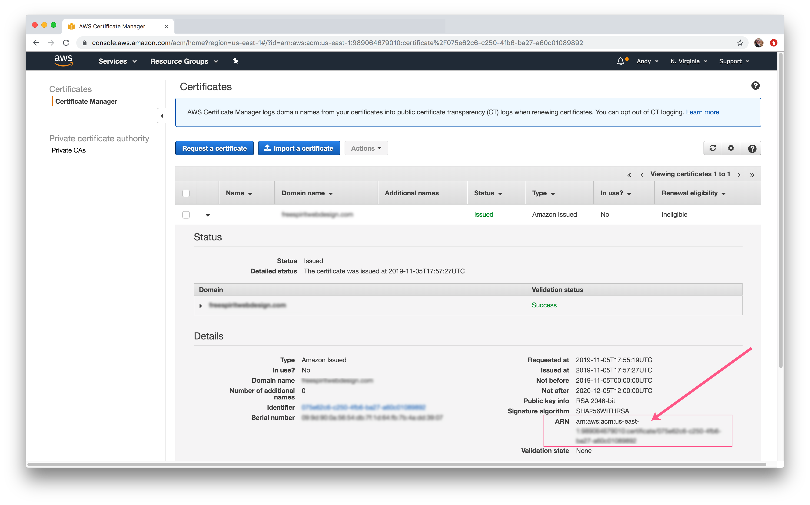

# Creating an AWS certificate for SSL


If you **do not want to use SSL**, you can disable by adding the `use_ssl = "false"` parameter to the `terraform.tfvars` file.


### To create:

1\) Go to [https://console.aws.amazon.com/acm/](https://console.aws.amazon.com/acm/). Select provision certificates and click on get started:

2\) Request a Public Certificate.

3\) Add a domain you have access to and click **Next**.


This does not need to be the same domain for deployment - as long as it’s a valid ARN on your account it will pass verification.


4\) Choose your validation method \(your preference\) and click **Review**.

5\) Review your information and click **Confirm and request.**

6\) Click **Continue** to begin validation.

7\) Confirm the Domain:

* **DNS Validation:** Create a CNAME record in the DNS configuration for each of the domains listed below.
* **Email Validation:** Receive email and follow link

8\)  Approve the Certificate

9\) In the AWS Certificate Manager, click on the domain name to view the certificate details. **Copy and paste your ARN** into the `alb_certificate_arn` field in the `terraform.tfvars` file 

