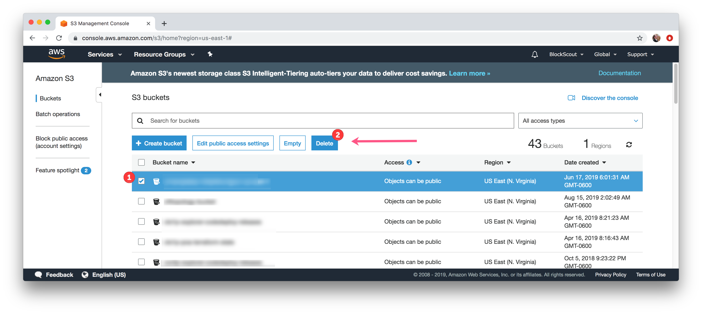
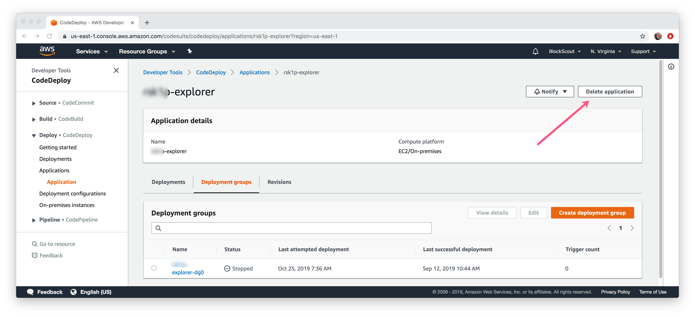
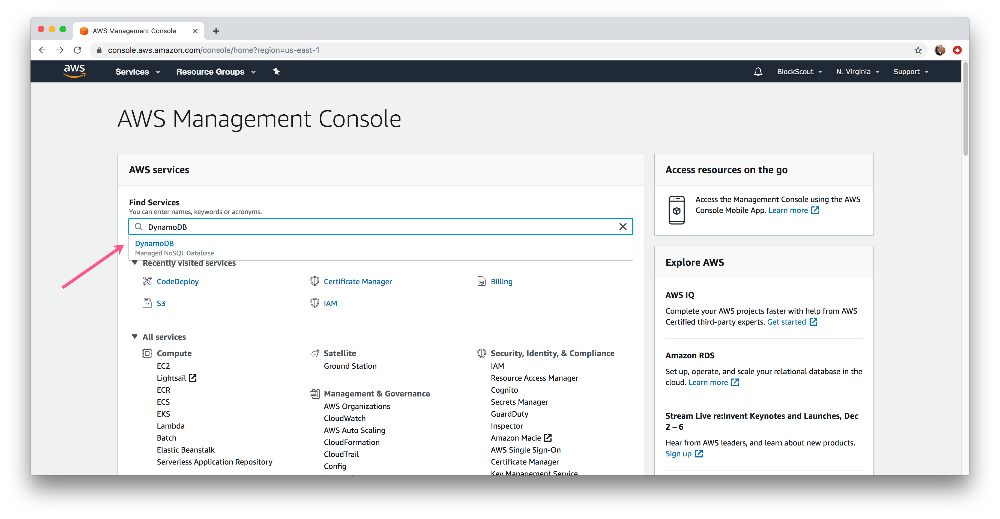
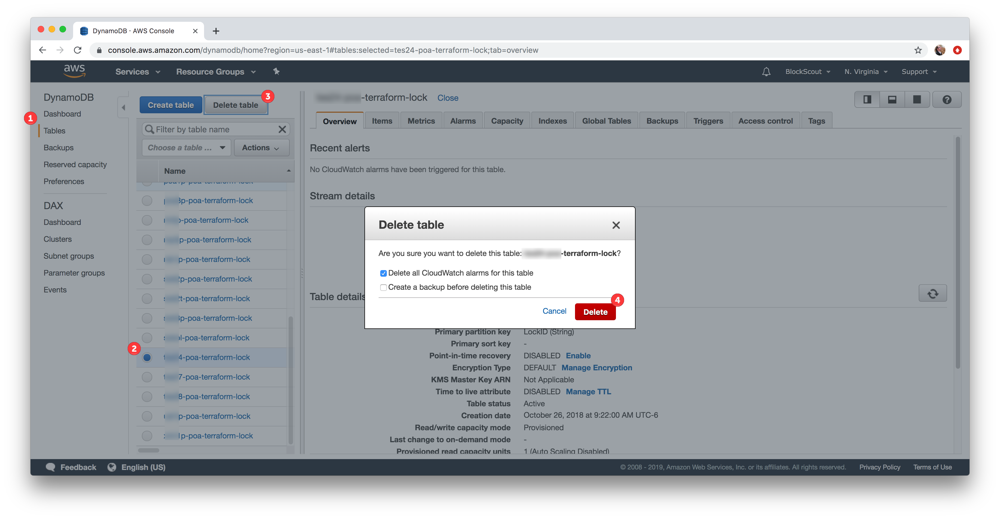
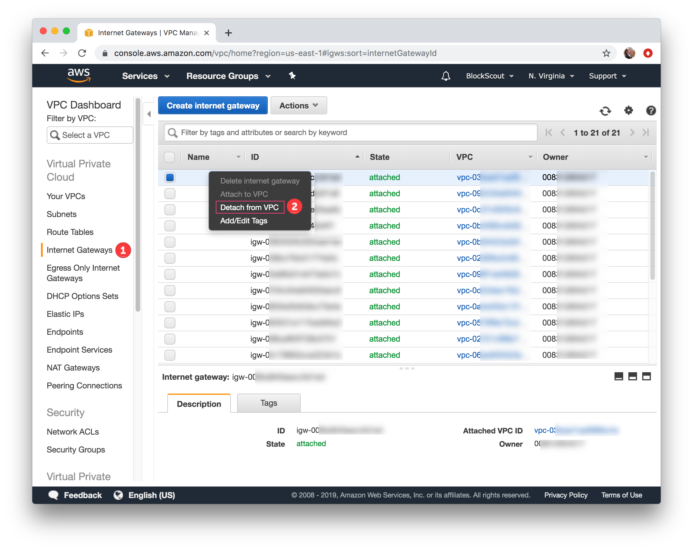
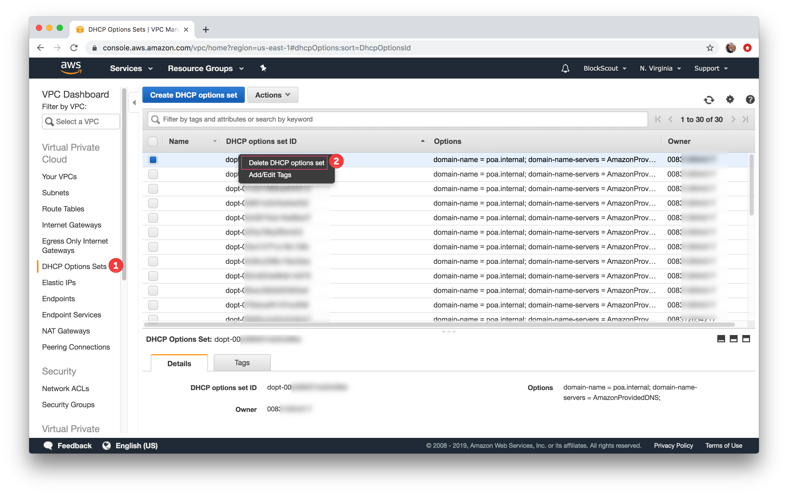
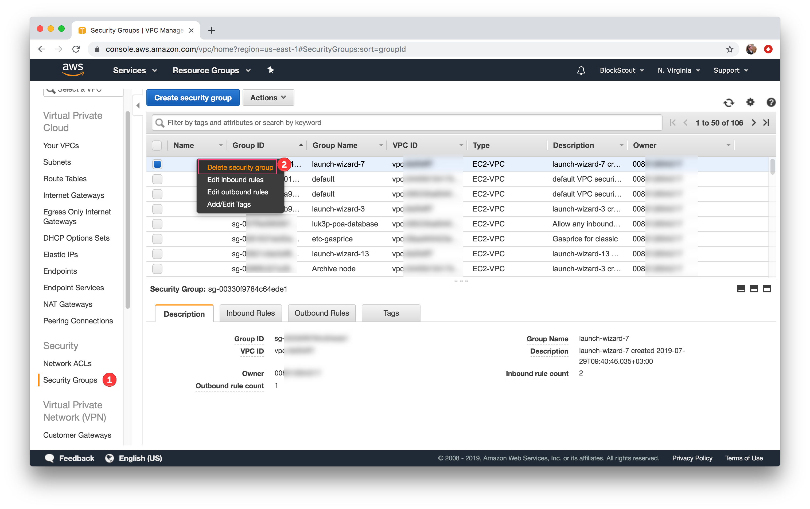
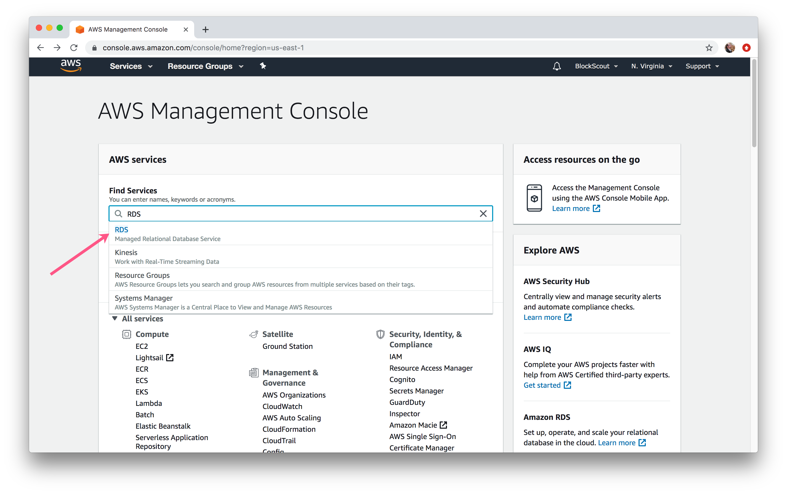

# Manually Cleaning Terraform Related Instances


If the deployment process was previously successful, you can run  `bin/infra destroy`. Additionally, `bin/infra destroy_setup`will delete the DynamoDB table. [More information on destroying infrastructure is available here](../destroying-provisioned-infrastructure.md).

However, in circumstances that rely on insufficient AWS account rights, the deployment process may fail. In this case, `bin/infra destroy_setup` will not work.&#x20;

**Additionally, forgetting to clean resources can result in high AWS costs in a short period of time, so it's best to check that all resources have been removed.**&#x20;


In order to completely manually remove Terraform deployment from AWS you need to clear all related instances of the following services:

* S3
* CodeDeploy
* DynamoDB
* Route 53
* DynamoDB
* VPC
* RDS

### Removing S3 Buckets

1\) In the Find Services box, type in S3 and select **S3, Scalable Storage in the Cloud**.

2\) Find related buckets created by Terraform one by one. You can only delete one at a time. They all will be prefixed with `${prefix}` from the Terraform config file. Select a bucket and click **Delete** button. Confirm the deletion. Continue for all related buckets.

### Removing CodeDeploy Application

1\) In the Find Services box, type in **CodeDeploy** and select.

2\) Select the **Applications** section in the left menu. Click an application in the list (related to Terraform deployment) to select.&#x20;

Click the **Delete Application** button and confirm the deletion.

### Remove DynamoDB instance

1\) In the Find Services box, type in **DynamoDB** and select.

2\) Remove all related DynamoDBs.&#x20;

1. Select **Tables** section in the left menu
2. Select related database (typically 1 database per deployment). Select database
3. &#x20;Click **Delete Table** button.&#x20;
4. Confirm the deletion.

### Remove DNS (Route 53)

1\)  In the Find Services box, type in **Route 53** and select.

2\) Remove all related Hosted zones.&#x20;

1. Select hosted zones in left menu.
2. Select related hosted zone.
3. Click **Delete Hosted Zone** button.&#x20;
4. Confirm the deletion.

### Remove Isolated Cloud Resources (VPC)

1\) In the Find Services box, type in **VPC** and select.

2\) Remove all related subnets. Select **Subnets** section in the left menu, select all related subnets (usually 1 subnet per deployment). Right mouse click or click **Delete subnet** item in **Actions** menu. Confirm the deletion.

3\) Remove all related route tables. Select **Route tables** section in the left menu, select all related route tables (usually it should be 1 route table for deployment). Right mouse click or click **Delete Route table** item in **Actions** menu. Confirm the deletion.

4\) Detach all related internet gateways. Select **Internet Gateways** section in the left menu, select all related internet gateways (usually 1 internet gateway per deployment). Right mouse click or click **Detach from VPC** item in **Actions** menu. Confirm the detachment.

5\) Remove all related DHCP options sets. Select **DHCP Options Sets** section in the left menu, select all related DHCP options sets (usually  1 DHCP option set per deployment). Right mouse click or click **Delete DHCP options** _set_ item in **Actions** menu. Confirm the deletion.

6\) Remove all related Network ACLs. Select **Network ACLs** section in the left menu, select all related Network ACLs (usually 1 Network ACL per deployment). Right mouse click or click **Delete network ACL** item in **Actions** menu. Confirm the deletion.

7\) Remove all related Security groups. Select **Security Groups** section in the left menu, select all related Security groups (usually 1 Security group for deployment). Right mouse click or click **Delete security group** item in **Actions** menu. Confirm the deletion.

8\) Remove all related VPCs. Select **Your VPCs** section in the left menu, select all related VPCs (usually1 VPC for deployment). Right mouse click or click **Delete VPC** item in **Actions** menu. Confirm the deletion.

### Remove Relational Database Service (RDS)

1\)  In the Find Services box, type in **RDS** and select.

2\) Remove all related subnet groups. Select **Subnet groups** section in the left menu, select all related subnet groups (usually  1 subnet group for deployment). Select subnet group and click **Delete** button. Confirm the deletion.

3\) Remove all related RDSs. Select **Databases** __ section in the left menu, select all related databases (usually 1 database for deployment). Select the Database, go to the **Actions** menu, and select **Delete** from the menu. Confirm the deletion.


This instruction was moved from [https://forum.poa.network/t/aws-settings-for-blockscout-terraform-deployment/1962](https://forum.poa.network/t/aws-settings-for-blockscout-terraform-deployment/1962)

