# Install from AWS Marketplace


Before you start, make sure you have completed the [prerequisites](aws-marketplace-installation.md).


1\) Login to your aws account

2\) Go to [https://aws.amazon.com/marketplace/search/results](https://aws.amazon.com/marketplace/search/results) and search for BlockScout. Click on **BlockScout Blockchain Explorer** to view.

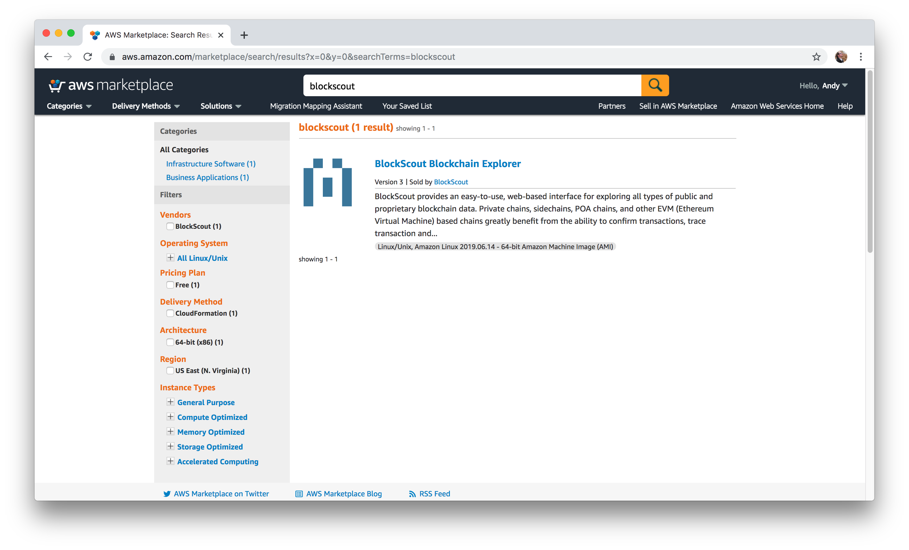

3\) From the main BlockScout Page, click the **Continue to** **Subscribe** button \(The parameters should be set and do not require any changes\)

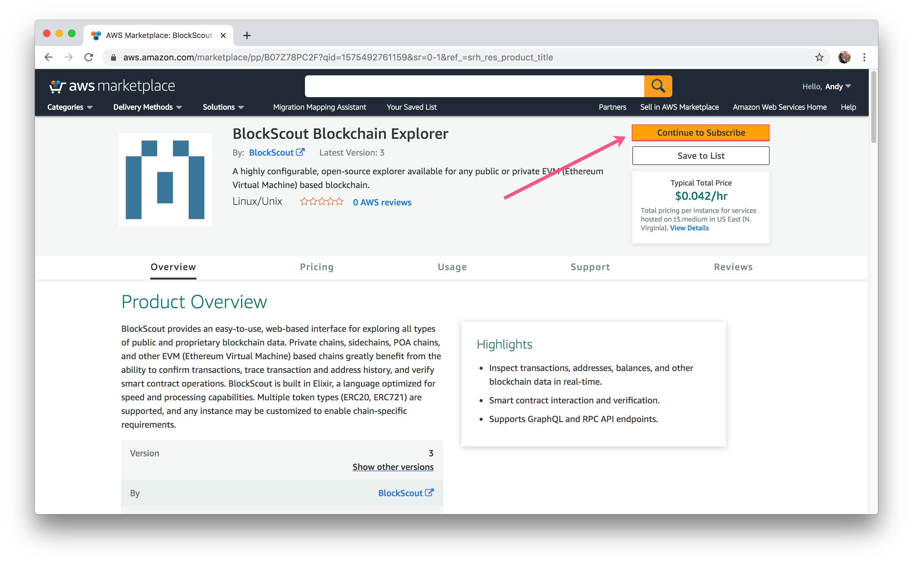

4\) Click **Continue to Configuration**.

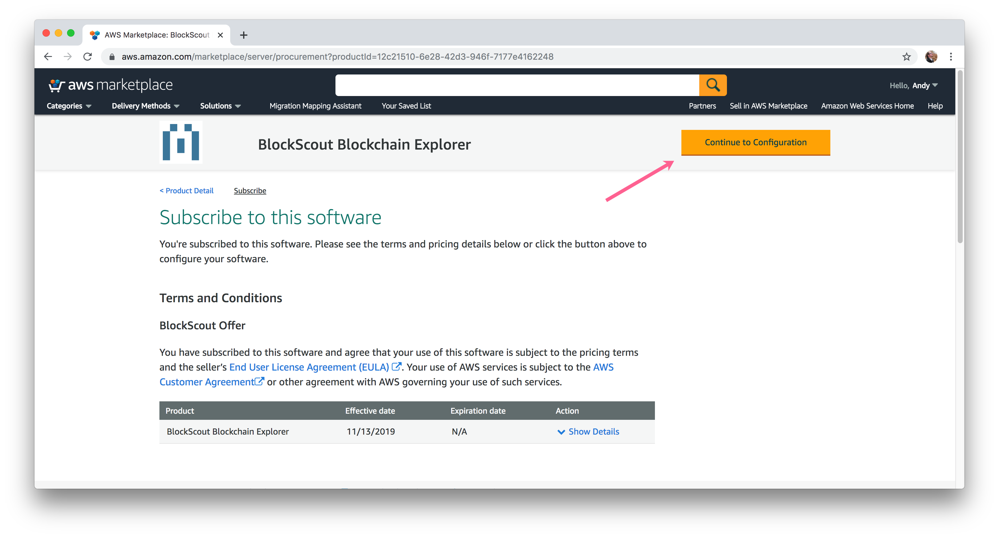

5\) Select BlockScout BlockChain Explorer as Fulfillment option and Software Version 3 \(both should be selected by default\) and **Continue to Launch**.

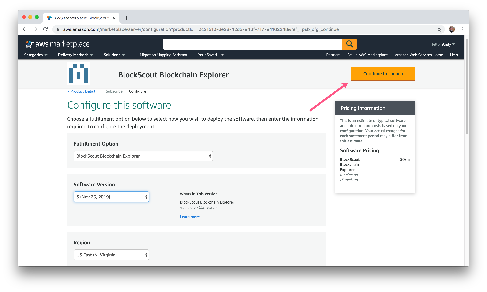

6\) Select **Launch CloudFormation** in the Choose Action dropdown, and click **Launch**.

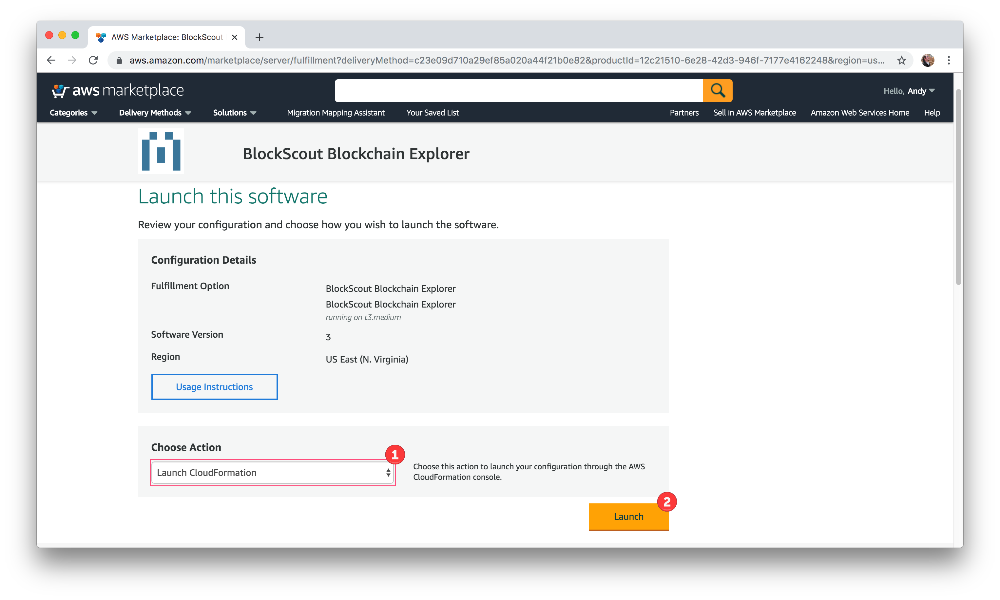

7\)  Start to configure the stack.  Maintain the default selections \(Template is ready\) and click **Next**.

8\) Specify the stack details. Parameters filled in by default can generally be left as-is. For blank items, enter the [chain parameters and environment variables to setup your BlockScout Instance](aws-marketplace-installation.md#installation-parameters).

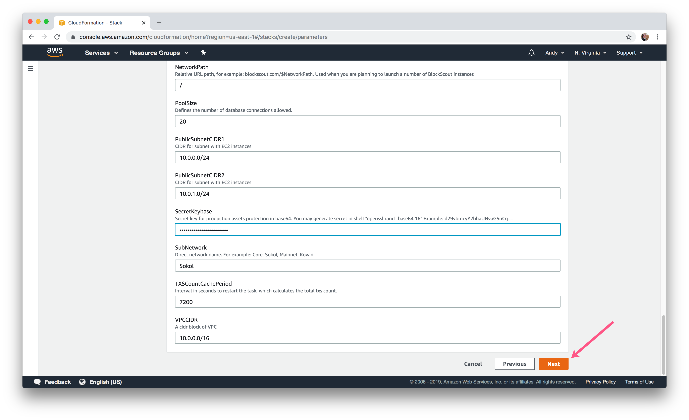

9\) Add any optional items.

* [Resource Tags](https://docs.aws.amazon.com/AWSCloudFormation/latest/UserGuide/aws-properties-resource-tags.html?icmpid=docs_cfn_console)
* [Permissions](https://docs.aws.amazon.com/AWSCloudFormation/latest/UserGuide/using-iam-servicerole.html?icmpid=docs_cfn_console)
* [Advanced Stack Options](https://docs.aws.amazon.com/AWSCloudFormation/latest/UserGuide/cfn-console-add-tags.html?icmpid=docs_cfn_console)

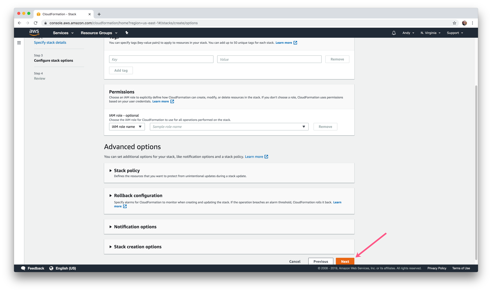

10\) Review all the parameters. If everything looks good, acknowledge that CloudFormation might create IAM resources and click **Create stack.**


If any items do not match template specifics, you can fix by clicking previous, changing an item, and returning to the Create stack page.


11\) Your instance will be located in the CloudFormation section of AWS \(search CloudFormation under services to find\). You can manage the stack here, including monitoring processes, updating and deleting.

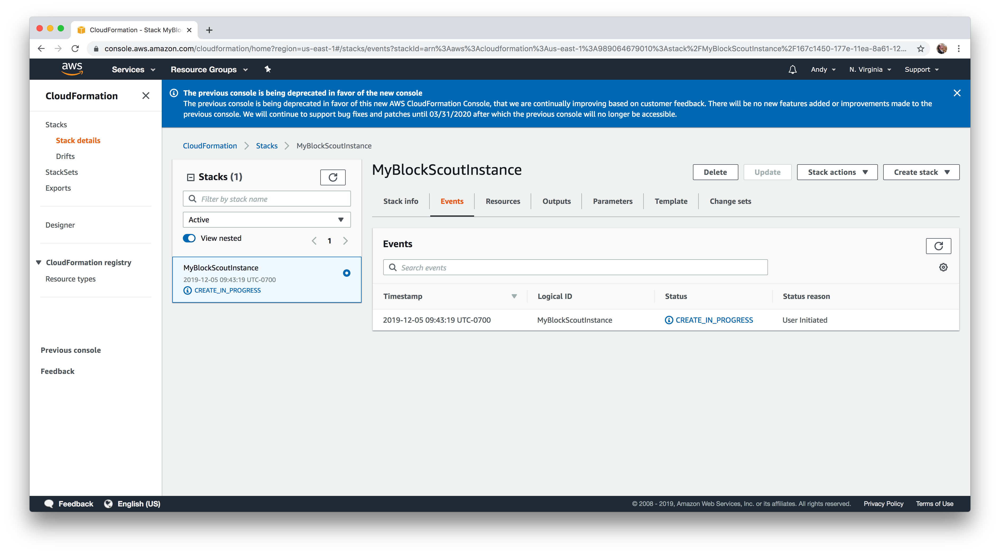

12\) When creation is complete, go to the Outputs tab to find the DNS value. Copy and paste into a browser.

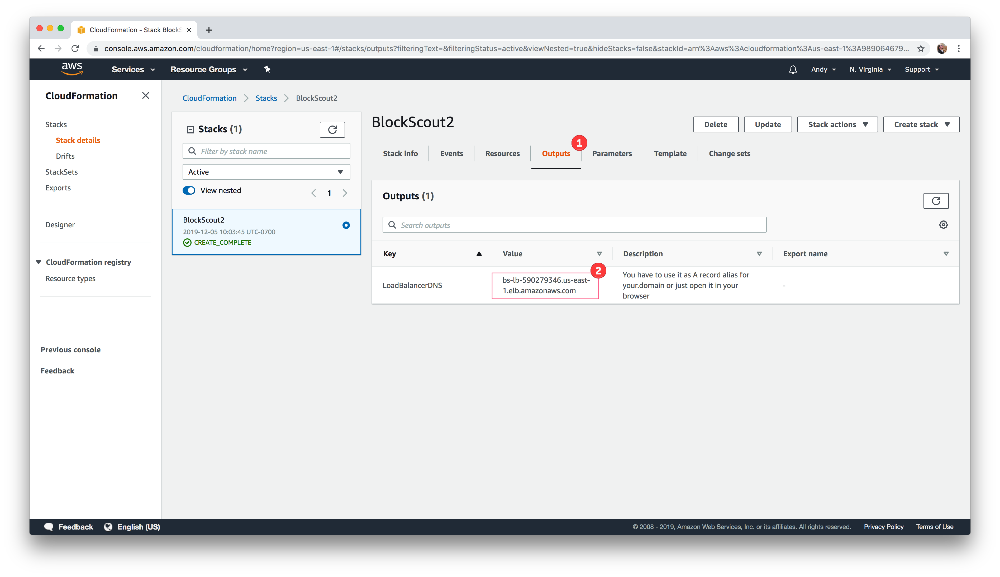

13\) Enter the username and password from the email you received during setup \(email sent to value entered for **CognitoUserEmail** parameter\)

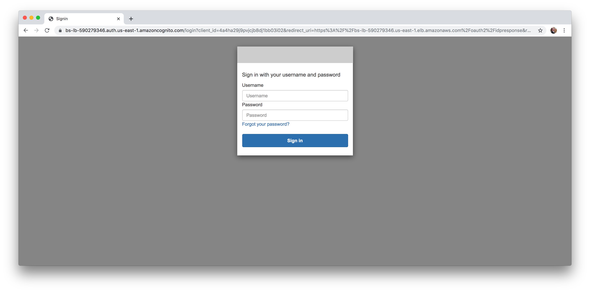

14\) You will be asked to change your password. Store in a safe place.

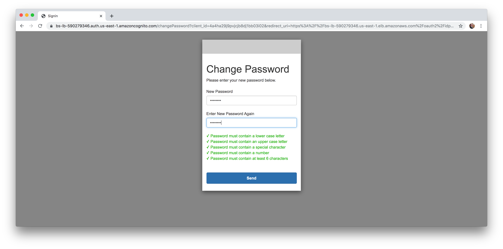

15\) You should now see your BlockScout instance! Depending on the chain you are running, it may take some time to index the data.

For additional configuration options, see:

* [Customizing CSS](customizing-css.md)
* [Updating BlockScout on AWS](updating-and-redeploying-in-aws.md)

\*\*\*\*

\*\*\*\*

