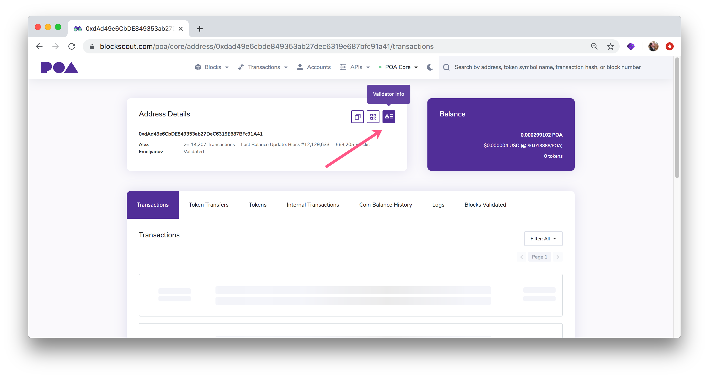
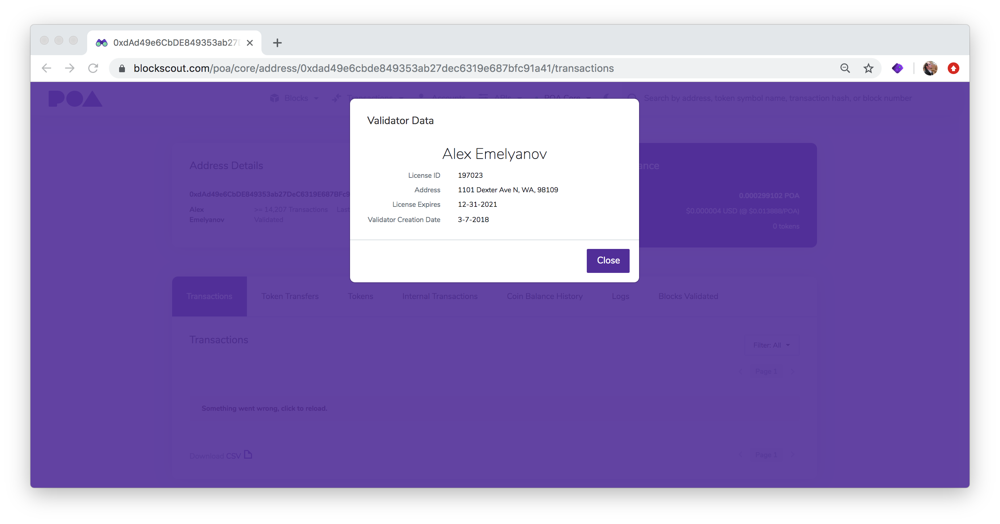

# Add Validator MetaData

BlockScout provides metadata on Validators of [POA Core ](https://blockscout.com/poa/core/)and [POA Sokol ](https://blockscout.com/poa/sokol/)chains.

This information is sourced through the [Validators Contract](https://blockscout.com/poa/core/address/0xa105db0e6671c7b5f4f350ff1af6460e6c696e71/read_contract) and the [Validator Metadata Contract](https://blockscout.com/poa/core/address/0xe3fffd154931eb80b2ace096ec32d6df23661203/read_contract). These contracts are defined through environment variables located here:

[https://github.com/poanetwork/blockscout/blob/12aa15671142af00b35ff05aeac107c2c686c4c8/apps/explorer/config/config.exs\#L33-L41](https://github.com/poanetwork/blockscout/blob/12aa15671142af00b35ff05aeac107c2c686c4c8/apps/explorer/config/config.exs#L33-L41)


Content moved from [https://forum.poa.network/t/how-to-add-validators-metadata-to-blockscout/1949](https://forum.poa.network/t/how-to-add-validators-metadata-to-blockscout/1949)


