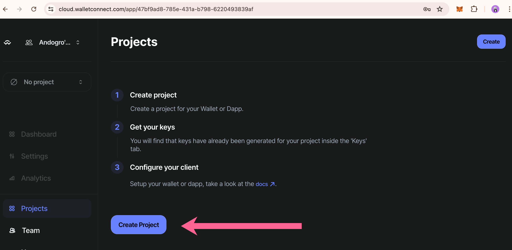
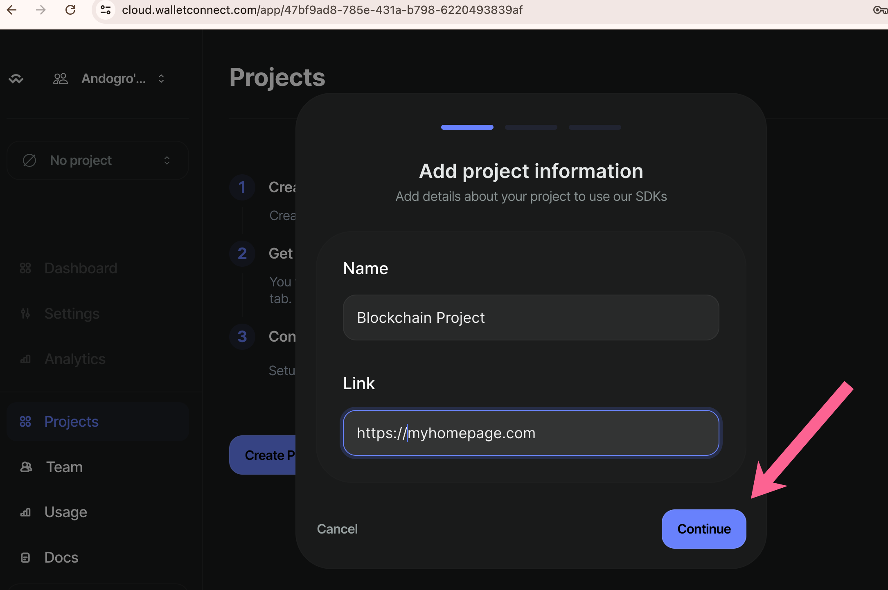
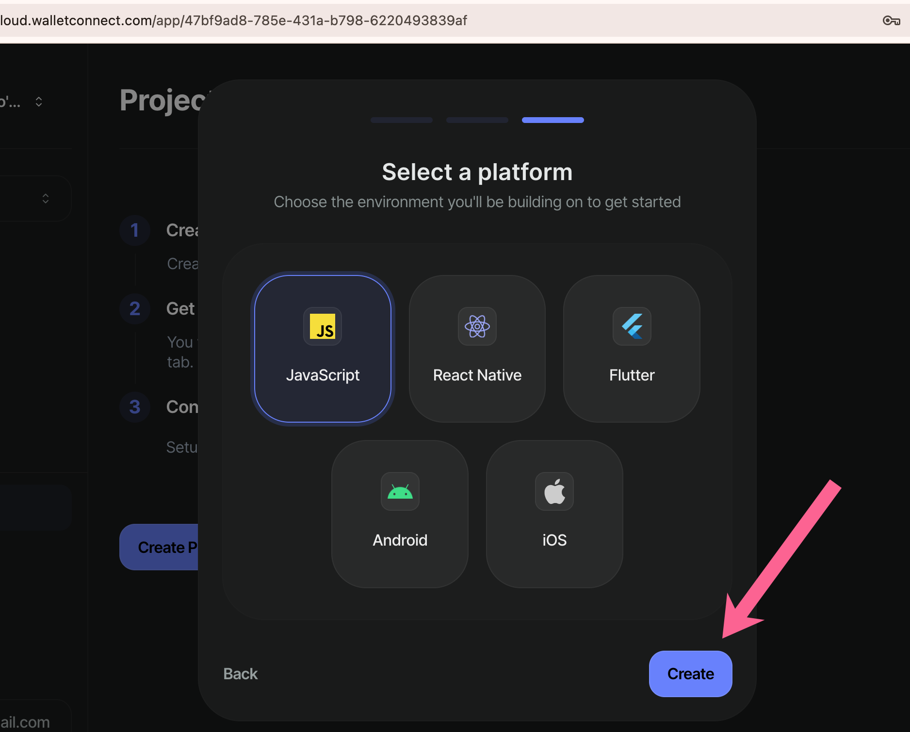
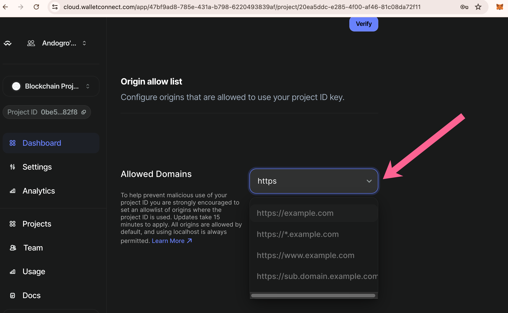
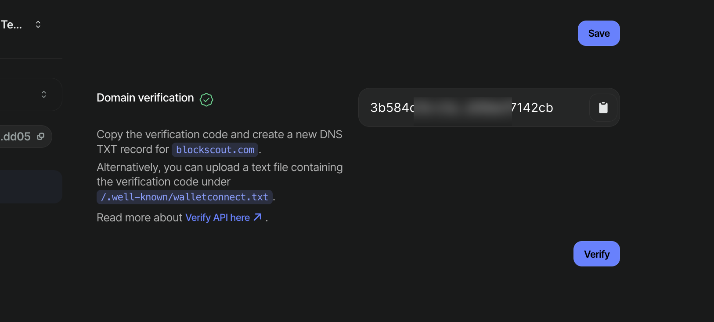

# WalletConnect Project ID for contract Read/Write


The latest versions of Blockscout use WalletConnect for Read and Write functionality with smart contracts.  The frontend variable `NEXT_PUBLIC_WALLET_CONNECT_PROJECT_ID` must be enabled with your project ID for this feature to work.&#x20;


## Setting up a WalletConnect Project ID

1\) Go to [https://cloud.walletconnect.com/sign-in](https://cloud.walletconnect.com/sign-in) and sign in or create an account.

2\) Create a new Project

<figure><figcaption></figcaption></figure>

3\) Add your project information (name and project homepage) and click continue.

<figure><figcaption></figcaption></figure>

4\) Select **WalletKit** as the SDK.

<figure><figcaption></figcaption></figure>

5\) Select **Javascript** as the platform and create your project.

<figure><figcaption></figcaption></figure>

6\) Scroll down to see your basic information, including your project ID. Before using, however, **set the Allowed Domains list**. Please include any urls which host your explorer(s) here.


This step is important because the Project ID will be exposed in the browser. Setting allowed domains  prevents unauthorized usage of your ID.&#x20;


<figure><figcaption></figcaption></figure>

You can also verify your domain. This is not required but is recommended for security. Instructions are included in the interface.

<figure><figcaption><p>Domain verification process</p></figcaption></figure>

7\) Copy your project ID and add in the ENV.

<figure><figcaption></figcaption></figure>

```bash
$ export NEXT_PUBLIC_WALLET_CONNECT_PROJECT_ID=54b4....8dd05
```


You Blockscout instance will now support the Wallet Connect Project ID for Contract Read and Write functionality.\
\
[-> See more front-end ENVs related to Blockchain and contract interaction](https://github.com/blockscout/frontend/blob/main/docs/ENVS.md#blockchain-interaction-writing-to-contract-etc).



