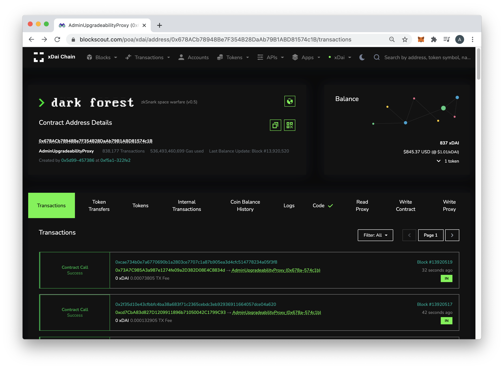
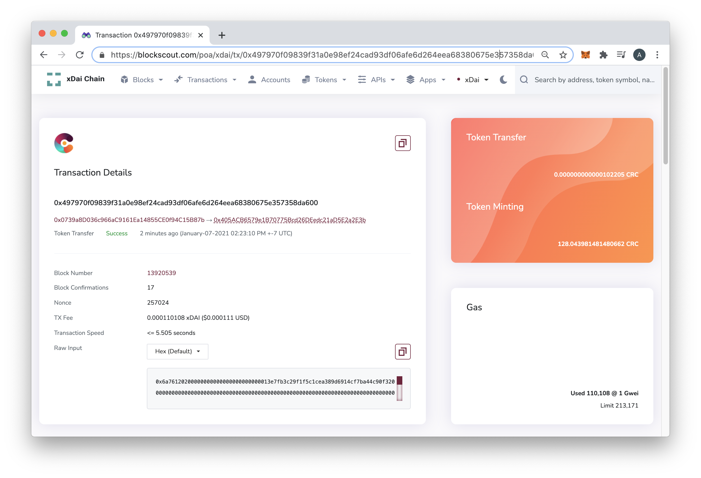

# Custom / Branded Themes

Custom blockscout themes create consistent branding, help users navigate transactions and other on-chain info, and keep users engaged with an application. Plus they look awesome! We can customize themes based on your specific project needs and work with your team to add features, links and other customizations. Help your project stand out.

## Examples:

### Dark Forest: 

[https://blockscout.com/xdai/mainnet/0x678ACb78948Be7F354B28DaAb79B1ABD81574c1B/transactions](https://blockscout.com/xdai/mainnet/0x678ACb78948Be7F354B28DaAb79B1ABD81574c1B/transactions)

### Circles UBI: 

[https://blockscout.com/xdai/mainnet/tx/0x497970f09839f31a0e98ef24cad93df06afe6d264eea68380675e357358da600/token-transfers](https://blockscout.com/xdai/mainnet/tx/0x497970f09839f31a0e98ef24cad93df06afe6d264eea68380675e357358da600/token-transfers)

