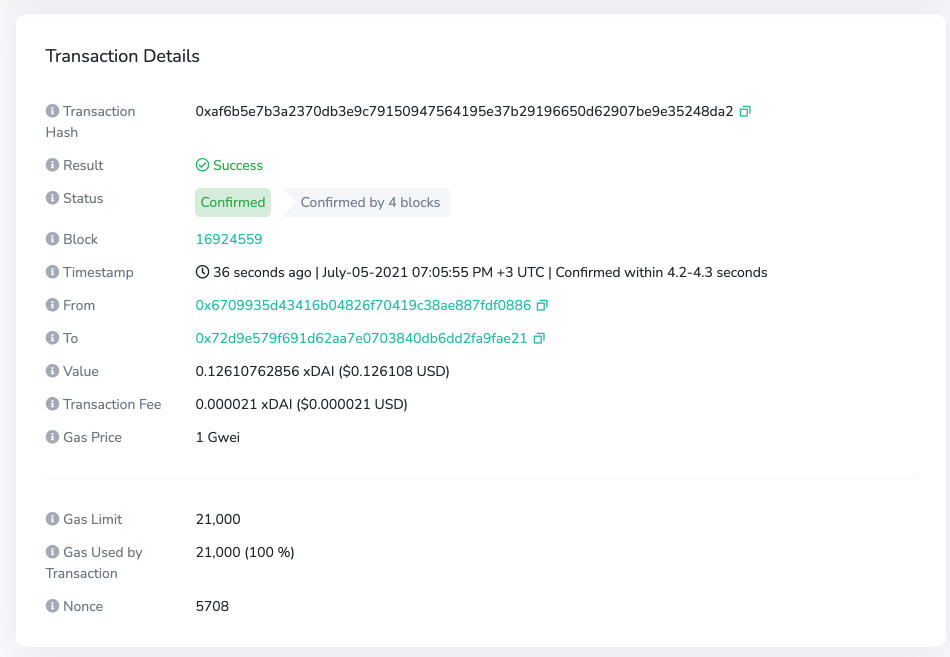
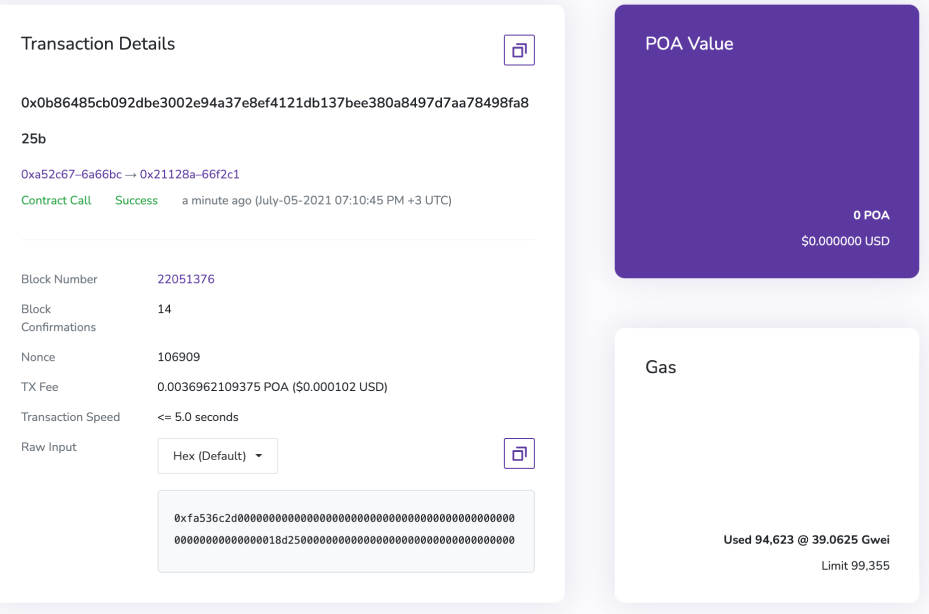

# Premium Transaction Pages

Default Blockscout transaction pages included basic information for users such as the transaction hash, block number, nonce and tx fees. While this is adequate for many users, projects can upgrade to premium transaction pages to give users additional data points and a user-friendly layout with tooltips and well-organized information.

### Premium Layout

### Basic Layout

### Primary Differences

|                                             | Basic Tx Page         | Premium Tx Page       |
| ------------------------------------------- | --------------------- | --------------------- |
| Basic info                                  | :heavy\_check\_mark:  | :heavy\_check\_mark:  |
| Squares layout                              | :heavy\_check\_mark:  |                       |
| Tooltip layout                              |                       | :heavy\_check\_mark:  |
| Status/blocks since confirmation            |                       | :heavy\_check\_mark:  |
| Separate To/From fields with easy copy icon |                       | :heavy\_check\_mark:  |
| Gas Price/ Gas Used by Tx %                 |                       | :heavy\_check\_mark:  |
