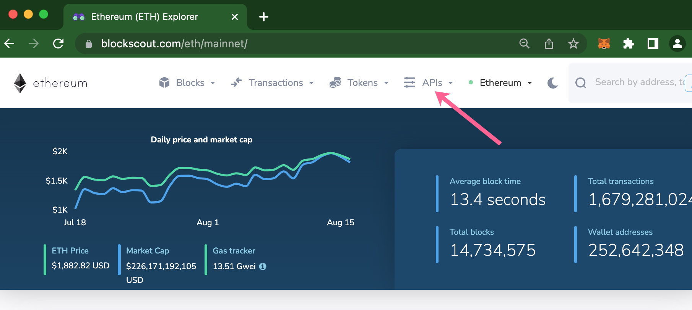
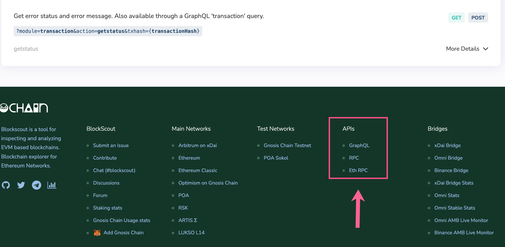

# API

## Blockscout Internal Documentation

To view Modules and API Reference documentation:

1.  Generate documentation.

    `mix docs`
2.  View the generated docs.

    `open doc/index.html`

## Blockscout API Usage

Api calls can be accessed from the Blockscout footer or top menu depending on the instance. Blockscout supports several methods:

1. ****[**Graphiql**](https://github.com/graphql/graphiql): An IDE for exploring GraphQL
2. **RPC**: API provided for developers transitioning their applications from Etherscan to Blockscout. Supports GET and POST requests.&#x20;
   1. Typically located at `https://blockscout.com/instance/networktype/api-docs`.&#x20;
   2. For example, Ethereum mainnet docs are located at [https://blockscout.com/eth/mainnet/api-docs](https://blockscout.com/eth/mainnet/api-docs)
3. **Eth RPC**: Supports the most popular [JSON RPC methods](https://github.com/ethereum/wiki/wiki/JSON-RPC).

## GraphQL

Send Queries to quickly get information. Use the **Docs button** to quickly find arguments accepted by the schema. More information is available in our [Blockscout GraphQL tutorial](https://forum.poa.network/t/graphql-in-blockscout/1971).

## ETH RPC

Blockscout supports the following methods. Requests and return data are identical to the [documentation](https://eth.wiki/json-rpc/API).

* eth\_blockNumber&#x20;
* eth\_call&#x20;
* eth\_getBalance&#x20;
* eth\_getCode&#x20;
* eth\_getBlockByHash&#x20;
* eth\_getBlockByNumber&#x20;
* eth\_getTransactionByHash&#x20;
* eth\_getTransactionByBlockHashAndIndex
* eth\_getTransactionByBlockNumberAndIndex&#x20;
* eth\_getTransactionReceipt&#x20;
* eth\_getUncleByBlockHashAndIndex&#x20;
* eth\_getLogs

## API Keys

If My Account is enabled, users can add up to 3 API keys to ensure 10 request/second limits. When API Keys are not used, the global default is 50 requests/second.

* More info on [My Account and adding API Keys](../my-account/api-keys.md)
* More info on [API Requests and Limits](requests-and-limits.md)

