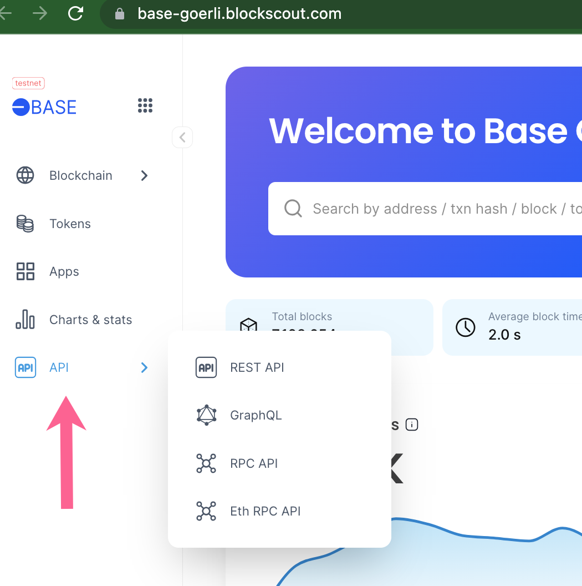

# API

## Blockscout Internal Documentation

To view Modules and API Reference documentation:

1.  Generate documentation.

    `mix docs`
2.  View the generated docs.

    `open doc/index.html`

## Blockscout API Usage

API calls can be accessed from the Blockscout main menu, footer or header depending on the instance.&#x20;

Blockscout supports several methods:

1. **REST API**: API that serves the UI for **new instances** of Blockscout. Methods available here: [https://eth.blockscout.com/api-docs](https://eth.blockscout.com/api-docs)
2. [**Graphiql**](https://github.com/graphql/graphiql): An IDE for exploring GraphQL.
3. **RPC API**: provided for developers transitioning their applications from Etherscan to Blockscout. Supports GET and POST requests.
   1. Typically located at `https://blockscout.com/instance/networktype/api-docs`.
   2. For example, Ethereum mainnet docs are located at [https://eth.blockscout.com/api-docs](https://eth.blockscout.com/api-docs)
4. **Eth RPC API**: Supports the most popular [JSON RPC methods](https://github.com/ethereum/wiki/wiki/JSON-RPC).

<figure><figcaption>
API access in new instance
</figcaption></figure>

## GraphQL

Send Queries to quickly get information. Use the **Docs button** to quickly find arguments accepted by the schema. More information is available in our [Blockscout GraphQL tutorial](https://forum.poa.network/t/graphql-in-blockscout/1971).

## ETH RPC

Blockscout supports the following methods. Requests and return data are identical to the [Ethereum documentation](https://eth.wiki/json-rpc/API).&#x20;

* eth\_blockNumber
* eth\_getBalance
* eth\_getLogs

More details on [ETH RPC for Blockscout](eth-rpc.md) are available here.

## API Keys

If My Account is enabled, users can add up to 3 API keys to ensure 50 request/second limits. When API Keys are not used, the global default is 50 requests/second.

* More info on [My Account and adding API Keys](../my-account/api-keys.md)
* More info on [API Requests and Limits](requests-and-limits.md)
