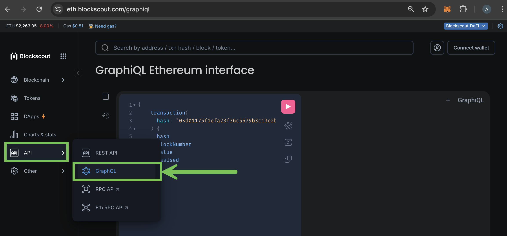

# GraphQL in Blockscout

## **What is GraphQL**

GraphQL is an open-source data query and manipulation language for APIs, and a runtime for fulfilling queries with existing data. It provides an efficient, powerful and flexible approach to developing web APIs. It allows clients to define the structure of the data required, and exactly the same structure of the data is returned from the server, therefore preventing excessively large amounts of data from being returned.

Key concepts of the GraphQL query language are:

* Hierarchical
* Strongly typed
* Client-specified queries

Advantages of GraphQL:

* Declarative integration on client \(what data/operations do I need\)
* A standard way to expose data and operations
* Support for real-time data \(with subscriptions\)

## **Query types**

There are three main query types in GraphQL schema:

1\) **Query:** fetch data

```
query {
  allPosts {
    description
    text
  }
}
```

2\) **Mutation:** change data.

```
   mutation {
     updatePost(id: 1, text: "text") {
       text
     }
   }
```

1. **Subscription:**  subscribe to real-time data.

```
subscription {
  newPost(category: [1]) {
    description
    text
  }
}
```

## **Access GraphQL API**

To access Blockscout GraphQL interface you can you can use GraphiQL - in-browser IDE for exploring GraphQL. It's built in to Blockscout.

From the `APIs` dropdown menu choose `GraphQL`



Or you can use your favorite http client:

```
curl 'https://blockscout.com/eth/kovan/graphiql'
  -H 'Authorization: Bearer YOUR_AUTH_TOKEN'
  -d '{"query":""{transaction(hash:\"0x69e3923eef50eada197c3336d546936d0c994211492c9f947a24c02827568f9f\"){blockNumbertoAddressHashfromAddressHashcreatedContractAddressHashvaluestatusnoncehasherrorgasgasPricegasUsedcumulativeGasUsedidindexinputrsv}}""}'
```

## **Queries**

Blockscout's GraphQL API provides 4 queries and 1 subscription. You can view them in the GraphQL interface under `Schema` tab. Example Queries:

| Query | Description | Example |
| :--- | :--- | :--- |
| address\(hash: AddressHash!\):  Address | Gets an address by hash | {address\(hash: "0x1fddEc96688e0538A316C64dcFd211c491ECf0d8"\) {hash, contractCode} } |
| addresses \(hashes: \[AddressHash!\]\): \[Address\] | Gets addresses by hashes | {addresses\(hashes: \["0x1fddEc96688e0538A316C64dcFd211c491ECf0d8",  "0x3948c17c0f45017064858b8352580267a85a762c"\]\) {hash, contractCode} } |
| block\(number: Int!\): Block | Gets a block by number | {block\(number: 1\) {parentHash, size, nonce}} |
| transaction \(hash: FullHash!\): Transaction | Gets a transaction by hash. | {transaction\(hash: "0xc391da8f433b3bea0b3eb45da40fdd194c7a0e07d1b5ad656bf98940f80a6cf6"\) {input, gasUsed}} |

### Example Query to retrieve transactions for a specific address

```
{
  address(hash: "0x...") {
    transactions(first:5) {
      edges {
        node {
          blockNumber
          createdContractAddressHash
          fromAddressHash
          gas
          hash
        }
      }
    }
  }
}
```

Note that transactions can accept the following arguments:

* first
* after
* before

This request could be sent via an HTTP GET to the Ethereum Mainnet using:

`https://blockscout.com/eth/mainnet/graphql?query={ address(hash: "0x….") { transactions(first: 10) { edges { node { blockNumber createdContractAddressHash fromAddressHash gas hash } } } } }`


