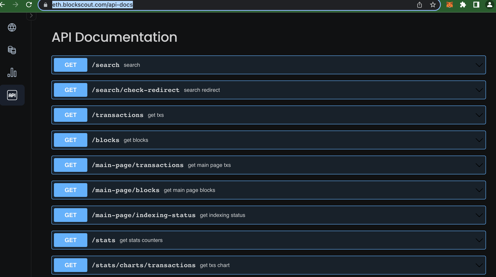

# REST API Endpoints

REST API methods are used to render the UI for new versions of Blockscout. These can be accessed and used to get many types of information. Methods parameters and schemas are available at _https://instance-name/api-docs_ (ie [https://eth.blockscout.com/api-docs](https://eth.blockscout.com/api-docs))

<figure><figcaption></figcaption></figure>

