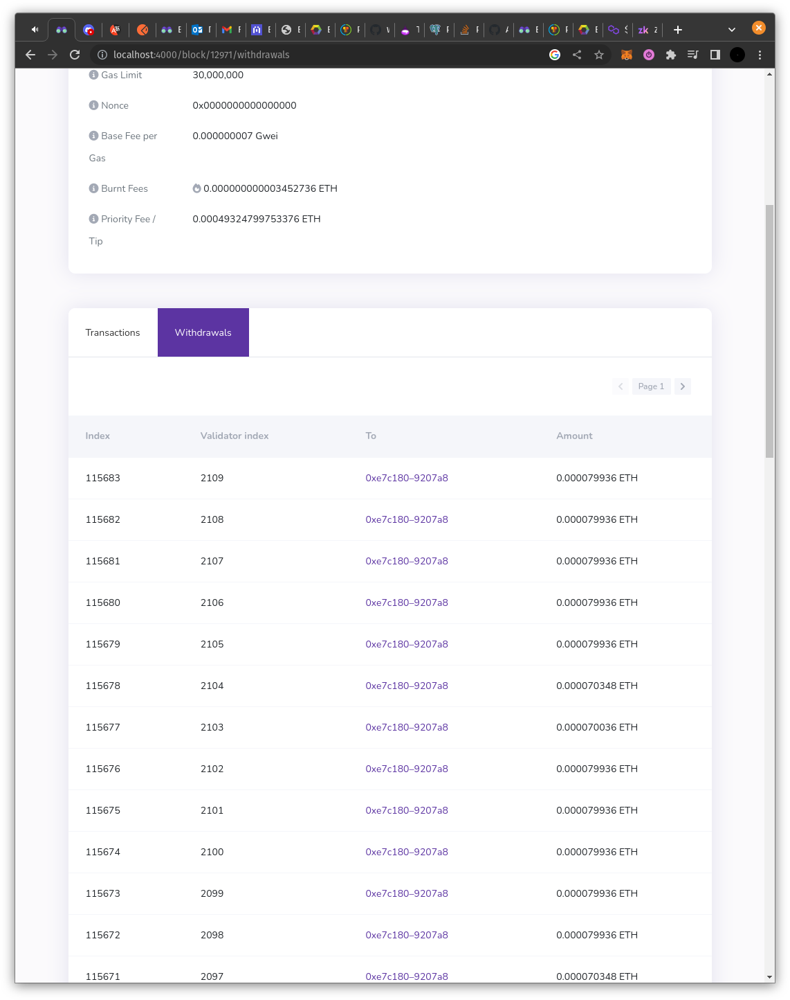

# Beacon Chain Withdrawal Views

Validator withdrawals will soon be activated on the Ethereum mainnet with the Shanghai/Capella hardfork ([EIP-4895](https://eips.ethereum.org/EIPS/eip-4895))**,** and Blockscout will provide views for partial and full withdrawals.

Withdrawals are akin to simple transactions (though they are actually 0 gas balance increases) included in the block structure. Coins are transferred from a validator to a preset withdrawal address (either EOA or contract). Each withdrawal also includes a unique integer index starting from 0 and incrementing by 1 with each withdrawal.

The unique `index`, assigned `validatorIndex`, withdrawal receiving `address`, and `amount` are all included in the withdrawals structure and will be displayed on Blockscout on the block and addresses pages.

```
 "withdrawals": [
            {
                "index": "0xbd8d0",
                "validatorIndex": "0x81e",
                "address": "0xe7c180eada8f60d63e9671867b2e0ca2649207a8",
                "amount": "0x6dcf0a644000"
            },
            {
                "index": "0xbd8d1",
                "validatorIndex": "0x81f",
                "address": "0xe7c180eada8f60d63e9671867b2e0ca2649207a8",
                "amount": "0x6dcf0a644000"
            },
        ],
```

<details>

<summary>Example block with withdrawal struct</summary>

```json
{
    "jsonrpc": "2.0",
    "id": 1,
    "result": {
        "baseFeePerGas": "0x7",
        "difficulty": "0x0",
        "extraData": "0x",
        "gasLimit": "0x1c9c380",
        "gasUsed": "0x0",
        "hash": "0x5262de0c24b0cab3fdc32fadda1904f4698ab0b12d505bf733cf47cb3e60f7f7",
        "logsBloom": "0x00000000000000000000000000000000000000000000000000000000000000000000000000000000000000000000000000000000000000000000000000000000000000000000000000000000000000000000000000000000000000000000000000000000000000000000000000000000000000000000000000000000000000000000000000000000000000000000000000000000000000000000000000000000000000000000000000000000000000000000000000000000000000000000000000000000000000000000000000000000000000000000000000000000000000000000000000000000000000000000000000000000000000000000000000000000",
        "miner": "0xf97e180c050e5ab072211ad2c213eb5aee4df134",
        "mixHash": "0x08471cc3dbac65574f049af479631af782cf31c841710640ed615dc50670b378",
        "nonce": "0x0000000000000000",
        "number": "0xd62f",
        "parentHash": "0xdabf9e7ebfad879ad44270c2a7a5ff8e848e72316def4d5b0305f2a1216089f7",
        "receiptsRoot": "0x56e81f171bcc55a6ff8345e692c0f86e5b48e01b996cadc001622fb5e363b421",
        "sha3Uncles": "0x1dcc4de8dec75d7aab85b567b6ccd41ad312451b948a7413f0a142fd40d49347",
        "size": "0x465",
        "stateRoot": "0x9f2a690353b6d8cfa75cb12347104f42d38463471cda1293696a6c3b685aa839",
        "timestamp": "0x63af29e4",
        "totalDifficulty": "0x1",
        "transactions": [],
        "transactionsRoot": "0x56e81f171bcc55a6ff8345e692c0f86e5b48e01b996cadc001622fb5e363b421",
        "uncles": [],
        "withdrawals": [
            {
                "index": "0xbd8d0",
                "validatorIndex": "0x81e",
                "address": "0xe7c180eada8f60d63e9671867b2e0ca2649207a8",
                "amount": "0x6dcf0a644000"
            },
            {
                "index": "0xbd8d1",
                "validatorIndex": "0x81f",
                "address": "0xe7c180eada8f60d63e9671867b2e0ca2649207a8",
                "amount": "0x6dcf0a644000"
            },
            {
                "index": "0xbd8d2",
                "validatorIndex": "0x820",
                "address": "0xe7c180eada8f60d63e9671867b2e0ca2649207a8",
                "amount": "0x6dcf0a644000"
            },
            {
                "index": "0xbd8d3",
                "validatorIndex": "0x821",
                "address": "0xe7c180eada8f60d63e9671867b2e0ca2649207a8",
                "amount": "0x6dcf0a644000"
            },
            {
                "index": "0xbd8d4",
                "validatorIndex": "0x822",
                "address": "0xe7c180eada8f60d63e9671867b2e0ca2649207a8",
                "amount": "0x6dcf0a644000"
            },
            {
                "index": "0xbd8d5",
                "validatorIndex": "0x823",
                "address": "0xe7c180eada8f60d63e9671867b2e0ca2649207a8",
                "amount": "0x6dcf0a644000"
            },
            {
                "index": "0xbd8d6",
                "validatorIndex": "0x824",
                "address": "0xe7c180eada8f60d63e9671867b2e0ca2649207a8",
                "amount": "0x651c03f6de00"
            },
            {
                "index": "0xbd8d7",
                "validatorIndex": "0x825",
                "address": "0xe7c180eada8f60d63e9671867b2e0ca2649207a8",
                "amount": "0x6dcf0a644000"
            },
            {
                "index": "0xbd8d8",
                "validatorIndex": "0x826",
                "address": "0xe7c180eada8f60d63e9671867b2e0ca2649207a8",
                "amount": "0x6dcf0a644000"
            },
            {
                "index": "0xbd8d9",
                "validatorIndex": "0x827",
                "address": "0xe7c180eada8f60d63e9671867b2e0ca2649207a8",
                "amount": "0x6dcf0a644000"
            },
            {
                "index": "0xbd8da",
                "validatorIndex": "0x828",
                "address": "0xe7c180eada8f60d63e9671867b2e0ca2649207a8",
                "amount": "0x1a2950b4af800"
            },
            {
                "index": "0xbd8db",
                "validatorIndex": "0x829",
                "address": "0xe7c180eada8f60d63e9671867b2e0ca2649207a8",
                "amount": "0x6dcf0a644000"
            },
            {
                "index": "0xbd8dc",
                "validatorIndex": "0x82a",
                "address": "0xe7c180eada8f60d63e9671867b2e0ca2649207a8",
                "amount": "0x6dcf0a644000"
            },
            {
                "index": "0xbd8dd",
                "validatorIndex": "0x82b",
                "address": "0xe7c180eada8f60d63e9671867b2e0ca2649207a8",
                "amount": "0x6dcf0a644000"
            },
            {
                "index": "0xbd8de",
                "validatorIndex": "0x82c",
                "address": "0xe7c180eada8f60d63e9671867b2e0ca2649207a8",
                "amount": "0x6dcf0a644000"
            },
            {
                "index": "0xbd8df",
                "validatorIndex": "0x82d",
                "address": "0xe7c180eada8f60d63e9671867b2e0ca2649207a8",
                "amount": "0x6dcf0a644000"
            }
        ],
        "withdrawalsRoot": "0xb28f757020474ee478a03be8ca4a2efaa7ebddbf565129bb08202ce9a8670d44"
    }
}
```

</details>

## UI display examples&#x20;

_(Note, Blockscout 1.0 mockups shown, Blockscout 2.0 will have a much improved UI)_

### Block page example

<figure><figcaption></figcaption></figure>

### Address page example

<figure><figcaption></figcaption></figure>
