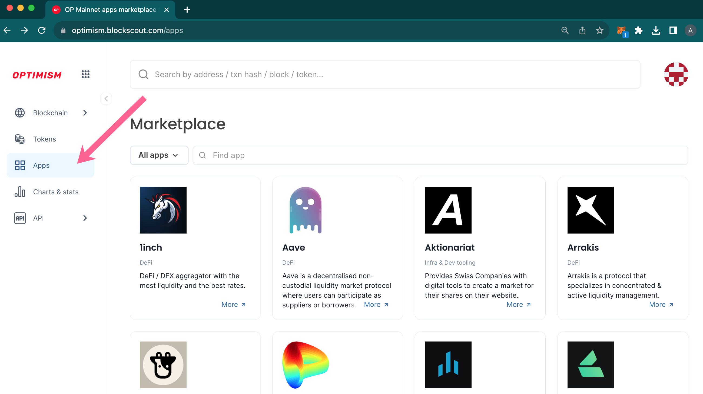
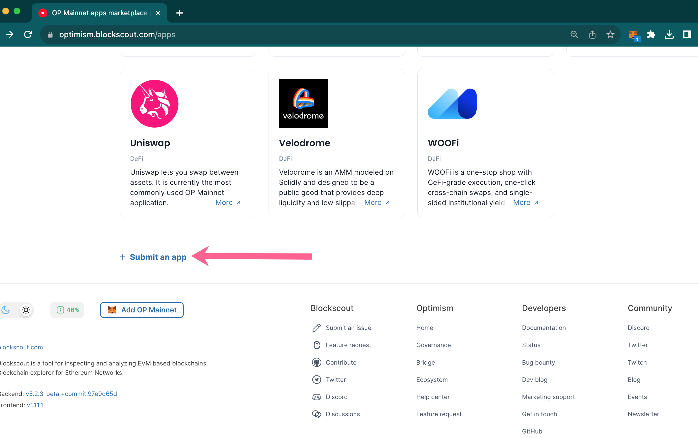

# DAppscout Apps Marketplace

DAppscout Apps Marketplace provides a curated list of apps available to on-chain users. Projects can submit their project for review. If accepted, the app will be listed in the marketplace. Apps are either embedded into the interface directly (like this [Uniswap example](https://optimism.blockscout.com/apps/uniswap)) or added as 3rd party links, depending on the functionality and ability to add into the interface.

In addition to 3rd party apps, Blockscout is developing native apps for the Marketplace. The first native app is the [Token Approval Tracker](token-approval-tracker.md) which allows you to manage and revoke contract approvals. Additional Blockscout native apps are in development.

To submit an app on a marketplace supported chain, access the marketplace from the Blockscout menu.

<figure><figcaption></figcaption></figure>

Scroll to the bottom of the marketplace and click **+ Submit an app.**

<figure><figcaption></figcaption></figure>

You will fill in a form with basic information about your project. This form is submitted to administrators for review and acceptance to the marketplace.

&#x20;
