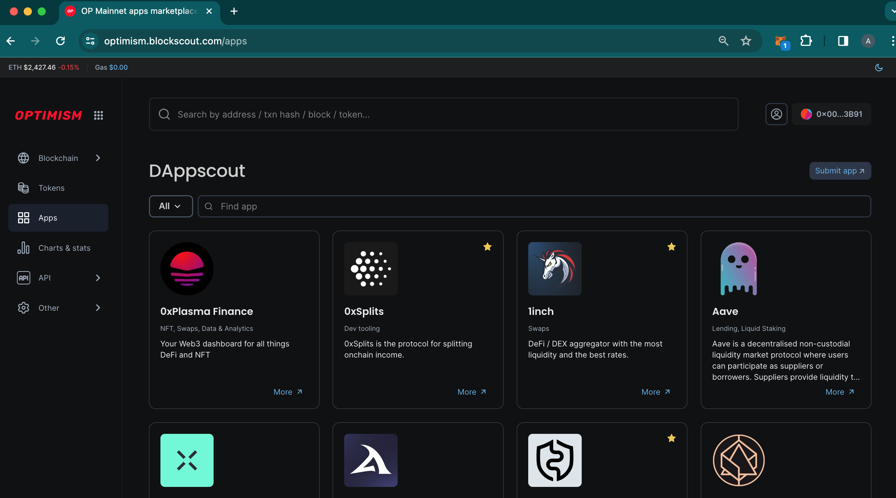
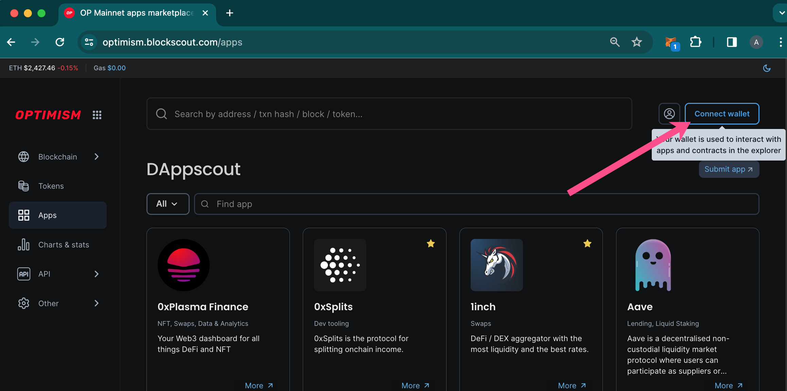
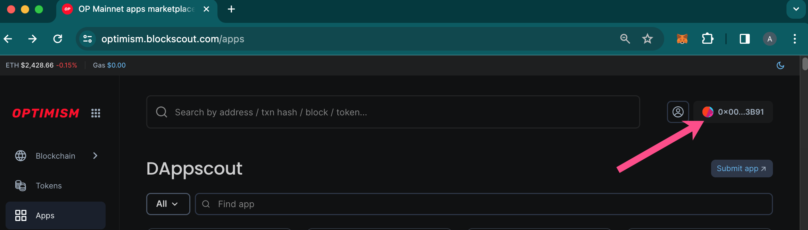
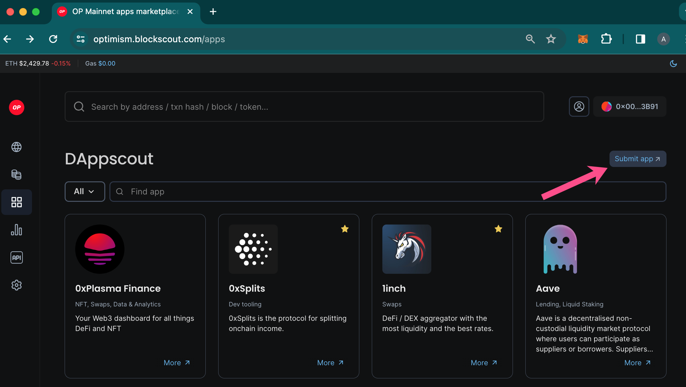

# DAppscout Apps Marketplace


💡 Submit your DApp now [with this quick form](https://airtable.com/appiy5yijZpMMSKjT/shr6uMGPKjj1DK7NL)!


DAppscout Apps Marketplace provides a curated list of apps available to on-chain users. Projects can submit their project for review, and once accepted, the project is listed in the marketplace.&#x20;

<figure><figcaption></figcaption></figure>

## Direct Interface

DApps are either embedded into the interface directly (like this [Uniswap example](https://optimism.blockscout.com/apps/uniswap)) or added as 3rd party links. When embedded, a user can connect their web3 wallet once to Blockscout, then use it with all of the supported DApps. This saves time and makes for a seamless user experience when switching between multiple applications.

<figure><figcaption>
Press the Connect wallet button to connect your web3 wallet using WalletConnect or MetaMask.
</figcaption></figure>

<figure><figcaption>
Wallet is connected and ready to use in DAppscout.
</figcaption></figure>


To enable direct embedding, DApps need to:

1. Support iframe embedding on 3rd party domains.
2. Integrate the [Safe Apps SDK](https://docs.safe.global/apps-sdk-overview).

_Blockscout-specific instructions are in process - follow the Safe Apps SDK instructions for now._


## DApps you can Trust

DAppscout marketplace provides additional security and peace of mind when interacting with various DApps on a chain. Rather than accessing potentially fake links, scam sites or compromised interfaces, all DApps in Blockscout are vetted and added by the curation team. DAppscout DApps are safe and secure for users.

## Blockscout Native DApps

In addition to 3rd party apps, Blockscout is developing native apps for the Marketplace. The first native app is the [Token Approval Tracker](token-approval-tracker.md) which allows you to manage and revoke contract approvals. Additional Blockscout native apps are in development.

## DAppscout Submissions

There are several ways to submit a DApp. You will fill out a form with basic information to get started.

* Use this form to [submit directly](https://airtable.com/appiy5yijZpMMSKjT/shr6uMGPKjj1DK7NL).
* Use the submit app button within the marketplace.

<figure><figcaption></figcaption></figure>

&#x20;
