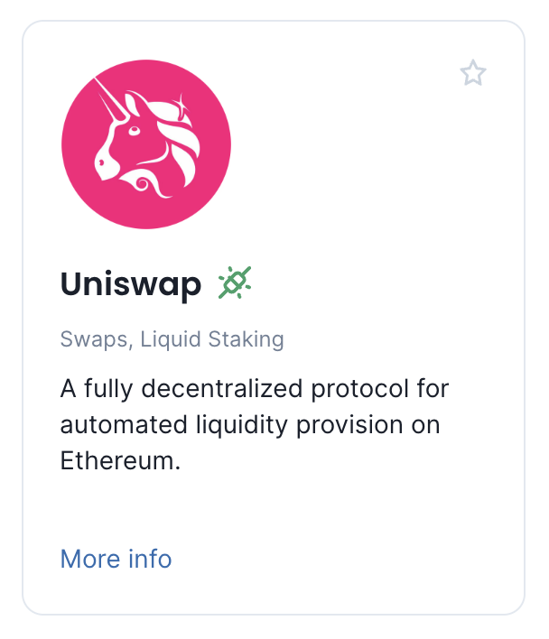
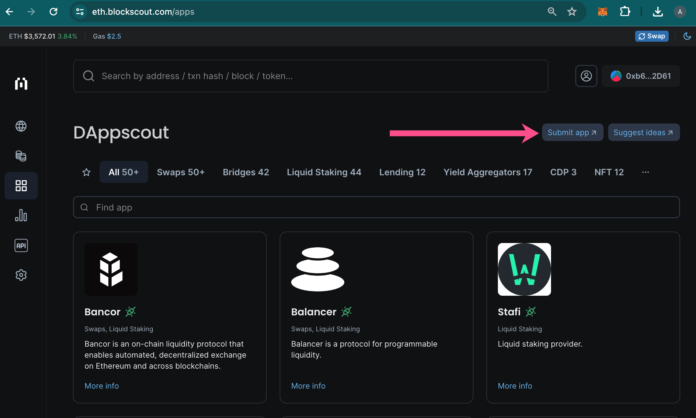

# DApp Integration

Embedded DApps allow users to connect with a single wallet, providing a seamless user experience that eliminates the need to visit different urls and connect a wallet each time.  See the How to Integrate section below to prepare your DApp.

## Integration Levels

There are several levels on integration with DAppscout.


Our goal is to have as many fully integrated apps as possible!


1. **Fully Integrated Apps**
   * Apps that are opened in an iFrame on \*.blockscout.com domains and have integrated the Safe Apps SDK
2. **Partially Integrated Apps**
   * Apps that are opened in an iFrame on \*.blockscout.com domains, but have not integrated the Safe Apps SDK for various reasons
3. **Non-Integrated Apps**
   * Apps that are not opened in an iFrame on \*.blockscout.com domains and have not integrated the Safe Apps SDK for various reasons

## Integration Benefits


Fully integrated apps receive the following benefits


1. **Top Places in the Ranking for Users**
   * All fully integrated apps will appear at the top of the list in their categories.
2. **Free Promo Through Ads**
   * Protocols will receive free promotion on Blockscout for a limited time.
3. **Co-Marketing with Blockscout**
   * In addition to free promotion, we’ll prepare a co-marketing campaign on social media and our blog.
4. **A Special Quality Mark**
   * All fully integrated DApps have a green “Fully-Integrated” symbol which shows users it is ready for use.

<figure><figcaption></figcaption></figure>

## How to Integrate

To fully integrate your protocol into DAppscout, you will need to do 3 things.

1. Enable iFrames for the \*.blockscout.com domain
2. Integrate the Safe Apps SDK
3. Submit your DApp via the form

### 1) Enable iFrame support

Both fully and partially integrated apps in the marketplace are embedded using iFrames, and it is necessary to enable iFrame support for our domain - \*.blockscout.com.  This can typically be done via the `frame-ancestors` directive of the `Content-Security-Policy` header in your application. For additional examples, please see  [https://developer.mozilla.org/en-US/docs/Web/HTTP/Headers/Content-Security-Policy/frame-ancestors](https://developer.mozilla.org/en-US/docs/Web/HTTP/Headers/Content-Security-Policy/frame-ancestors).

### 2) Integrate the Safe Apps SDK

DAppscout uses the Safe Apps SDK to automatically connect a wallet linked to Blockscout to any of the apps in our marketplace. This allows a visitor to connect a wallet once and then open any app without needing to connect the wallet again

To enable this functionality, Safe Apps SDK needs to be integrated for your protocol, and the \*.blockscout.com domain added as an exception.

The [SAFE SDK documentation page](https://docs.safe.global/apps-sdk-get-started) guides you through the process. It includes a quick start guide to help integrate the SDK into your protocol. For additional integration options, check the list of other Safe packages for Safe Apps at [https://github.com/safe-global/safe-apps-sdk?tab=readme-ov-file#packages](https://github.com/safe-global/safe-apps-sdk?tab=readme-ov-file#packages)

If you integrate any of these packages, DAppscout can use them to automatically connect a wallet to your app.


After integrating the Safe Apps, make sure you have added the \*.blockscout.com domain as an exception to the SDK. Otherwise, we cannot utilize the Safe Apps SDK on our website



It is not necessary to have the Safe app/smart contracts on a network where your app is deployed. It’s only necessary to integrate Safe Apps SDK for your application.


### 3) Submit your DApp

To submit your DApp to a marketplace, simply click on the submit DApp button. You will be taken to a form where you will fill out the needed information including contract addresses, description, logo, and links. Once your DApp is submitted, the DAppscout team will reach out with any questions and add your DApp to the marketplace.

<figure><figcaption></figcaption></figure>
