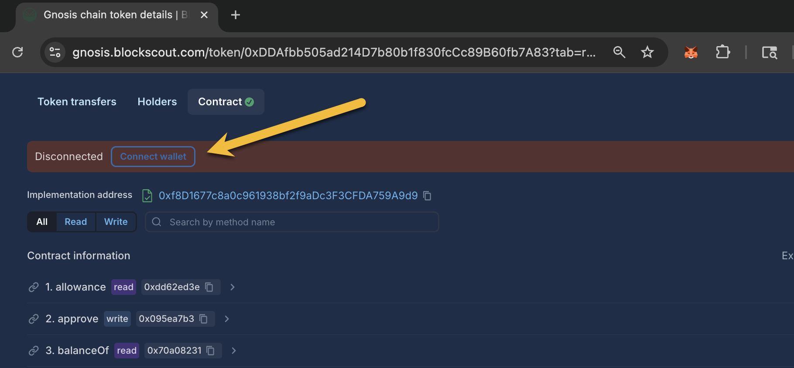

# Token Approval Tracker

<figure><figcaption></figcaption></figure>

Many applications require you to grant approvals so that contracts can interact with tokens in your wallet. This can be a security issue if you have granted unlimited or high allowances, or have granted approvals and forgotten about them. If an application is hacked or misused in some way, this can result in all funds being drained from your wallet address.&#x20;

Token Approval Tracker lets you manage your approvals from a single interface. You can easily check, update, and revoke token allowances you may have granted to different applications.&#x20;

## Access the App

The Token Approval Tracker app is located in the apps section of Blockscout (new version only).

<figure><figcaption></figcaption></figure>

To sort through apps easily, you can also search for Token Approval Tracker.

<figure><figcaption></figcaption></figure>

## Check and Revoke

From the app, you can see allowances for any address. In order to revoke allowances, you will need to connect the wallet you want to revoke allowances for.

<figure><figcaption></figcaption></figure>

In the following example we check and revoke token approval for an address on the goerli instance [https://eth-goerli.blockscout.com/apps/token-approval-tracker](https://eth-goerli.blockscout.com/apps/token-approval-tracker)


