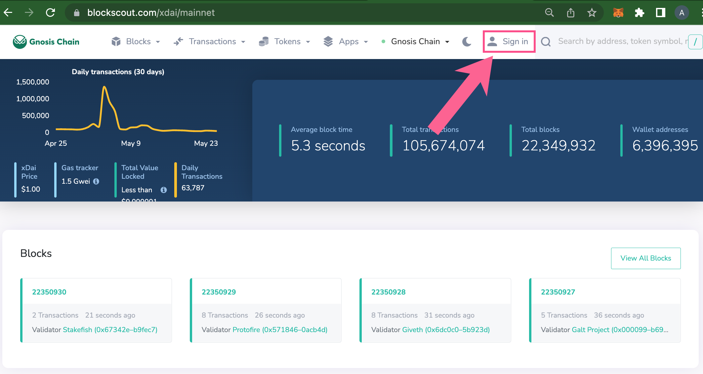
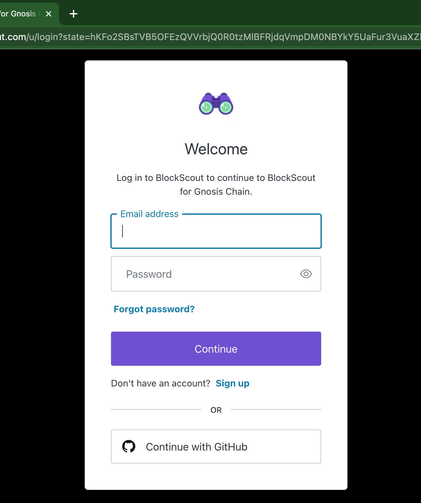
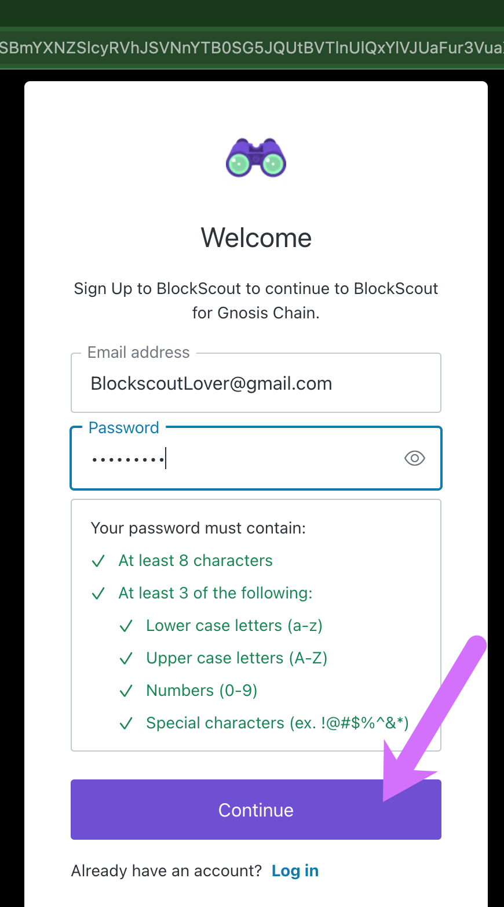
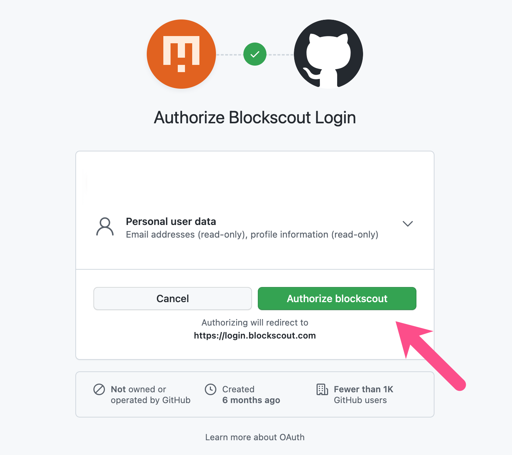

# My Account

The My Account feature provides the ability to watch addresses (and receive email notifications regarding activity), create private tags, and add API keys to an account.&#x20;

Additional future features include an upcoming redesign and a rollout for more chains.&#x20;

## Get Started

1\) Click Sign In.

2\) Choose to create a new account with an email address and password or connect your github account.

2a) Email and Password

2b) Github

3\) View options in the My Account Dropdown.

* **Profile**: Basic Information
* **Watch list:** Watch specific addresses and receive email notifications for transactions.
* **Address Tags**: Private tags for addresses.
* **Transaction Tags**: Private tags for transactions.
* **API keys:** Add api keys
* **Custom ABI**: Useful for testing & debugging, can be used with verified or unverified contracts.
* **Public Tags**: Request a public category tag displayed to all Blockscout users. Requests are processed manually.
* **Sign Out**: Sign out, info kept in local storage for easy sign-in.

