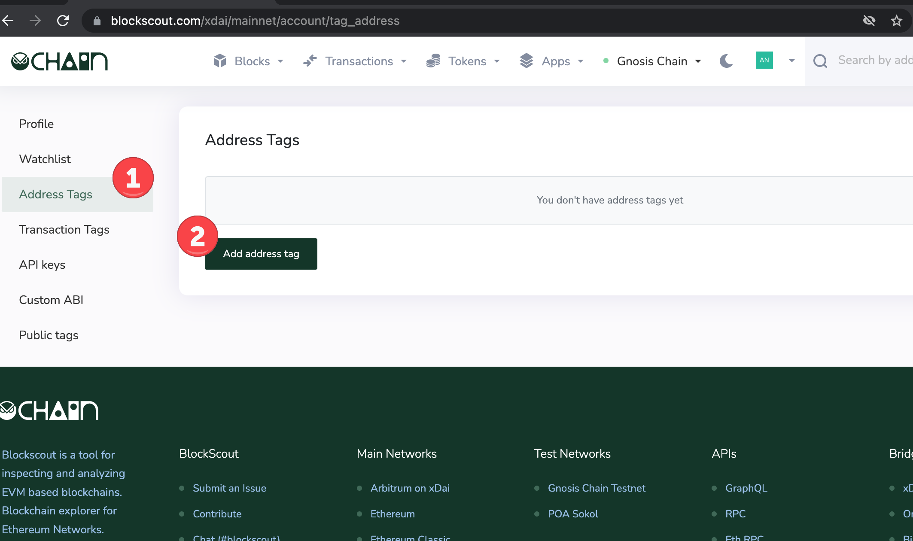
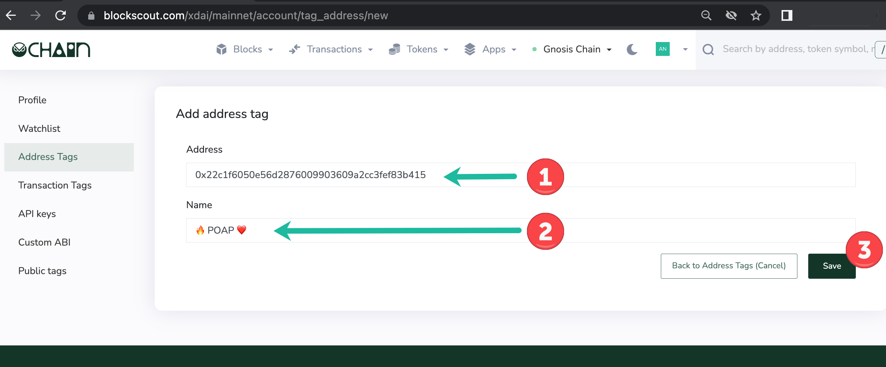
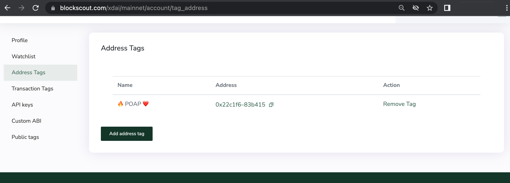
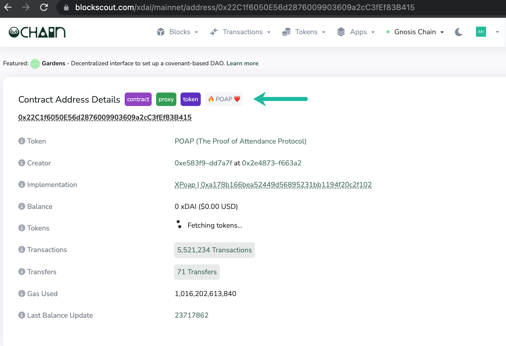
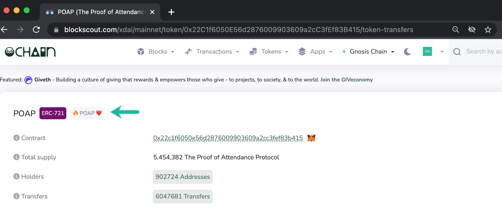

# Address Tags

Address tags are useful for tracking specific addresses, either EOAs (Externally Owned Addresses) or smart contracts. When you are logged in, a small grey tag will be added with the name you select to any specified addresses.

Use cases might include tags for specific wallet accounts (EOAs) you are interested in, Gnosis safe multisig wallets you want highlighted, or tags for specific applications, tokens, NFTs etc.

**1) Login to Blockscout** to create a tag.

1. Go to Address Tags in the user menu.
2. Press Add address tag.

**2)** **Fill in the fields**.

1. Address. Double check you are entering the correct address for the chain. Search the address in Blockscout to confirm.
2. Name. Create a name for the tag (35 characters or less). Emojis are a nice way to differentiate and add style and color to tags.
3. Press Save.

**3) Address tag added** to the Address Tags home screen. You can add additional tags or remove old tags from here.

**4) View tags in Blockscout**. They will appear in grey next to additional tags that may exist for that address.&#x20;


Note, you must be logged in to My Account to see your address tags.


\

