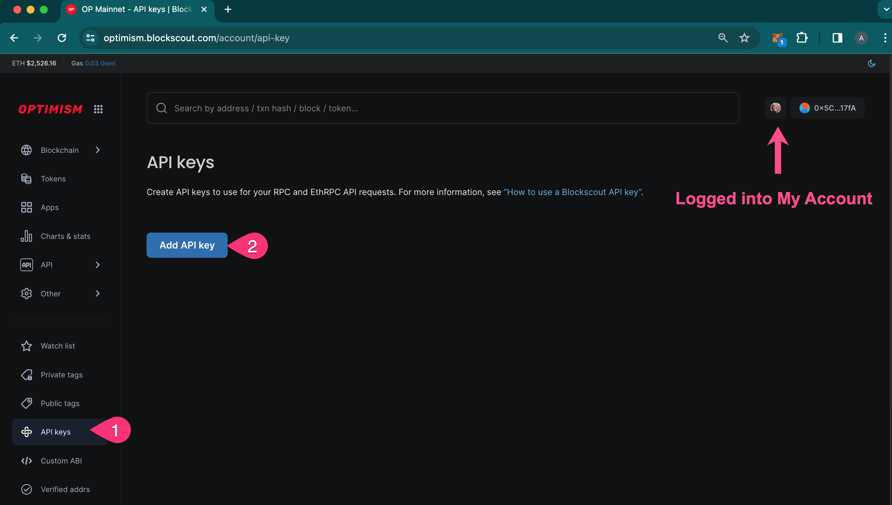
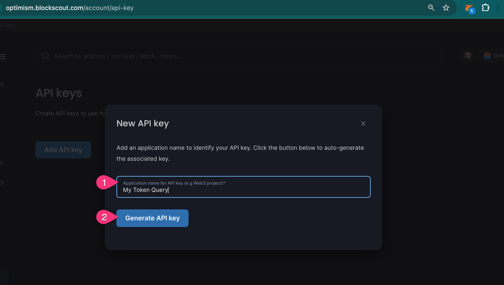
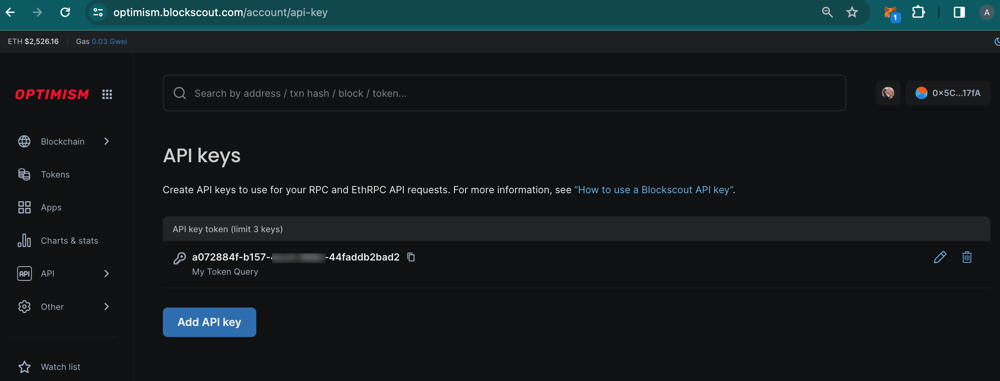

# API keys

API Keys are available to enhance request availability. Keys give users the ability to query the API up to 50 requests/sec.


The value of requests per API key is managed via `API_RATE_LIMIT_BY_KEY`. The default value is _50_.


A maximum of 3 keys can be created for each account.

## Create API key

**1) Login to My Account in Blockscout** <[_login instructions_](./)> to get started. Once logged in:

1. Go to API keys in the user menu.
2. Press Add API key.

<figure><figcaption></figcaption></figure>

**2)** **Fill in the Name field**. Add a Name for your API key. This is for your information only and to differentiate between different keys. Press **Generate API key.**

<figure><figcaption></figcaption></figure>

**3) API key generated.** The API Key is now added to your API dashboard. You can copy the key or edit the name/delete the key at any time. In addition you can add 2  additional keys (up to 3 per account).

<figure><figcaption></figcaption></figure>

## Use API key

Add the following to the end of a query to use your API key:\
`&apikey=your-api-key`

For example, a query to get more info on USDT on the Gnosis Chain with the API key `fdbfa288-1695-454e-a369-4501253a120`would be formatted as follows:

`https://gnosis.blockscout.com/api?module=token&action=getToken&contractaddress=0x4ECaBa5870353805a9F068101A40E0f32ed605C6&apikey=fdbfa288-1695-454e-a369-4501253a120`


More on this RPC call (_Get ERC-20 or ERC-721 token by contract address_) and other calls can be found in the RPC docs for Gnosis Chain at [https://gnosis.blockscout.com/api-docs#token](https://gnosis.blockscout.com/api-docs#token)

