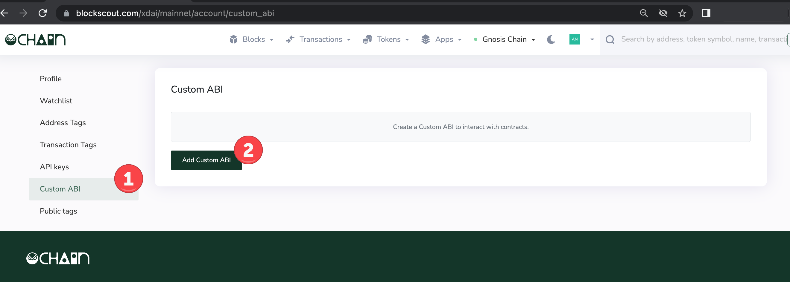
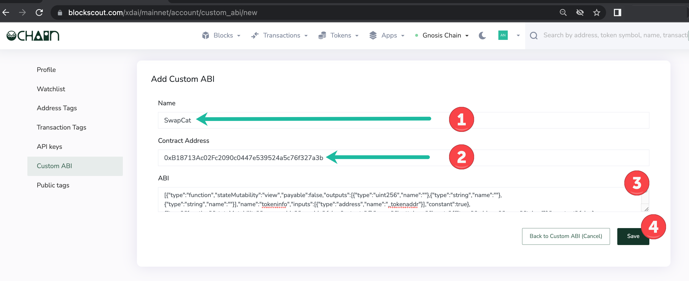
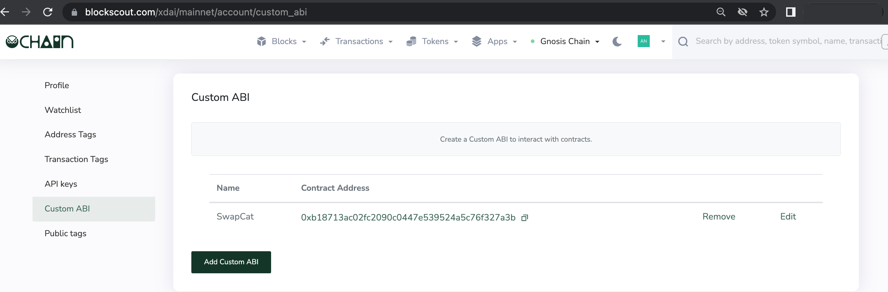

# Custom ABI

The Custom ABI feature is useful for debugging and testing newly deployed smart contracts. This feature can be used with verified or unverified contracts.

Once a custom ABI is added, the user can test methods using the Write Custom and Read Custom features.

## Add Custom ABI

**1) Login to My Account in Blockscout** <[_login instructions_](./)> to get started. Once logged in:

1. Go to Custom ABI in the user menu.
2. Press Add Custom ABI button.

**2)** **Fill in the fields**.

1. Name.  Create a name for your ownreference.&#x20;
2. Contract Address. Enter the correct 0x address of the deployed contract.
3. ABI: Copy and paste in the ABI for the contract, either from your development environment (truffle, hardhat, remix etc), or if the contract is already verified, you can copy the ABI from Blockscout, located in the code tab for that contract.
4. Press Save.

**3) Custom ABI added** to the  home screen. You can edit, remove or add additional custom ABIs from here.

## Interact with a Custom ABI

Go to the contract page and find the Custom button to Read and Write to your contract.&#x20;


More details coming soon.

