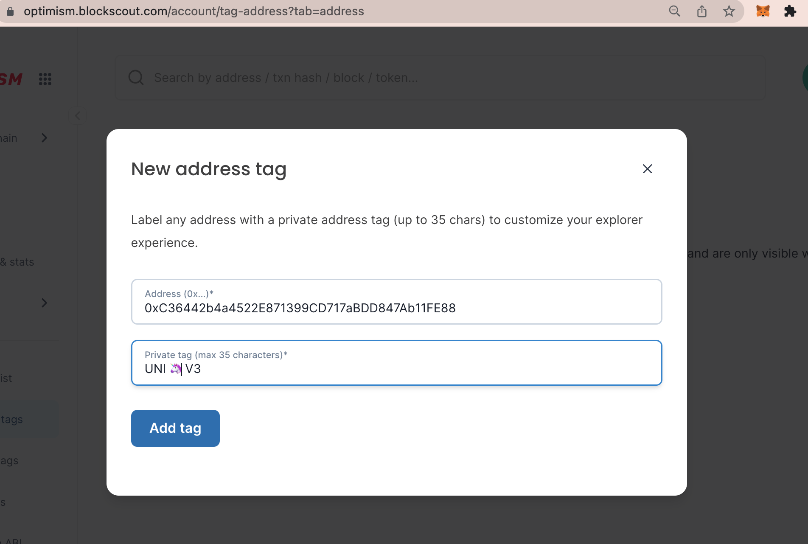
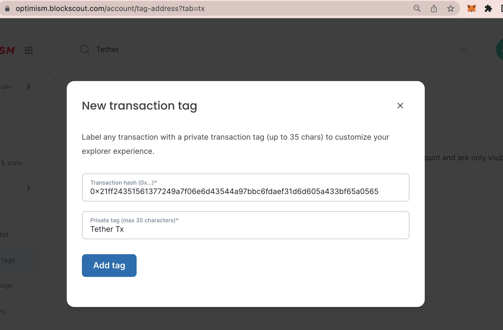

# Private Tags

Private tags help customize your Blockscout instance to track addresses and transactions that are important to you. You can track specific addresses, either EOAs (Externally Owned Addresses) or smart contracts, as well as group and organize specific transactions.&#x20;

Use the private tags feature to add your own **address tags** and **transaction tags**. These will be viewable on your instance of Blockscout only.

When logged in, a small grey tag is added with the selected name to any specified addresses or transactions. You can also add emojis 😁 for easy identification.

Use cases might include tags for specific wallet accounts (EOAs) of interest, Gnosis safe multisig wallets to highlight, tags for specific applications, tags for specific transaction types, tokens, NFTs etc.


_The following example is created using the_ [_Optimism Blockscout instance_](https://optimism.blockscout.com/)_._



To start with private tags, you must first[ login to My Account](./).&#x20;


### 1) Create a Private Address Tag

1. Go to Private Tags in the My Account user menu. Address tag will be the default option
2. Press the **Add address tag** button.

<figure><figcaption></figcaption></figure>

**2)** **Fill in the fields**.

1. Address. Double check you are entering the correct address for the chain. Search the address in Blockscout to confirm.
2. Name. Create a name for the tag (35 characters or less). Emojis are a nice way to differentiate and add style and color to tags.
3. Press **Add tag**.

<figure><figcaption></figcaption></figure>

**3) Address tag added** to the Address Tags home screen. You can add additional tags or remove old tags from here.

<figure><figcaption></figcaption></figure>

**4) View tags in Blockscout**. They will appear in grey next to additional tags that may exist for that address.&#x20;


Note, you must be logged in to My Account to see your private tags.


<figure><figcaption></figcaption></figure>

## 2) Create a Private Transaction Tag

* Go to **Private Tags** in the My Account user menu. Select the **Transaction** tab.&#x20;
* Press the **Add transaction tag** button.

<figure><figcaption></figcaption></figure>

**2)** **Fill in the fields**.

1. Transaction hash. Double check you are entering the correct tx for the chain. Search the transaction and copy/paste from Blockscout to easily add.
2. Name. Create a name for the tag (35 characters or less). Emojis are a nice way to differentiate and add style and color to tags.
3. Press **Add tag**.

<figure><figcaption></figcaption></figure>

**3) Transaction tag added** to the transaction tags home screen. You can add additional tags or remove old tags from here.

<figure><figcaption></figcaption></figure>

**4) View tags in Blockscout**. They will appear in grey next to additional tags that may exist for that address.&#x20;


Note, you must be logged in to My Account to see your private tags.


<figure><figcaption></figcaption></figure>
