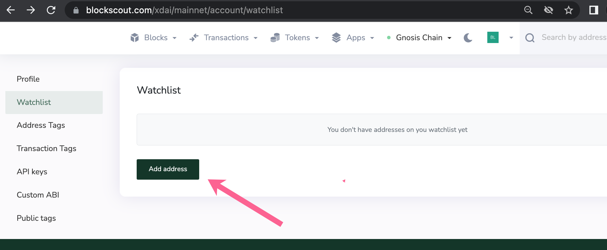
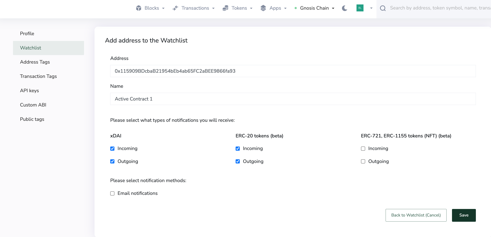
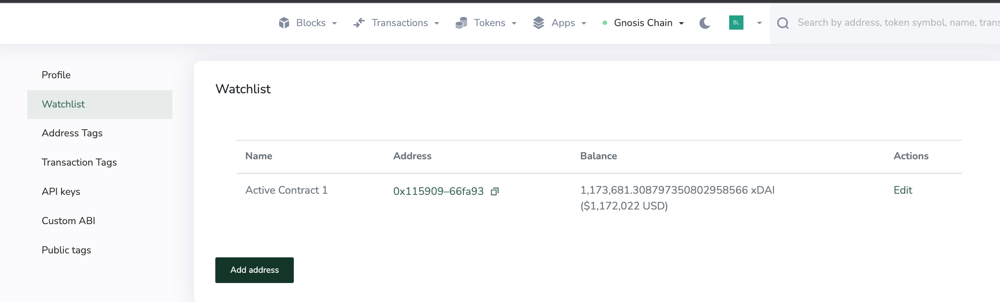
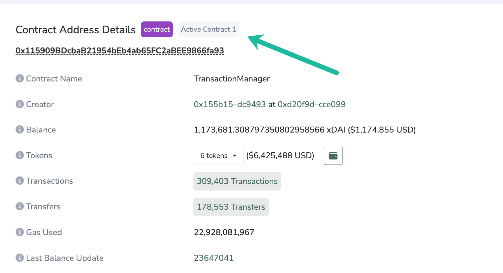

# Watchlist

Sign up for email notifications for different actions related to an EOA or contract address. This can include incoming/outgoing transactions for native tokens, ERC-20 tokens or NFTs like ERC-721 and ERC-1155s.

1\) **Login to My Account in Blockscout** <[_login instructions_](./)> . From the Watchlist menu click Add address.

2\) **Fill in information** including:

* Address:
* Name: For your reference, will be created as a private tag for this address as well
* Notification types: Select which types of transactions you would like to receive email notifications for.
* Email Notifications: Select to receive.
* Save

3\) **New address added** to your watchlist dashboard. You can edit info, remove, or add more items.

4\) Click on the address to view anytime in the Blockscout console. Watch list addresses show the Name as a tag when logged into My Account.

