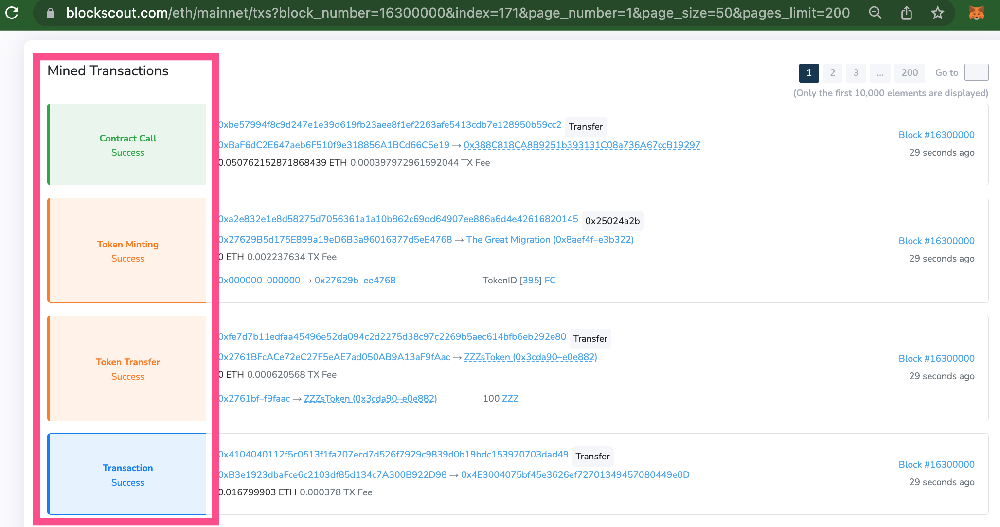

# Transaction Types

Different types of transactions are categorized in the Blockscout UI to allow for quick identification. Types include:

* **Coin transfer**: value transfer, value >= 0, no tx input&#x20;
* **Contract call**: tx input is present (any value including 0)&#x20;
* **Contract creation**: creation of a smart-contract&#x20;
* **Token burning**: recognized token transfer of any of ERC-20, 721, 1155 token instance (single or bulk) to 0x0000... address&#x20;
* **Token creation**: creation of token instance in ERC-1155&#x20;
* **Token minting**: token transfer of any of ERC-20, 721, 1155 token instance (single or bulk) from 0x0000... address&#x20;
* **Token transfer**: token transfer of any of ERC-20, 721, 1155 token instance (single or bulk)&#x20;
* **Transaction**: A contract call where the contract has not yet been identified by Blockscout.

<figure><figcaption>
Transaction types in Blockscout 2.0
</figcaption></figure>

<figure><figcaption>
Transaction types in old UI
</figcaption></figure>

