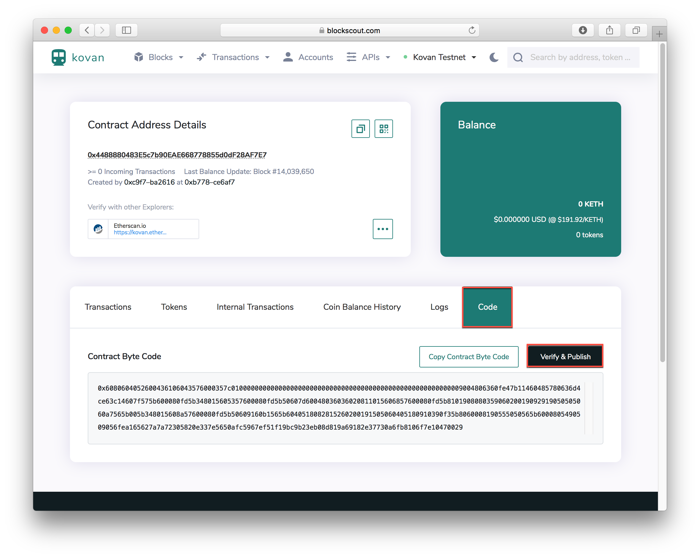
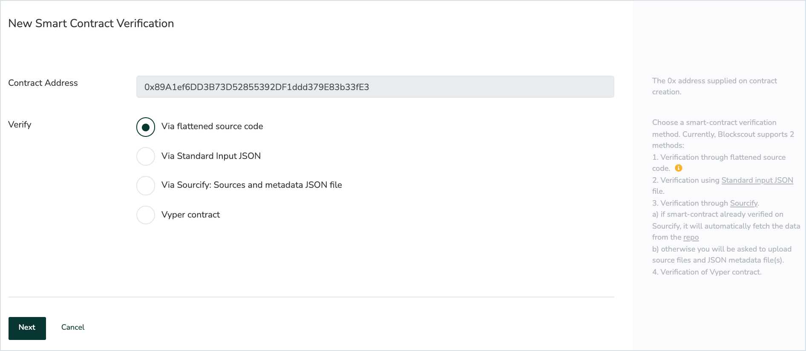
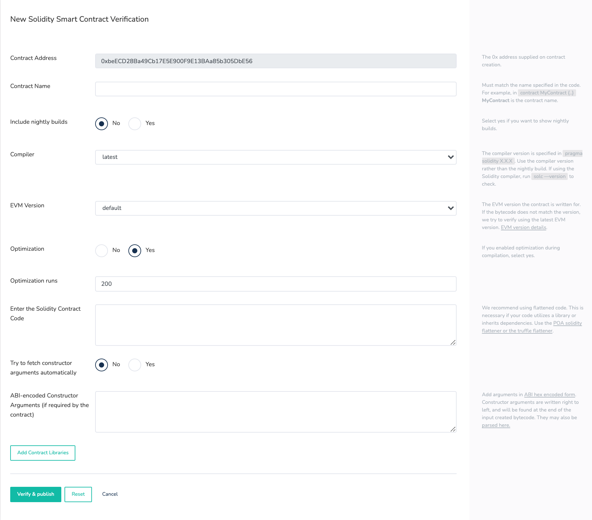
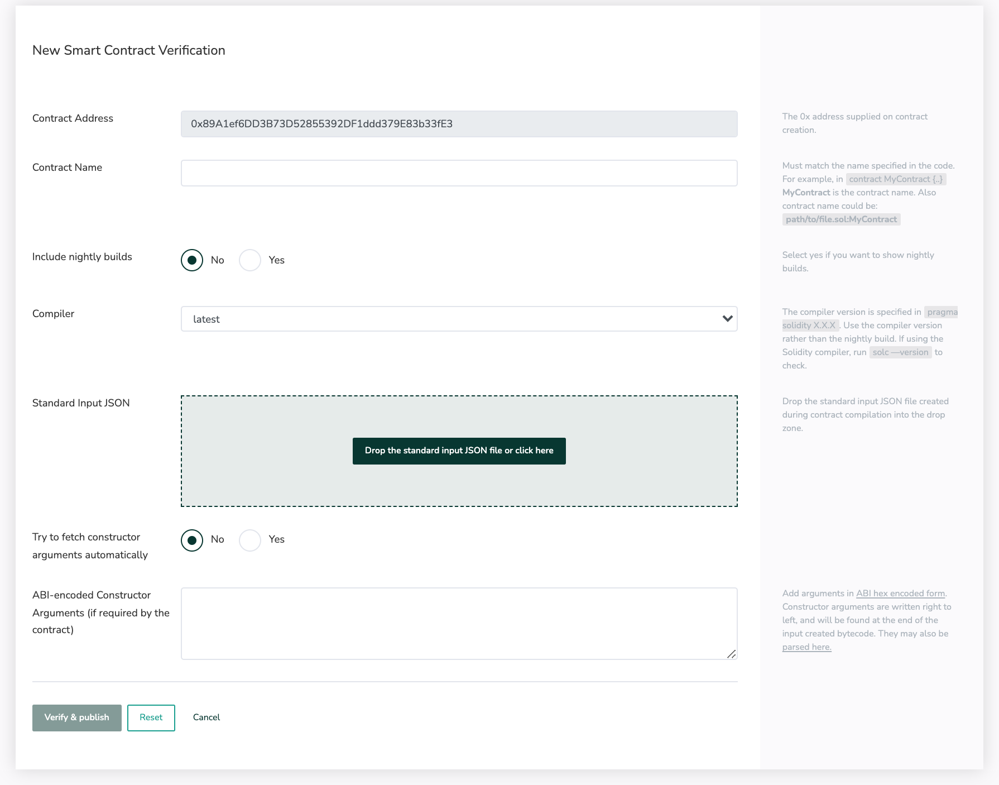
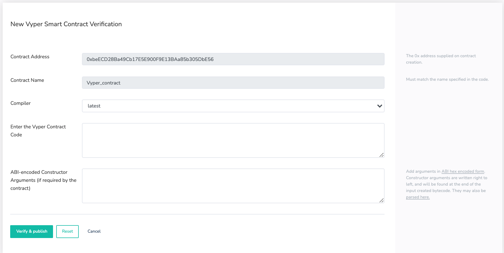

# Verifying a Smart Contract

Once verified, a smart contract or token contract's source code becomes publicly available and verifiable. This creates transparency and trust. Plus, it's easy to do! Verification is available for both Solidity and Vyper contracts.&#x20;

There are multiple methods for verification using the Blockscout UI - all are cataloged below.&#x20;

* [Via flattened source code (Solidity)](./#via-flattened-source-code)
* [Via standard JSON input](./#via-standard-json-input)
* [Via Sourcify: Sources and metadata JSON file](contracts-verification-via-sourcify.md)
* [Vyper contract](./#vyper-contract)


To learn more about the smart contract verification Rust microservice and verification algorithm [see this page for developers](../../../for-developers/information-and-settings/smart-contract-verification.md).



👷🏻‍♂️ If preferred you can choose the following methods to verify directly from your Hardhat dev environment.&#x20;

* [Hardhat Verification Plugin](hardhat-verification-plugin.md)
* [Sourcify Plugin for Hardhat](../../verifying-a-smart-contract/sourcify-plugin-for-hardhat.md)


## Smart Contract Verification with Blockscout

1\) On contract creation, you will receive an address to check a pending transaction. If it does not redirect you to [blockscout.com](https://blockscout.com/), go to Blockscout, verify you are on the chain where the contract was deployed, and type the contract's address into the search bar. Your contract details should come up.\

2\) Select the `Code` tab to view the bytecode, click the **Verify & Publish** button. You will see several options for verification.

* [Via flattened source code (Solidity)](./#via-flattened-source-code)
* [Via standard JSON input](./#via-standard-json-input)
* [Via Sourcify: Sources and metadata JSON file](contracts-verification-via-sourcify.md)
* [Vyper contract](./#vyper-contract)

## Via Flattened Source Code

1. **Contract Address:** The `0x` address supplied on contract creation.&#x20;
2. **Contract Name:** Name of the class whose constructor was called in the .sol file. For example, in `contract MyContract {..` **MyContract** is the contract name.&#x20;
3. **Include Nightly Builds**: Yes if you want to show nightly builds.
4. **Compiler:** derived from the first line in the contract `pragma solidity X.X.X`. Use the corresponding compiler version rather than the nightly build.
5. **EVM Version:** [See EVM version information](../evm-version-information.md)
6. **Optimization:** If you enabled optimization during compilation, check yes.
7. **Optimization Runs:** 200 is the Solidity Compiler default value. Only change if you changed this value while compiling.
8. &#x20;**Enter the Solidity Contract Code:** You may need to flatten your solidity code if it utilizes a library or inherits dependencies from another contract. We recommend the [POA solidity flattener](https://github.com/poanetwork/solidity-flattener) or the [truffle flattener](https://www.npmjs.com/package/truffle-flattener).
9. **Try to fetch constructor arguments automatically**: If similar contracts exist these may be available.
10. **ABI-encoded Constructor Arguments:** [See this page for more info](../abi-encoded-constructor-arguments.md).
11. **Add Contract Libraries:** Enter the name and 0x address for any required libraries called in the called in the .sol file.
12. Click the `Verify and Publish` button.
13. If all goes well, you will see a checkmark :white\_check\_mark: next to Code in the code tab, and an additional tab called `Read Contract`. The contract name will now appear in BlockScout with any transactions related to your contract.

## Via standard JSON input

1. **Contract Name**. There are several options:
   1. Leave blank.
   2. Enter contract name: `MyContract`.
   3. Enter path to the contract and it's name: `path/to/file.sol:MyContract` (path should match what is written in your JSON file).
2. **Include nightly builds**. You can choose **Yes** or **No** depending on your compiler.
3. **Compiler.** Choose the compiler version used to compile your smart contract.
4. **Standard Input JSON.** Attach your Standard Input JSON file. File should follows solidity [format](https://docs.soliditylang.org/en/latest/using-the-compiler.html#input-description) and all the sources must be in Literal Content format, not an URL.
5. **Try to fetch constructor arguments automatically.** Select No if you want to provide ABI-encoded Constructor Arguments or the contract does not have any.
6. **ABI-encoded Constructor Arguments.** Fill it with ABI-encoded Constructor Arguments or leave blank.

After filling the form click the **Verify & publish** button and wait for the response.

## Via Sourcify: Sources and metadata JSON file

See the [Contract Verification via Sourcify](contracts-verification-via-sourcify.md) page for details.

## Vyper Contract

1. **Contract Address:** The `0x` address supplied on contract creation. Should autopopulate
2. **Contract Name:** Should autopopulate
3. **Compiler**: Select the compiler version used in the source code.
4. **Enter the Vyper Contract Code:** Copy and paste the contract code
5. **ABI-encoded Constructor Arguments (if required):**  [See this page for more info](../abi-encoded-constructor-arguments.md).
6. Click the `Verify and Publish` button.
7. If all goes well, you will see a checkmark :white\_check\_mark: next to Code in the code tab, and an additional tab called `Read Contract`. The contract name will now appear in BlockScout with any transactions related to your contract.

## Troubleshooting

If you receive the dreaded `There was an error compiling your contract` message this means the bytecode doesn't match the supplied sourcecode. Unfortunately, there are many reasons this may be the case. Here are a few things to try:

1\) Double check the compiler version is correct.


Check all version digits - for example 0.5.1 is different from 0.5.10


2\) Check that an extra space has not been added to the end of the contract. When pasting in, an extra space may be added. Delete this and attempt to recompile.

3\) Copy, paste and verify your source code in Remix. You may find some exceptions here.

### Verification in a dev environment

The [Hardhat verification plugin](hardhat-verification-plugin.md) supports BlockScout. You can also choose to use the [Sourcify plugin](../../verifying-a-smart-contract/sourcify-plugin-for-hardhat.md) to verify with Sourcify from your hardhat environment.
