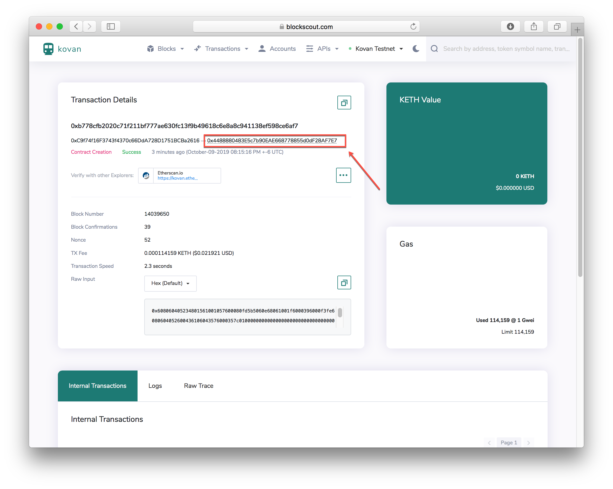
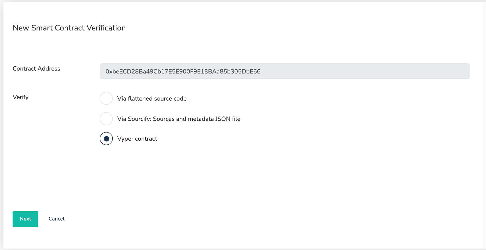

# Verifying a Smart Contract

Once verified, a smart contract or token contract's source code becomes publicly available and verifiable. This creates transparency and trust. Plus, it's easy to do! Verification is available for both Solidity and Vyper contracts.


In addition to the methods below, you can also use the [Sourcify integration to verify without flattening contracts](contracts-verification-via-sourcify.md).


## Smart Contract Verification

1\) On contract creation, you will receive an address to check a pending transaction. If it does not redirect you to [blockscout.com](https://blockscout.com/), go to BlockScout, verify you are on the chain where the contract was deployed, and type the contract's address into the search bar. Your contract details should come up.  

2\) Select the `Code` tab to view the bytecode, click the **Verify & Publish** button. You will see several options for verification.

* [Via flattened source code \(Solidity\)](./#via-flattened-source-code)
* [Via Sourcify: Sources and metadata JSON file](contracts-verification-via-sourcify.md)
* [Vyper contract](./#vyper-contract)

## Via flattened source Code

1. **Contract Address:** The `0x` address supplied on contract creation. 
2. **Contract Name:** Name of the class whose constructor was called in the .sol file. For example, in `contract MyContract {..` **MyContract** is the contract name. 
3. **Include Nightly Builds**: Yes if you want to show nightly builds.
4. **Compiler:** derived from the first line in the contract `pragma solidity X.X.X`. Use the corresponding compiler version rather than the nightly build.
5. **EVM Version:** [See EVM version information](../evm-version-information.md)
6. **Optimization:** If you enabled optimization during compilation, check yes.
7. **Optimization Runs:** 200 is the Solidity Compiler default value. Only change if you changed this value while compiling.
8.  **Enter the Solidity Contract Code:** You may need to flatten your solidity code if it utilizes a library or inherits dependencies from another contract. We recommend the [POA solidity flattener](https://github.com/poanetwork/solidity-flattener) or the [truffle flattener](https://www.npmjs.com/package/truffle-flattener).
9. **Try to fetch constructor arguments automatically**: If similar contracts exist these may be available.
10. **ABI-encoded Constructor Arguments:** [See this page for more info](../abi-encoded-constructor-arguments.md).
11. **Add Contract Libraries:** Enter the name and 0x address for any required libraries called in the called in the .sol file.
12. Click the `Verify and Publish` button.
13. If all goes well, you will see a checkmark ✅ next to Code in the code tab, and an additional tab called `Read Contract`. The contract name will now appear in BlockScout with any transactions related to your contract.

### Vyper Contract

1. **Contract Address:** The `0x` address supplied on contract creation. Should autopopulate
2. **Contract Name:** Should autopopulate
3. **Compiler**: Select the compiler version used in the source code.
4. **Enter the Vyper Contract Code:** Copy and paste the contract code
5. **ABI-encoded Constructor Arguments \(if required\):**  [See this page for more info](../abi-encoded-constructor-arguments.md).
6. Click the `Verify and Publish` button.
7. If all goes well, you will see a checkmark ✅ next to Code in the code tab, and an additional tab called `Read Contract`. The contract name will now appear in BlockScout with any transactions related to your contract.

## Sourcify

See the [Contract Verification via Sourcify](contracts-verification-via-sourcify.md) page for details.

## Troubleshooting

If you receive the dreaded `There was an error compiling your contract` message this means the bytecode doesn't match the supplied sourcecode. Unfortunately, there are many reasons this may be the case. Here are a few things to try:

1\) Double check the compiler version is correct.


Check all version digits - for example 0.5.1 is different from 0.5.10


2\) Check that an extra space has not been added to the end of the contract. When pasting in, an extra space may be added. Delete this and attempt to recompile.

3\) Copy, paste and verify your source code in Remix. You may find some exceptions here.

## 

