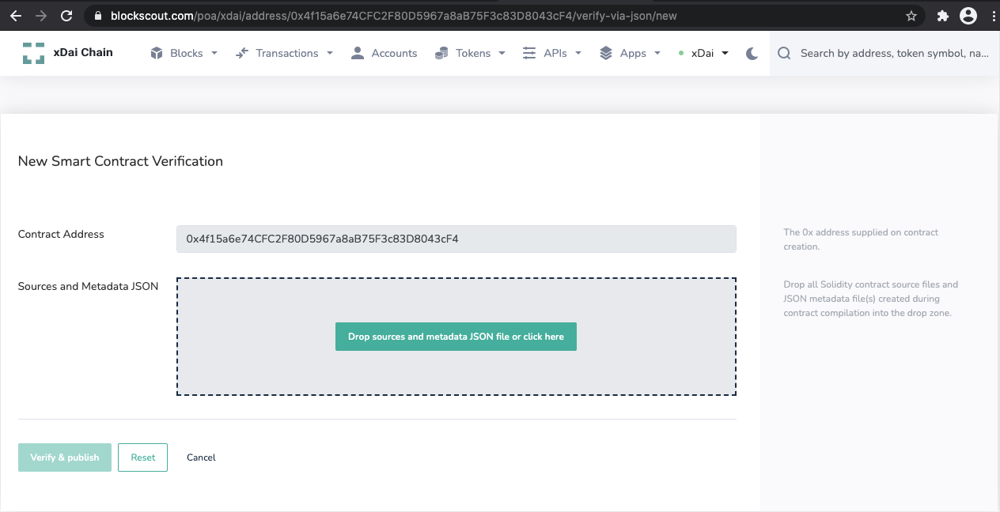

# Contract Verification via Sourcify

Along with contract verification through a flattened source file \(the default option in Blockscout\),  a [Sourcify](https://sourcify.dev/) API verification option is also available. The _Verification with Sourcify_  feature is enabled in the [xDai instance of Blockscout](https://blockscout.com/xdai/mainnet) and available in [version 3.7.0+](https://github.com/blockscout/blockscout/releases/tag/v3.7.0-beta). Projects who want to use this feature need to set the following [ENV variables](../../../for-developers/information-and-settings/env-variables.md).

```text
ENABLE_SOURCIFY_INTEGRATION=true
CHAIN_ID={chain_id_number}
```

## Usage Example

Verify your contract using Sourcify:

   1. Open the address page for the contract you want to verify, switch to _Code tab,_ and click _Verify & Publish_ button.


    2. Choose S_ources and metadata JSON file_ option and click the _Next_ button.


On the next screen, you will see a drop field where you will add files.



3. Drag and drop \(or click the button to add files from your computer\) all _.sol_ files used by the target contract you want to verify and the _.json_ file containing the contract's metadata. For example, this _.json_ is created by Truffle in _./build/contracts_ folder after `truffle compile`. If your contract has linked libraries you should also drag & drop _.json_ files __for those libraries. Once all files are added, start verification by clicking the _Verify & Publish_ button.


After several seconds your contract should be verified through Sourcify's API \(If verification fails, you will see the reason in the dropzone\). Verification metadata will be saved in the Blockscout DB and you will see the verified contract page with the link to the same metadata in the [Sourcify contract repository](https://repo.sourcify.dev/contracts/full_match/100/) \(chain ID is 100 for the xDai chain\).


Example Contract:

* Contract [verified via Sourcify contract in Blockscout](https://blockscout.com/xdai/mainnet/address/0x4f15a6e74CFC2F80D5967a8aB75F3c83D8043cF4/contracts). 
* The same contract in the [Sourcify contract repository](https://repo.sourcify.dev/contracts/full_match/100/0x4f15a6e74CFC2F80D5967a8aB75F3c83D8043cF4/).

