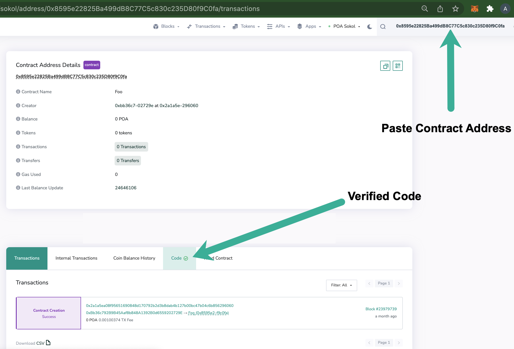
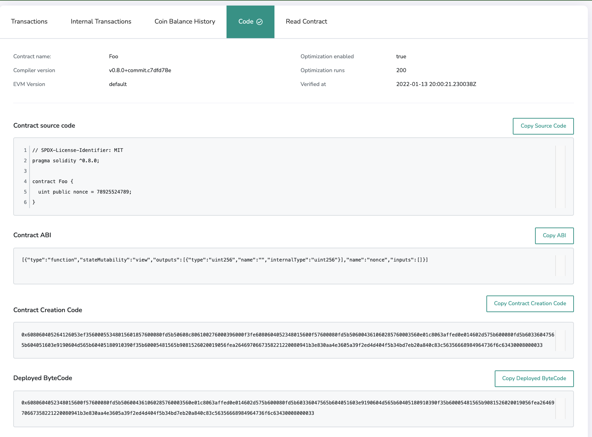

# Hardhat Verification Plugin

[Hardhat ](https://hardhat.org)is a full-featured development environment for contract compilation, deployment and verification. The [Hardhat Etherscan plugin](https://hardhat.org/plugins/nomiclabs-hardhat-etherscan.html) supports contract verification on BlockScout.

## Prerequisites

You should have the latest version of hardhat and the [hardhat-etherscan plugin](https://hardhat.org/plugins/nomiclabs-hardhat-etherscan.html) installed to begin.

### Hardhat installation:

```
npm install --save-dev hardhat
```

### hardhat-etherscan plugin installation

```
npm install --save-dev @nomiclabs/hardhat-etherscan
```

And add the following statement to your `hardhat.config.js`:

```
require("@nomiclabs/hardhat-etherscan");
```

## Config File

Your basic [Hardhat config file](https://hardhat.org/config/) will be setup to support the network you are working on. In this example we use the Sokol test network.  We are using an RPC url without an API key, however a value is still required. You can use any arbitrary string. [More info](https://hardhat.org/plugins/nomiclabs-hardhat-etherscan.html#multiple-api-keys-and-alternative-block-explorers).

```
require("@nomiclabs/hardhat-waffle");
require("@nomiclabs/hardhat-etherscan");
require('hardhat-deploy');
let secret = require("./secret");

module.exports = {
  solidity: "0.8.0",
  networks: {
    sokol: {
      url: 'https://sokol.poa.network/',
      accounts: [secret.key],
    }
  },
  etherscan: {
    // Your API key for Etherscan
    // Obtain one at https://etherscan.io/
    apiKey: "abc"
  }
};
```

## Deploy and Verify

### Deploy

```
D:\hard_hat>npx hardhat run scripts\deploy.js --network sokol
Contract deployed to: 0x8595e22825Ba499dB8C77C5c830c235D80f9C0fa
```

### Verify

```bash
D:\hard_hat>npx hardhat verify 0x8595e22825Ba499dB8C77C5c830c235D80f9C0fa --network sokol
Nothing to compile
Compiling 1 file with 0.8.0
Successfully submitted source code for contract
contracts/test.sol:Foo at 0x8595e22825Ba499dB8C77C5c830c235D80f9C0fa
for verification on Etherscan. Waiting for verification result...

Successfully verified contract Foo on Etherscan.
https://blockscout.com/poa/sokol/address/0x8595e22825Ba499dB8C77C5c830c235D80f9C0fa#code
```

## Confirm Verification on BlockScout

Go to your BlockScout instance and paste the contract address into the search bar. If verified, the code tab will display a green checkmark.



**Selecting the Code tab will provide additional information about your contract.**



## Resources


Learn more about plugin configs, troubleshooting etc. at [https://hardhat.org/plugins/nomiclabs-hardhat-etherscan.html](https://hardhat.org/plugins/nomiclabs-hardhat-etherscan.html)

