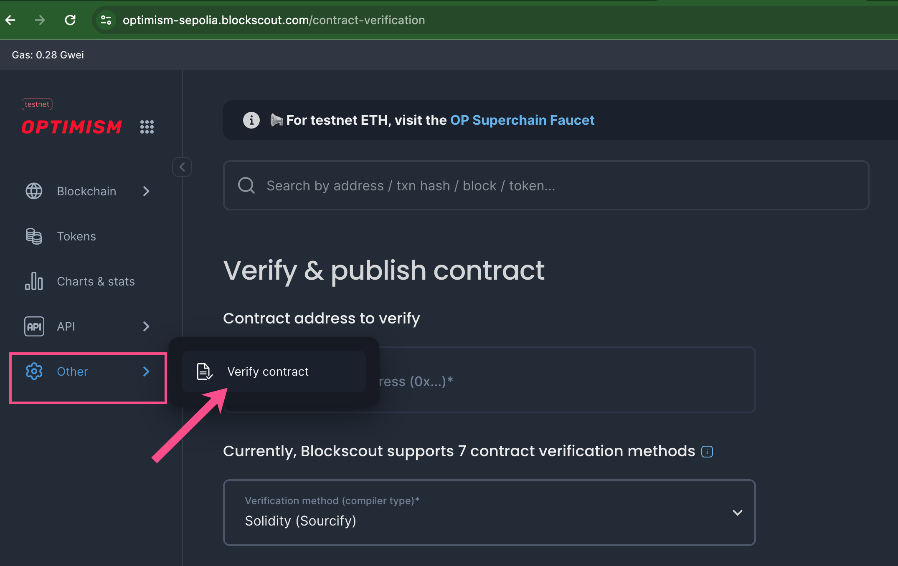
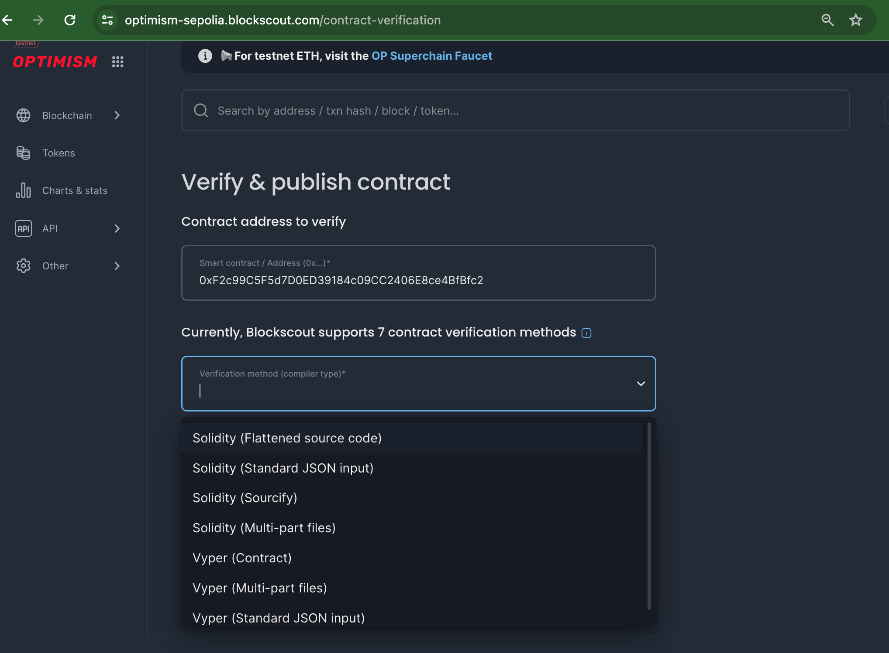
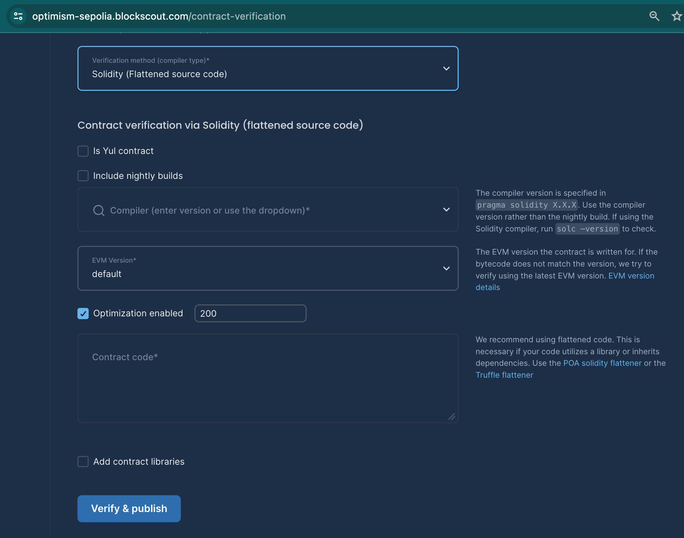

# Verifying a Smart Contract

Once verified, a smart contract or token contract's source code becomes publicly available and verifiable, creating transparency and trust.&#x20;

Verification is available for both Solidity and Vyper contracts. **Currently, there are 7 methods for verification using the Blockscout UI.**


👷🏻‍♂️ If preferred you can verify directly from your Hardhat or Foundry dev environment.&#x20;

* [Hardhat Verification Plugin](hardhat-verification-plugin.md)
* [Foundry Verification](https://hardhat.org/hardhat-runner/plugins/nomicfoundation-hardhat-verify)



To learn more about the smart contract verification Rust microservice and verification algorithm [see this page for developers](../../for-developers/information-and-settings/smart-contract-verification.md).


## Smart Contract Verification with Blockscout

1\) Go to the Verify contract page _(Other -> Verify contract)_

<figure><figcaption></figcaption></figure>

2\) Enter in the contract address you received during deployment. The dropdown will show you several available verification options. Select the one you would like to use and continue.

<figure><figcaption></figcaption></figure>

* Solidity ([Flattened source code)](./#via-flattened-source-code)
* Solidity ([Standard JSON input](./#via-standard-json-input))
* Solidity ([Sourcify](contracts-verification-via-sourcify.md))
* Solidity ([Multi-part files](./#solidity-multi-part-files))
* [Vyper (Contract](./#vyper-contract))
* Vyper ([Multi-part files](./#vyper-multi-part-files-and-standard-json-input))
* Vyper ([Standard JSON input](./#vyper-multi-part-files-and-standard-json-input))

### Solidity (Flattened source code)

This verification method is recommended only for single-file smart contract without any imports. For verifaction of contracts containing more that 1 file, it's recommended to use different verification method.

<figure><figcaption></figcaption></figure>

1. **Contract Address:** The `0x` address supplied on contract creation (added above)
2. **Is Yul contract:** Select if the contract is coded in Yul for efficiency.
3. **Include Nightly Builds**: Select if you want to show nightly builds.
4. **Compiler:** derived from the first line in the contract `pragma solidity X.X.X`. Use the corresponding compiler version rather than the nightly build.
5. **EVM Version:** Select the correct[ EVM version ](../../for-developers/evm-version-information.md)if known, otherwise use default.
6. **Optimization Enabled:** If you enabled optimization during compilation, select and enter the run value. 200 is the Solidity Compiler default value. Only change if you changed this value while compiling.
7. &#x20;**Enter the Solidity Contract Code:** Copy-paste the source code of your smart contract as is.
8. **Add Contract Libraries:** Enter the name and 0x address for any required libraries called in the .sol file. You can add multiple contracts with the "+" button.
9. Click the `Verify and Publish` button.
10. If all goes well, you will see a checkmark :white\_check\_mark: next to Code in the code tab, and an additional tab called `Read Contract`. The contract name will now appear in BlockScout with any transactions related to your contract.

### Solidity (Standard JSON input)


[More information on JSON input is available here](https://docs.soliditylang.org/en/latest/using-the-compiler.html#input-description).&#x20;


1. **Include nightly builds**. You can choose **Yes** or **No** depending on your compiler.&#x20;
2. **Compiler.** Choose the compiler version used to compile your smart contract. If you selected yes for nightly builds, use the compiler version rather than the build.
3. **Standard Input JSON.** Upload your Standard Input JSON file. File should follows solidity [format](https://docs.soliditylang.org/en/latest/using-the-compiler.html#input-description) and all the sources must be in Literal Content format, not a URL.

Click the **Verify & publish** button and wait for the response.

### Via Sourcify: Sources and metadata JSON file

See the [Contract Verification via Sourcify](contracts-verification-via-sourcify.md) page for details.

### Solidity (Multi-part files)

See the above settings. You will upload all of the .sol or .yul files you used for your contract. This method requires at least 2 files - if you have a single file use the flattened source code method.

### Vyper Contract

1. **Contract Name:** Name assigned to the contract.
2. **Compiler**: Select the compiler version used in the source code.
3. **EVM Version:** Select the correct[ EVM version ](../../for-developers/evm-version-information.md)if known, otherwise use default.
4. **Contract Code:** Copy and paste the contract code
5. Click the `Verify and Publish` button.

If all goes well, you will see a checkmark :white\_check\_mark: next to Code in the code tab, and an additional tab called `Read Contract`. The contract name will now appear in BlockScout with any transactions related to your contract.

### Vyper Multi-part files and standard json input

See the information above.

## Troubleshooting

If you receive the dreaded `There was an error compiling your contract` message this means the bytecode doesn't match the supplied sourcecode. Unfortunately, there are many reasons this may be the case. Here are a few things to try:

1\) Double check the compiler version is correct.


Check all version digits - for example 0.5.1 is different from 0.5.10


2\) Check that an extra space has not been added to the end of the contract. When pasting in, an extra space may be added. Delete this and attempt to recompile.

3\) Copy, paste, and verify your source code in Remix. You may find some exceptions here.

### Verification in a dev environment

The [Hardhat verification plugin](hardhat-verification-plugin.md) supports BlockScout. You can also choose to use the [Sourcify plugin](sourcify-plugin-for-hardhat.md) to verify with Sourcify from your hardhat environment. [Foundry supports blockscout verification with Forge](https://book.getfoundry.sh/reference/forge/forge-verify-contract).
