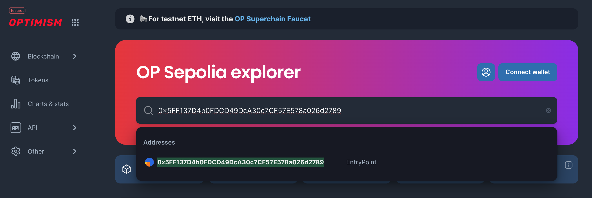
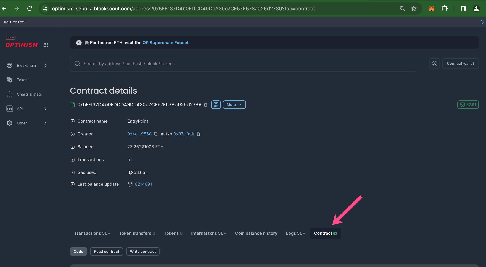
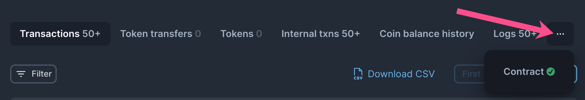
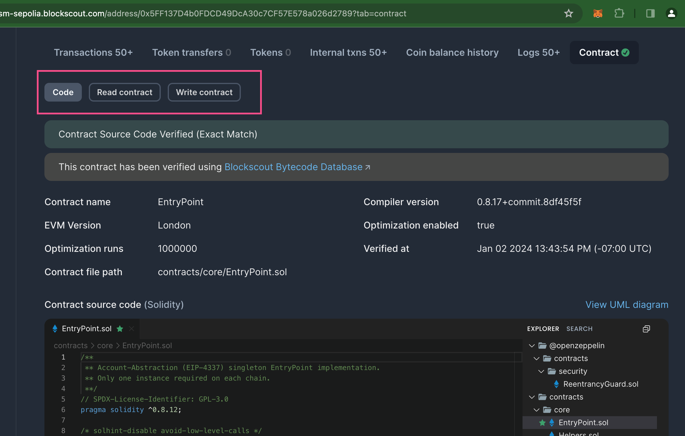

# Hardhat Verification Plugin

[Hardhat ](https://hardhat.org/)is a full-featured development environment for contract compilation, deployment and verification. The [hardhat-verify plugin](https://hardhat.org/plugins/nomiclabs-hardhat-etherscan.html) supports contract verification on BlockScout.

## Get Started

### **1) Install Hardhat**

If you are starting from scratch, create an npm project by going to an empty folder, running `npm init`, and following the instructions. Recommend npm 7 or higher.

Once your project is ready:

**npm instructions**

```
npm install --save-dev hardhat
```

**yarn instructions**

```
yarn add --dev hardhat
```

### **2) Create a project**

Run `npx hardhat` in your project folder and follow the instructions to create ([more info here](https://hardhat.org/getting-started/#quick-start)).

### 3) Install plugin

Install the [hardhat-verify plugin](https://hardhat.org/plugins/nomiclabs-hardhat-etherscan.html) (requires **v3.0.0+).**

**npm**

```
npm install --save-dev @nomicfoundation/hardhat-verify
```

**yarn**

```
yarn add --dev @nomicfoundation/hardhat-verify
```

### 4) Add plugin reference to config file

Add the following statement to your `hardhat.config.js`.

```
require("@nomicfoundation/hardhat-verify");
```

If using TypeScript, add this to your `hardhat.config.ts.` [More info on using typescript with hardhat available here](https://hardhat.org/guides/typescript.html#typescript-support).

```
import "@nomicfoundation/hardhat-verify";
```

## Config File and Unsupported Networks

Your basic [Hardhat config file](https://hardhat.org/config/) (`hardhat.config.js` or `hardhat.config.ts`) will be setup to support the network you are working on. In this example we use the Sepolia test network and a `.js` file. &#x20;

Here we add an RPC url without an API key, however some value is still required. You can use any arbitrary string. [More info](https://hardhat.org/plugins/nomiclabs-hardhat-etherscan.html#multiple-api-keys-and-alternative-block-explorers).

If you prefer, you can migrate to [hardhat-toolbox](https://hardhat.org/hardhat-runner/plugins/nomicfoundation-hardhat-toolbox) to use a plugin bundle.

In order to use Blockscout explorer for the verification, you have to specify the explorer details under a `customChains` object. It includes: 

* `chainID` - Network chain ID
* `apiURL` - Block explorer API URL
* `browserURL` - Block explorer URL


&#x20;Find an extensive list of ChainIDs at [https://chainlist.org/](https://chainlist.org/).


For example, here we added Blockscout api endpoints for the Sepolia network to the config file. 
Note the network name in `customChains` must match the network name in the `apiKey` object.

```
import { HardhatUserConfig } from "hardhat/config";
import "@nomicfoundation/hardhat-toolbox";
import "@nomicfoundation/hardhat-verify";

const PRIVATE_KEY = vars.get("PRIVATE_KEY");

const config: HardhatUserConfig = {
  solidity: "0.8.24",
  networks: {
    sepolia: {
      url: 'https://ethereum-sepolia-rpc.publicnode.com',
      accounts: [PRIVATE_KEY],
    },
  },
  // npx hardhat verify 0xd69b16ACEF4bd0aCB7E57D4dF0F1AC84D377E96b --network sepolia 123 --force
  etherscan: {
    apiKey: {
      // Is not required by blockscout. Can be any non-empty string
      sepolia: "abc"
    },
    customChains: [
      {
        network: "sepolia",
        chainId: 11155111,
        urls: {
          apiURL: "https://eth-sepolia.blockscout.com/api",
          browserURL: "https://eth-sepolia.blockscout.com/",
          // apiURL: "https://api-sepolia.etherscan.io/api",
          // browserURL: "https://sepolia.etherscan.io/",
          // apiURL: "https://api.etherscan.io/api",
          // browserURL: "https://etherscan.io/"
        }
      }
    ]
  },
  sourcify: {
    enabled: false
  }
};

export default config;
```

## Deploy and Verify

For deployment we will use [Hardhat Ignition](https://hardhat.org/ignition/docs/getting-started#overview) - built-in Hardhat deployment system.

### Deploy

```
D:\hard_hat>npx hardhat ignition deploy ./ignition/modules/Lock.ts --network sepolia
✔ Confirm deploy to network sepolia (11155111)? … yes
Compiled 1 Solidity file successfully (evm target: paris).
Hardhat Ignition 🚀

Deploying [ LockModule ]

Batch #1
  Executed LockModule#Lock

[ LockModule ] successfully deployed 🚀

Deployed Addresses

LockModule#Lock - 0x15447991b46862f6cF9a5dB358a923f768a9Fadb
```

### Verify

The plugin requires you to include constructor arguments with the verify task 
and ensures that they correspond to expected ABI signature. 
However, Blockscout ignores those arguments, so you may specify any values that correspond to the ABI. 

```
npx hardhat verify --network <network> DEPLOYED_CONTRACT_ADDRESS "Constructor argument 1"
```

Sepolia example.

```bash
D:\hard_hat>npx hardhat verify --network sepolia 0x15447991b46862f6cF9a5dB358a923f768a9Fadb 1234
Successfully submitted source code for contract
contracts/Lock.sol:Lock at 0x15447991b46862f6cF9a5dB358a923f768a9Fadb
for verification on the block explorer. Waiting for verification result...

Successfully verified contract Lock on the block explorer.
https://eth-sepolia.blockscout.com/address/0x15447991b46862f6cF9a5dB358a923f768a9Fadb#code
```


Note the verify task may not be listed in the available tasks lists at `npx hardhat --help` but should work as expected.

If not, check you have the minimum required version of the nomiclabs-hardhat-etherscan plugin (v3.0.0+) installed


### Automatically verified contracts
Sometimes the contract may be automatically verified via [Ethereum Bytecode Database](https://docs.blockscout.com/about/features/ethereum-bytecode-database-microservice#solution-ethereum-bytecode-database-blockscout-ebd) service.
In that case you may see the following response:
```bash
The contract 0x15447991b46862f6cF9a5dB358a923f768a9Fadb has already been verified on Etherscan.
https://eth-sepolia.blockscout.com/address/0x15447991b46862f6cF9a5dB358a923f768a9Fadb#code
```

In that case, you may try to enforce using `--force` flag*.

It prevents Hardhat to check if the contract is already verified, and force it to send verification request anyway.
Notice, that it is helpful only if the contract was automatically verified **partially**. 
That way, a new verification sources would be saved. If the contract was **fully** verified already, that just returns an error.
```bash
npx hardhat verify --network <network> DEPLOYED_CONTRACT_ADDRESS "Constructor argument 1" --force
```

* The flag is available starting from `@nomicfoundation/hardhat-verify@2.0.7`

## Confirm Verification on BlockScout

Go to your BlockScout instance and paste the contract address into the search bar.

<figure><figcaption></figcaption></figure>

Scroll down to see verified status. A green checkmark ✅ means the contract is verified.

<figure><figcaption></figcaption></figure>

If your screen size is limited, you may need to click the 3 dots to view and click through to the contract.

<figure><figcaption></figcaption></figure>

Scroll down to see and interact with the contract code.

<figure><figcaption></figcaption></figure>

## FAQ

<details>

<summary>I am using an <a href="https://github.com/OpenZeppelin/openzeppelin-upgrades">OpenZeppelin upgrades plugin implementation</a> and receive an error on proxy contract verification. What should I do?</summary>

Although you receive an error, the contracts should be verified during the previous steps and you can ignore. Check in the explorer to make sure the contracts have been verified.&#x20;

</details>

## Resources


Learn more about plugin configs, troubleshooting etc. at [https://hardhat.org/hardhat-runner/plugins/nomicfoundation-hardhat-verify](https://hardhat.org/hardhat-runner/plugins/nomicfoundation-hardhat-verify)

