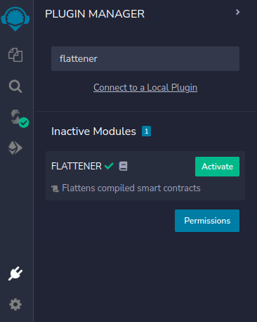
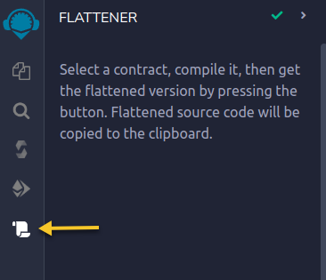
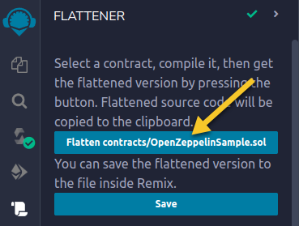
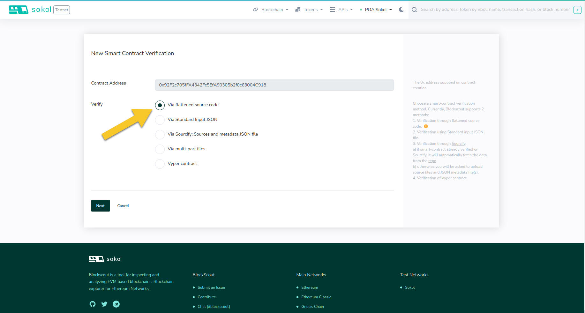
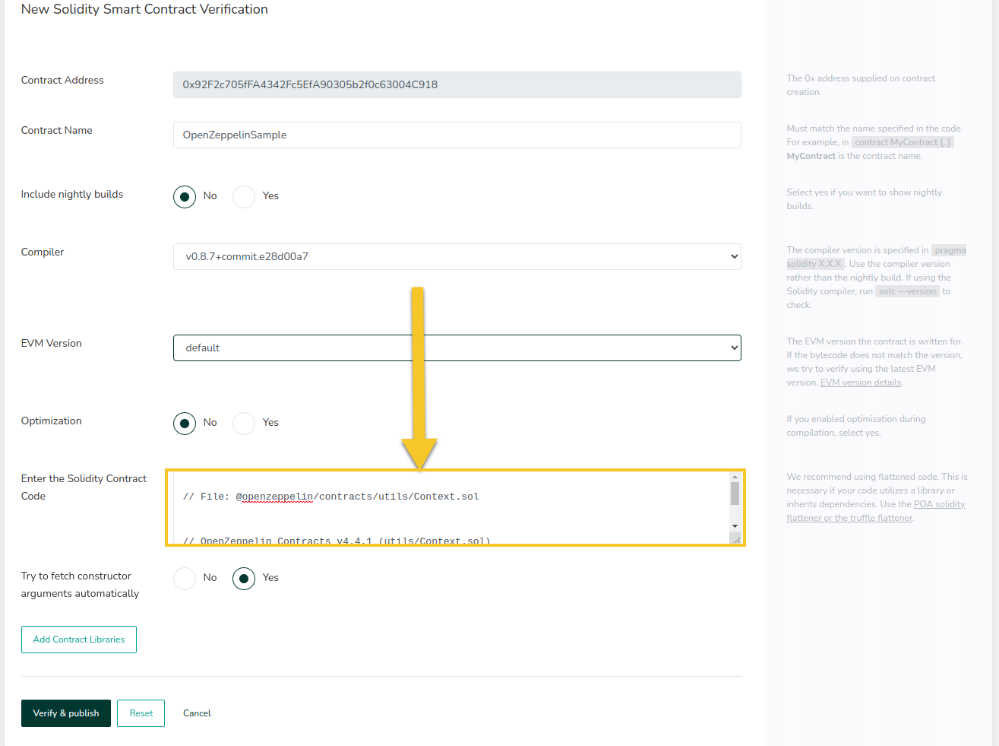
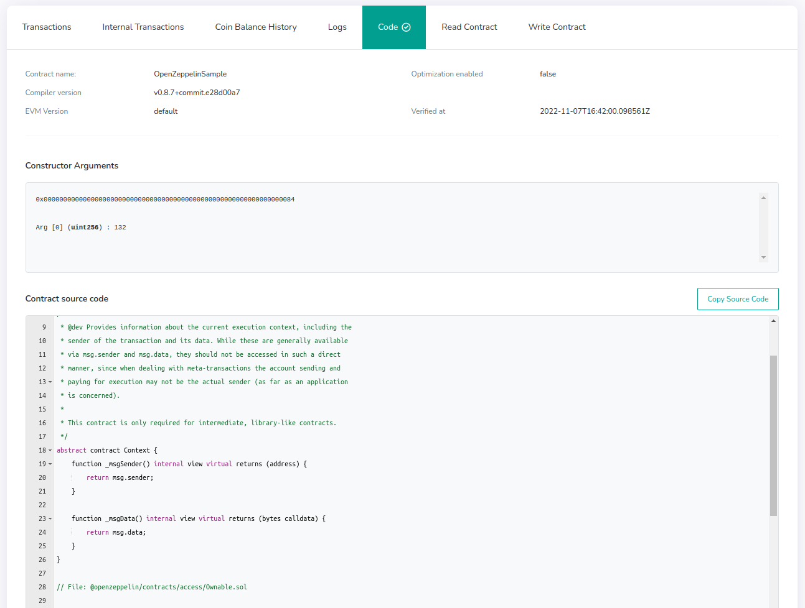
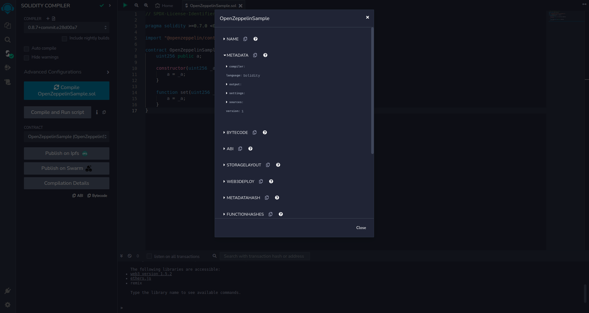
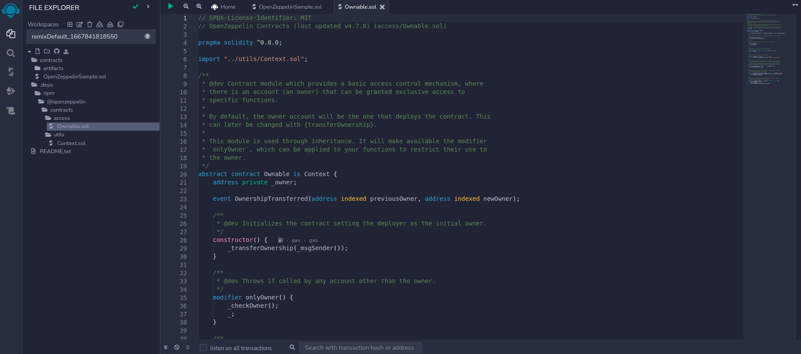
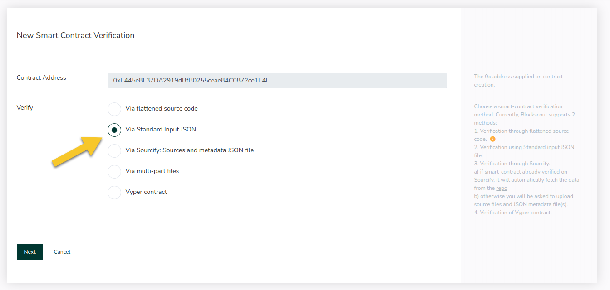
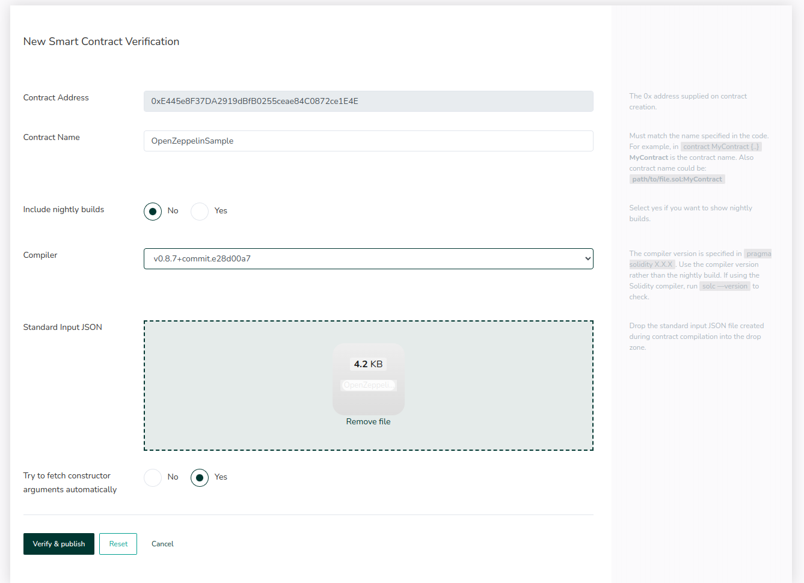

# OpenZeppelin Contract Verification


Page partially based on [OpenZeppelin Tutorial](https://forum.openzeppelin.com/t/how-to-verify-with-hardhat-or-truffle-a-smart-contract-using-openzeppelin-contracts/4119).&#x20;


Due to compiler constraints, contracts which include OpenZeppelin-related source contracts (e.g., `import@openzeppelin/contracts/access/Ownable.sol;`) can cause problems with verification. The sources must be provided explicitly during the contract verification process.

Below we describe verification information when including these contracts specific to different development environments.

* [Hardhat](openzeppelin-contract-verification.md#hardhat)
* [Truffle](openzeppelin-contract-verification.md#truffle)
* [Foundry (forge)](openzeppelin-contract-verification.md#foundry-forge)
* [Remix](openzeppelin-contract-verification.md#remix)

## Hardhat

[Hardhat](https://hardhat.org/) is a full-featured development environment for contract compilation, deployment, and verification. The [Hardhat Etherscan plugin](https://hardhat.org/plugins/nomiclabs-hardhat-etherscan.html) supports contract verification on Blockscout and includes in-built functionality to address verification with OpenZeppelin-based imports.

A separate tutorial about contract verification via Hardhat on Blockscout [is available here](../smart-contract-interaction/verifying-a-smart-contract/hardhat-verification-plugin.md).

## Truffle&#x20;

[Truffle](https://trufflesuite.com/) is a world-class development environment, testing framework, and asset pipeline for blockchains using the Ethereum Virtual Machine (EVM). The [truffle-plugin-verify](https://github.com/rkalis/truffle-plugin-verify) supports contract verification on BlockScout.

You can find more details about `truffle-plugin-verify` in their [Readme file](https://github.com/rkalis/truffle-plugin-verify#readme) and [tutorial](https://kalis.me/verify-truffle-smart-contracts-etherscan/).

There are two main differences to keep in mind when verifying contracts on Blockscout vs Etherscan:

1. Blockscout does not require ApiKey to verify smart-contracts. However, truffle-plugin-verify requires one to be provided. **You can use any non-empty string**.
2.  In search of constructor arguments, the plugin makes a request to the explorer’s `?module=`**`account`**`&action=`**`txlist`**`&address={`**`addressHash`**`} endpoint`. This request can fail if verification is taking too long to answer.\


    If you encounter this problem, specify the constructor arguments explicitly via the [`--forceConstructorArgs string:`](https://github.com/rkalis/truffle-plugin-verify#constructor-arguments-override-optional) option (e.g., `truffle run verify OpenZeppelinSample@0xf1b1B44B70f4531217c8c4B6C7A9a52D2B052F81 --network sokol --forceConstructorArgs string:`). This way, the _txlist_ request is omitted, and the problem should be resolved. \
    \
    _Note: you can always use just an empty string (as in the example) even if there are some arguments in reality. Blockscout obtains them automatically and ignores any provided value._

## Foundry (forge)

[Foundry](https://github.com/foundry-rs/foundry/) is a smart contract development toolchain. Foundry manages your dependencies, compiles your project, runs tests, deploys, and lets you interact with the chain from the command line and via Solidity scripts.

Forge is a command-line tool that ships with Foundry. Forge tests, builds, and deploys your smart contracts. Forge supports contract verification out of the box ([https://book.getfoundry.sh/reference/forge/forge-verify-contract](https://book.getfoundry.sh/reference/forge/forge-verify-contract))

#### Tips:

1. Setting the `—verifier=blockscout` flag allows you to not specify any Api key.
2. While specifying `--verifier-url` flag omit the final slash (e.g., `--verifier-url=`[`https://blockscout.com/poa/sokol/api`](https://blockscout.com/poa/sokol/api)). Otherwise, you will encounter an “_Failed to deserialize response_” error.
3. You can specify most configuration options (e.g., evm version, disabling optimizations) via the usual Forge configuration (see [https://github.com/foundry-rs/foundry/blob/master/config/README.md](https://github.com/foundry-rs/foundry/blob/master/config/README.md)).
Note: You might not need an API key to verify on Blockscout. You can use the following format for the --verifier-url flag:
<blockscout_homepage_explorer_url>/api\? 

Example:

Verify a contract with Blockscout right after deployment (make sure you add "/api\?" to the end of the Blockscout homepage explorer URL):
```sh
forge create --rpc-url <rpc_https_endpoint> --private-key $devTestnetPrivateKey src/Contract.sol:SimpleStorage --verify --verifier blockscout --verifier-url <blockscout_homepage_explorer_url>/api\? 
```

## Remix

While there are 2 plugins available to help with this process, Etherscan and Flattener. Currently only Flattener works with Blockscout. You can use this plugin to flatten contracts and submit for verification as flattened source code.  This is the recommended option.&#x20;

We also include the Manual Standard Input JSON Method below the flattener instructions. This method is not recommended, but included since it is also a viable method.

### Flattener Plugin

1. Go to Plugin Manager and search for "flattener". Activate the plugin.\
   \

2. The plugin is now available in the lefthand menu.\
   \

3. Compile the contract you want to verify.\
   .png>)\

4. Return to the Flattener. The ‘Flatten contract\_name’ button should appear. Click the button. Flattened source code is copied onto the clipboard.\
   \

5. Go to Blockscout and on the verification page choose the ‘_Via flattened source code_’ method.\
   \

6. Paste the copied flattened source code into the ‘_Enter the Solidity Contract Code_’ field. \
   \

7. Check that all info is correct and click the Verify and Publish button to verify your contract. Once verified, the code tab will include the :white\_check\_mark: icon and source code will be viewable.\
   

### Manual Standard Input Json with Remix

Standard input json is basically the raw file fed into the Solidity compiler on verification. There are some minor updates made regarding info the output compiler should return, but the main contract-related fields remain the same. This way, standard json allows you to specify the most subtle compiler settings, as well as to specify all source files.

It is quite cumbersome and tedious work, so it is preferable to use any of the above methods, however, we describe the process in more detail for those who want to use it.

For this tutorial, we will create standard json for the following contract:

```solidity
// SPDX-License-Identifier: GPL-3.0

pragma solidity >=0.7.0 <0.9.0;

import "@openzeppelin/contracts/access/Ownable.sol";

contract OpenZeppelinSample is Ownable {
    uint256 public a;

    constructor(uint256 _a) {
        a = _a;
    }

    function set(uint256 _a) public {
        a = _a;
    }
}
```

1\) Start by creating a template which will be filled with sources later. For this purpose, we will use a metadata file generated by the compiler. You can find it in the “Compilation Details” tab (ensure that correct contract is chosen).

<figure><figcaption><p>Compilation Details → Metadata</p></figcaption></figure>

```json
{
    "compiler": {
        "version": "0.8.7+commit.e28d00a7"
    },
    "language": "Solidity",
    "output": {
        "abi": [
            {
                "inputs": [
                    {
                        "internalType": "uint256",
                        "name": "_a",
                        "type": "uint256"
                    }
                ],
                "stateMutability": "nonpayable",
                "type": "constructor"
            },
            {
                "anonymous": false,
                "inputs": [
                    {
                        "indexed": true,
                        "internalType": "address",
                        "name": "previousOwner",
                        "type": "address"
                    },
                    {
                        "indexed": true,
                        "internalType": "address",
                        "name": "newOwner",
                        "type": "address"
                    }
                ],
                "name": "OwnershipTransferred",
                "type": "event"
            },
            {
                "inputs": [],
                "name": "a",
                "outputs": [
                    {
                        "internalType": "uint256",
                        "name": "",
                        "type": "uint256"
                    }
                ],
                "stateMutability": "view",
                "type": "function"
            },
            {
                "inputs": [],
                "name": "owner",
                "outputs": [
                    {
                        "internalType": "address",
                        "name": "",
                        "type": "address"
                    }
                ],
                "stateMutability": "view",
                "type": "function"
            },
            {
                "inputs": [],
                "name": "renounceOwnership",
                "outputs": [],
                "stateMutability": "nonpayable",
                "type": "function"
            },
            {
                "inputs": [
                    {
                        "internalType": "uint256",
                        "name": "_a",
                        "type": "uint256"
                    }
                ],
                "name": "set",
                "outputs": [],
                "stateMutability": "nonpayable",
                "type": "function"
            },
            {
                "inputs": [
                    {
                        "internalType": "address",
                        "name": "newOwner",
                        "type": "address"
                    }
                ],
                "name": "transferOwnership",
                "outputs": [],
                "stateMutability": "nonpayable",
                "type": "function"
            }
        ],
        "devdoc": {
            "kind": "dev",
            "methods": {
                "owner()": {
                    "details": "Returns the address of the current owner."
                },
                "renounceOwnership()": {
                    "details": "Leaves the contract without owner. It will not be possible to call `onlyOwner` functions anymore. Can only be called by the current owner. NOTE: Renouncing ownership will leave the contract without an owner, thereby removing any functionality that is only available to the owner."
                },
                "transferOwnership(address)": {
                    "details": "Transfers ownership of the contract to a new account (`newOwner`). Can only be called by the current owner."
                }
            },
            "version": 1
        },
        "userdoc": {
            "kind": "user",
            "methods": {},
            "version": 1
        }
    },
    "settings": {
        "compilationTarget": {
            "contracts/OpenZeppelinSample.sol": "OpenZeppelinSample"
        },
        "evmVersion": "london",
        "libraries": {},
        "metadata": {
            "bytecodeHash": "ipfs"
        },
        "optimizer": {
            "enabled": false,
            "runs": 200
        },
        "remappings": []
    },
    "sources": {
        "@openzeppelin/contracts/access/Ownable.sol": {
            "keccak256": "0xa94b34880e3c1b0b931662cb1c09e5dfa6662f31cba80e07c5ee71cd135c9673",
            "license": "MIT",
            "urls": [
                "bzz-raw://40fb1b5102468f783961d0af743f91b9980cf66b50d1d12009f6bb1869cea4d2",
                "dweb:/ipfs/QmYqEbJML4jB1GHbzD4cUZDtJg5wVwNm3vDJq1GbyDus8y"
            ]
        },
        "@openzeppelin/contracts/utils/Context.sol": {
            "keccak256": "0xe2e337e6dde9ef6b680e07338c493ebea1b5fd09b43424112868e9cc1706bca7",
            "license": "MIT",
            "urls": [
                "bzz-raw://6df0ddf21ce9f58271bdfaa85cde98b200ef242a05a3f85c2bc10a8294800a92",
                "dweb:/ipfs/QmRK2Y5Yc6BK7tGKkgsgn3aJEQGi5aakeSPZvS65PV8Xp3"
            ]
        },
        "contracts/OpenZeppelinSample.sol": {
            "keccak256": "0xca4fea32c78a11ca048ac26aa8655073e7a6ae534459ac4d07afbb55c9e751e0",
            "license": "GPL-3.0",
            "urls": [
                "bzz-raw://8c5e775b4b8c2c445d056d2ff6adc97d258fdf86071be30dcb3b13f09d143efb",
                "dweb:/ipfs/QmauZE2ySRS9Xm9JF7FsfzzGitEjHfSxnykyxvMRsSF7Lr"
            ]
        }
    },
    "version": 1
}sol
```

2\) The only fields required for standard json input are “language”, “settings”, and “sources”. In addition, only content is needed for sources. Add it for each source and remove everything unnecessary.

```json
{
    "language": "Solidity",
    "settings": {
        "compilationTarget": {
            "contracts/OpenZeppelinSample.sol": "OpenZeppelinSample"
        },
        "evmVersion": "london",
        "libraries": {},
        "metadata": {
            "bytecodeHash": "ipfs"
        },
        "optimizer": {
            "enabled": false,
            "runs": 200
        },
        "remappings": []
    },
    "sources": {
        "@openzeppelin/contracts/access/Ownable.sol": {
            "content": ""
        },
        "@openzeppelin/contracts/utils/Context.sol": {
            "content": ""
        },
        "contracts/OpenZeppelinSample.sol": {
            "content": ""
        }
    }
}
```

_Note that the only fields to fill in the contents for each source file. Everything else (including compiler settings) is already filled via the metadata file._

3\) First, add the content for the main `OpenZeppelinSample.sol` file&#x20;

```json
{
    "language": "Solidity",
    "settings": {
        "compilationTarget": {
            "contracts/OpenZeppelinSample.sol": "OpenZeppelinSample"
        },
        "evmVersion": "london",
        "libraries": {},
        "metadata": {
            "bytecodeHash": "ipfs"
        },
        "optimizer": {
            "enabled": false,
            "runs": 200
        },
        "remappings": []
    },
    "sources": {
        "@openzeppelin/contracts/access/Ownable.sol": {
            "content": ""
        },
        "@openzeppelin/contracts/utils/Context.sol": {
            "content": ""
        },
        "contracts/OpenZeppelinSample.sol": {
            "content": "// SPDX-License-Identifier: GPL-3.0\n\npragma solidity >=0.7.0 <0.9.0;\n\nimport \"@openzeppelin/contracts/access/Ownable.sol\";\n\ncontract OpenZeppelinSample is Ownable {\n    uint256 public a;\n\n    constructor(uint256 _a) {\n        a = _a;\n    }\n\n    function set(uint256 _a) public {\n        a = _a;\n    }\n}"
        }
    }
}
```

4\) Next, add the sources for @openzeppelin/contracts/access/Ownable.sol contract that is being imported. They can be found inside the `.deps/npm/` directories, which will appear after contract compilation.

<figure><figcaption></figcaption></figure>

Copy the source code with the path used in imports:

```json
{
    "language": "Solidity",
    "settings": {
        "compilationTarget": {
            "contracts/OpenZeppelinSample.sol": "OpenZeppelinSample"
        },
        "evmVersion": "london",
        "libraries": {},
        "metadata": {
            "bytecodeHash": "ipfs"
        },
        "optimizer": {
            "enabled": false,
            "runs": 200
        },
        "remappings": []
    },
    "sources": {
        "@openzeppelin/contracts/access/Ownable.sol": {
            "content": "// SPDX-License-Identifier: MIT\n// OpenZeppelin Contracts (last updated v4.7.0) (access/Ownable.sol)\n\npragma solidity ^0.8.0;\n\nimport \"../utils/Context.sol\";\n\n/**\n * @dev Contract module which provides a basic access control mechanism, where\n * there is an account (an owner) that can be granted exclusive access to\n * specific functions.\n *\n * By default, the owner account will be the one that deploys the contract. This\n * can later be changed with {transferOwnership}.\n *\n * This module is used through inheritance. It will make available the modifier\n * `onlyOwner`, which can be applied to your functions to restrict their use to\n * the owner.\n */\nabstract contract Ownable is Context {\n    address private _owner;\n\n    event OwnershipTransferred(address indexed previousOwner, address indexed newOwner);\n\n    /**\n     * @dev Initializes the contract setting the deployer as the initial owner.\n     */\n    constructor() {\n        _transferOwnership(_msgSender());\n    }\n\n    /**\n     * @dev Throws if called by any account other than the owner.\n     */\n    modifier onlyOwner() {\n        _checkOwner();\n        _;\n    }\n\n    /**\n     * @dev Returns the address of the current owner.\n     */\n    function owner() public view virtual returns (address) {\n        return _owner;\n    }\n\n    /**\n     * @dev Throws if the sender is not the owner.\n     */\n    function _checkOwner() internal view virtual {\n        require(owner() == _msgSender(), \"Ownable: caller is not the owner\");\n    }\n\n    /**\n     * @dev Leaves the contract without owner. It will not be possible to call\n     * `onlyOwner` functions anymore. Can only be called by the current owner.\n     *\n     * NOTE: Renouncing ownership will leave the contract without an owner,\n     * thereby removing any functionality that is only available to the owner.\n     */\n    function renounceOwnership() public virtual onlyOwner {\n        _transferOwnership(address(0));\n    }\n\n    /**\n     * @dev Transfers ownership of the contract to a new account (`newOwner`).\n     * Can only be called by the current owner.\n     */\n    function transferOwnership(address newOwner) public virtual onlyOwner {\n        require(newOwner != address(0), \"Ownable: new owner is the zero address\");\n        _transferOwnership(newOwner);\n    }\n\n    /**\n     * @dev Transfers ownership of the contract to a new account (`newOwner`).\n     * Internal function without access restriction.\n     */\n    function _transferOwnership(address newOwner) internal virtual {\n        address oldOwner = _owner;\n        _owner = newOwner;\n        emit OwnershipTransferred(oldOwner, newOwner);\n    }\n}"
        },
        "@openzeppelin/contracts/utils/Context.sol": {
            "content": ""
        },
        "contracts/OpenZeppelinSample.sol": {
            "content": "// SPDX-License-Identifier: GPL-3.0\n\npragma solidity >=0.7.0 <0.9.0;\n\nimport \"@openzeppelin/contracts/access/Ownable.sol\";\n\ncontract OpenZeppelinSample is Ownable {\n    uint256 public a;\n\n    constructor(uint256 _a) {\n        a = _a;\n    }\n\n    function set(uint256 _a) public {\n        a = _a;\n    }\n}"
        }
    }
}
```


5\) The last source is a "`../utils/Context.sol`" imported from `@openzeppelin/contracts/access/Ownable.sol`. You can find it in the same `.deps/npm` directory.

<figure><figcaption></figcaption></figure>


Although import "../utils/Context.sol"; specifies a relative path, the absolute path is used in standard json, and can be found relative to @openzeppelin/contracts/access/Ownable.sol


```json
    {
    "language": "Solidity",
    "settings": {
        "compilationTarget": {
            "contracts/OpenZeppelinSample.sol": "OpenZeppelinSample"
        },
        "evmVersion": "london",
        "libraries": {},
        "metadata": {
            "bytecodeHash": "ipfs"
        },
        "optimizer": {
            "enabled": false,
            "runs": 200
        },
        "remappings": []
    },
    "sources": {
        "@openzeppelin/contracts/access/Ownable.sol": {
            "content": "// SPDX-License-Identifier: MIT\n// OpenZeppelin Contracts (last updated v4.7.0) (access/Ownable.sol)\n\npragma solidity ^0.8.0;\n\nimport \"../utils/Context.sol\";\n\n/**\n * @dev Contract module which provides a basic access control mechanism, where\n * there is an account (an owner) that can be granted exclusive access to\n * specific functions.\n *\n * By default, the owner account will be the one that deploys the contract. This\n * can later be changed with {transferOwnership}.\n *\n * This module is used through inheritance. It will make available the modifier\n * `onlyOwner`, which can be applied to your functions to restrict their use to\n * the owner.\n */\nabstract contract Ownable is Context {\n    address private _owner;\n\n    event OwnershipTransferred(address indexed previousOwner, address indexed newOwner);\n\n    /**\n     * @dev Initializes the contract setting the deployer as the initial owner.\n     */\n    constructor() {\n        _transferOwnership(_msgSender());\n    }\n\n    /**\n     * @dev Throws if called by any account other than the owner.\n     */\n    modifier onlyOwner() {\n        _checkOwner();\n        _;\n    }\n\n    /**\n     * @dev Returns the address of the current owner.\n     */\n    function owner() public view virtual returns (address) {\n        return _owner;\n    }\n\n    /**\n     * @dev Throws if the sender is not the owner.\n     */\n    function _checkOwner() internal view virtual {\n        require(owner() == _msgSender(), \"Ownable: caller is not the owner\");\n    }\n\n    /**\n     * @dev Leaves the contract without owner. It will not be possible to call\n     * `onlyOwner` functions anymore. Can only be called by the current owner.\n     *\n     * NOTE: Renouncing ownership will leave the contract without an owner,\n     * thereby removing any functionality that is only available to the owner.\n     */\n    function renounceOwnership() public virtual onlyOwner {\n        _transferOwnership(address(0));\n    }\n\n    /**\n     * @dev Transfers ownership of the contract to a new account (`newOwner`).\n     * Can only be called by the current owner.\n     */\n    function transferOwnership(address newOwner) public virtual onlyOwner {\n        require(newOwner != address(0), \"Ownable: new owner is the zero address\");\n        _transferOwnership(newOwner);\n    }\n\n    /**\n     * @dev Transfers ownership of the contract to a new account (`newOwner`).\n     * Internal function without access restriction.\n     */\n    function _transferOwnership(address newOwner) internal virtual {\n        address oldOwner = _owner;\n        _owner = newOwner;\n        emit OwnershipTransferred(oldOwner, newOwner);\n    }\n}"
        },
        "@openzeppelin/contracts/utils/Context.sol": {
            "content": "// SPDX-License-Identifier: MIT\n// OpenZeppelin Contracts v4.4.1 (utils/Context.sol)\n\npragma solidity ^0.8.0;\n\n/**\n * @dev Provides information about the current execution context, including the\n * sender of the transaction and its data. While these are generally available\n * via msg.sender and msg.data, they should not be accessed in such a direct\n * manner, since when dealing with meta-transactions the account sending and\n * paying for execution may not be the actual sender (as far as an application\n * is concerned).\n *\n * This contract is only required for intermediate, library-like contracts.\n */\nabstract contract Context {\n    function _msgSender() internal view virtual returns (address) {\n        return msg.sender;\n    }\n\n    function _msgData() internal view virtual returns (bytes calldata) {\n        return msg.data;\n    }\n}"
        },
        "contracts/OpenZeppelinSample.sol": {
            "content": "// SPDX-License-Identifier: GPL-3.0\n\npragma solidity >=0.7.0 <0.9.0;\n\nimport \"@openzeppelin/contracts/access/Ownable.sol\";\n\ncontract OpenZeppelinSample is Ownable {\n    uint256 public a;\n\n    constructor(uint256 _a) {\n        a = _a;\n    }\n\n    function set(uint256 _a) public {\n        a = _a;\n    }\n}"
        }
    }
}
```

6\) Submit composed standard json for verification “Via Standard Input JSON” and check results.

<figure><figcaption></figcaption></figure>

<figure><figcaption></figcaption></figure>

